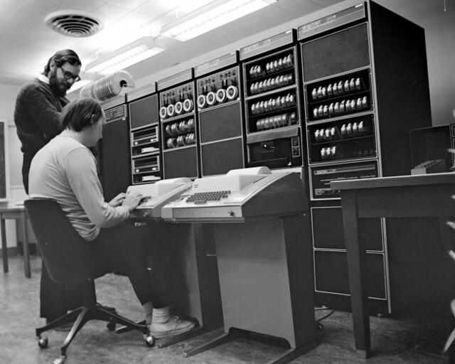
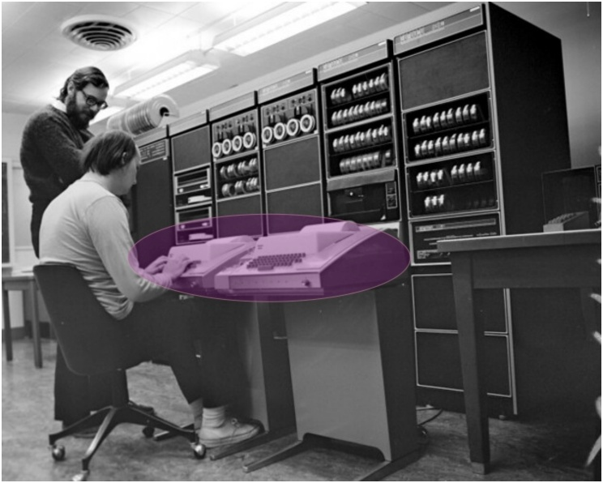
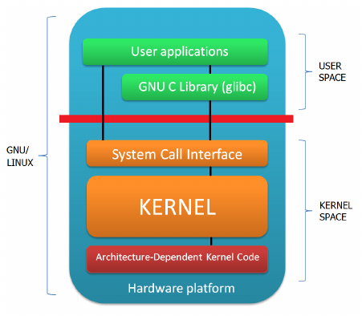
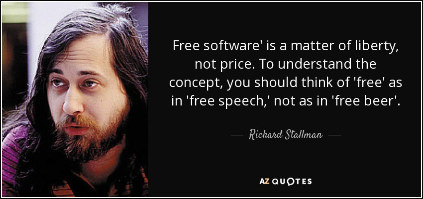

<!-- list_item_newlines: 2 -->

Housekeeping
===

* **PSet 0 is due Tuesday 9/9 @ 11:59PM** (Submit through Gradescope on Canvas)
* **Section Preferences** due by end of today!
- **Sections & OHs** begin next week (See Google Calendar on Canvas)
* **The Ed forum** is the best place to ask questions
* Log into [https://code.harvard.edu](https://code.harvard.edu) to generate an account (more on this
  later)

<!-- end_slide -->

<!-- list_item_newlines: 1 -->
# Lecture Outline

## Unix History
- GNU Project & Linux Kernel

## Working in the Linux Terminal
### The Basics
- The User (`whoami`)
- Exploring the File System (`~/`, `.`, `..`, `pwd`, `cd`, `ls`, `find`)
- Environment Variables (`$0`, `$HOME`, `$PATH`)
- Aliases
### Working with Files
- Creating, Moving, and Deleting Files (`touch`, `mv`, `cp`, `rm`)
- Viewing Files (`cat`, `less`, `head`, `tail`)
- Editing Files (`nano`, `vim`)
- Shell Configuration (`~/.bashrc`, `~/.bash_profile`, `source`)
- File Attributes, Permissions, & Groups (`chown`, `chmod`, `usermod`)
### Working with Streams
- Redirection & Pipes (`>`, `|`)
- Regular Expressions & `grep`
- Advanced String Manipulation (`sed`, `awk`)
### Shell Scripting
- Command Line Arguments & Functions
- Conditional Statements, Boolean Operators, and Loops
- What is POSIX?
### Everyday Skills
- Controlling Processes (`ps`, `top`, `^C`, `kill`)
- Managing Disk Space (`du`)
- Backgrounding & Multiplexing (`^Z`, `fg`, `screen`)
### Misc.
- Other Shells
- CLI vs TUI vs GUI

<!-- end_slide -->

# Unix History: Where It All Began


## In the late 1960s, at Bell Telephone Laboratories in New Jersey, something revolutionary was brewing...

<!-- end_slide -->

# The Birth of Unix

<!-- column_layout: [7, 3] -->

<!-- column: 0 -->

**Ken Thompson** and **Dennis Ritchie** created Unix in 1969-1970

**Why?** They wanted a **time-sharing** operating system where:
- Multiple users could share the same computer simultaneously
- Each user could run programs independently
- Resources (CPU, memory, storage) were managed efficiently

*Before this, computers typically served only one user at a time!*

<!-- column: 1 -->



<!-- reset_layout -->

<!-- end_slide -->

# How Did Users Interact with Unix?

<!-- column_layout: [7, 3] -->

<!-- column: 0 -->

**Terminals**: Physical devices with keyboards and either:
- Paper printouts (teletypes)
- Cathode ray tube displays (later)

**The Shell**: A command interpreter that:
- Reads your typed commands
- Executes programs
- Returns results to your terminal

**Utility Programs**: Small, focused tools that do one job well
- `ls` (list files), `cat` (display file contents), `grep` (search text)
- The Unix philosophy: "Do one thing and do it well"

<!-- column: 1 -->



<!-- reset_layout -->

<!-- end_slide -->

# But How Do Programs Actually *Do* Anything?

## When you run a program, it needs to:
- Read keyboard input
- Write to memory and disk
- Display output on screen
- Access hardware devices
- Communicate over networks

## **The Problem**: Direct hardware access would be chaos with multiple users!

## *How do we safely coordinate all these requests?*

<!-- end_slide -->

# The Kernel: Where Mind Meets Metal

<!-- column_layout: [7, 3] -->

<!-- column: 0 -->

## **The Unix Kernel** acts as a gatekeeper:

**Kernel Space**: Where the operating system runs with full hardware access
**User Space**: Where your programs run with restricted permissions

**System Calls**: The controlled interface between user programs and kernel
- `open()` to access files
- `write()` to output data  
- `fork()` to create new processes

## *This design keeps the system stable and secure!*

<!-- column: 1 -->



<!-- reset_layout -->

<!-- end_slide -->

# The Problem: Unix Wasn't Free

## By the 1980s, Unix had become:
- **Proprietary** - owned by AT&T
- **Expensive** - required costly licenses
- **Fragmented** - many incompatible versions

## Universities and researchers were frustrated:
- Couldn't study the source code
- Couldn't modify it for their needs
- Couldn't share improvements

## *There had to be a better way...*

<!-- end_slide -->

# Enter Richard Stallman and the GNU Project

<!-- column_layout: [7, 3] -->

<!-- column: 0 -->

**1983**: Richard Stallman launches the **GNU Project**
- **Goal**: Create a completely free Unix-like system
- **GNU**: "GNU's Not Unix" (computer nerds love recursive acronyms)
- **Philosophy**: Software should be free to use, study, modify, and share

**What GNU Accomplished**:
- `gcc` (compiler), `bash` (shell), `emacs` (editor)
- Most of the essential Unix utilities
- The GNU General Public License (GPL)

**What Was Missing**: A kernel! 😱

<!-- column: 1 -->


<!-- reset_layout -->

<!-- end_slide -->

# Linux: The Missing Piece

<!-- column_layout: [7, 3] -->

<!-- column: 0 -->

**1991**: Finnish student **Linus Torvalds** announces:

> "I'm doing a (free) operating system (just a hobby, won't be big and professional like gnu) for 386(486) AT clones..."

**Linux** provided:
- A free Unix-like kernel
- The missing piece for GNU's vision
- Collaborative development model

*Finally, a complete free Unix-like system was possible!*

<!-- column: 1 -->


<!-- reset_layout -->

<!-- end_slide -->

# GNU/Linux: The Complete System

<!-- column_layout: [7, 3] -->

<!-- column: 0 -->

**GNU/Linux** combines:
- **GNU**: The utilities, compiler, shell, and philosophy
- **Linux**: The kernel that manages hardware

*Richard Stallman insists we call it "GNU/Linux" to recognize GNU's contributions!*

<!-- column: 1 -->


<!-- reset_layout -->


<!-- end_slide -->

# What Makes a Linux Distribution?

## A **Linux Distribution** packages together:
- **Linux kernel** (hardware management)
- **GNU utilities** (basic commands and tools)
- **Package manager** (software installation)
- **Desktop environment** (graphical interface)
- **Default applications** (web browser, text editor, etc.)

## **Popular Distributions**:
- **Ubuntu**: User-friendly, great for beginners
- **Debian**: Rock-solid stability, completely free
- **Arch**: Minimalist, cutting-edge, for advanced users
- **Gentoo**: Compile everything from source
- **NixOS**: Reproducible system configurations

<!-- end_slide -->

# Free Software vs Open Source Software

<!-- column_layout: [7, 3] -->

<!-- column: 0 -->

**Free Software** (GNU/FSF philosophy):
- Emphasizes user **freedom** and **ethics**
- Four essential freedoms: use, study, modify, distribute

**Open Source Software**:
- Emphasizes **practical benefits**: better quality, security, collaboration
- More business-friendly messaging

*Both movements largely support the same software, but with different philosophical emphasis.*

We'll revisit software licensing in detail in a later lecture!

<!-- column: 1 -->


<!-- reset_layout -->



<!-- end_slide -->

# Working in the Linux Terminal

## Now that we understand the history, let's learn to use this powerful system!

**What we'll cover:**
- Who am I and where am I?
- Navigating the file system
- Understanding files and directories
- Basic file operations
- Environment variables and customization

*Time to get our hands dirty!*

<!-- end_slide -->

# First Steps: Who Am I?

When you first open a terminal, you might feel lost. Let's start with the basics:

```bash +exec
whoami
```

**What is a "user" in Linux?**
- Every person who uses the system has a unique **username**
- Linux tracks who owns which files and who can access what
- Your username determines your permissions and home directory

**Why this matters:** Linux was designed as a **multi-user system** from the beginning. Multiple people can use the same computer simultaneously, each with their own files and permissions.

*This is different from early personal computers that assumed only one person would use them!*

<!-- end_slide -->

# Users and Groups

Now let's see more details about your identity:

```bash +exec
id
```

**What this shows:**
- **uid**: Your unique user ID number
- **gid**: Your primary group ID number  
- **groups**: All groups you belong to

**What are groups?** Collections of users who share certain permissions. For example:
- `sudo` group: Can run administrative commands
- `staff` group: Can access shared project files

*We'll return to groups when we discuss file permissions - they're crucial for controlling who can access what!*

<!-- end_slide -->

# Where Am I? Understanding Your Location

Every terminal session has a **current working directory** - think of it as "where you are" in the file system:

```bash +exec
pwd
```

`pwd`: **P**rint **W**orking **D**irectory - shows your current location

**What does this path mean?**
- It shows your complete address in the file system
- Usually starts with `/home/username` - your personal space
- Think of it like your mailing address - it tells you exactly where you are

**Try this:** Open a terminal and run `pwd` to see where you are right now!

<!-- end_slide -->

# The Linux File System: A Hierarchy

Linux organizes everything in a **tree structure** starting from the root `/`:

```bash +exec
ls /
```

This shows all the top-level directories in the Linux file system.

<!-- end_slide -->

# Important System Directories

**What do these directories contain?**
- `/`: The root - top of everything
- `/home`: Contains user directories
- `/usr`: System programs and files
- `/etc`: System configuration files
- `/tmp`: Temporary files
- `/bin`: Essential system binaries (programs)
- `/lib` & `/lib64`: System libraries
- `/var`: Variable data (logs, databases)
- `/opt`: Optional software packages
- `/proc`: Virtual filesystem with system information

**Note:** Different Linux distributions may have slightly different directory structures. For example, some distributions might have `/snap` for Snap packages, or `/nix` for the Nix package manager (as seen here).

<!-- pause -->

```bash +exec
ls /home
```

This shows all user directories on the system.

<!-- pause -->

```bash +exec
ls ~
```

The `~` symbol is a shortcut that means "my home directory" - we'll learn more about these shortcuts later.

<!-- end_slide -->

# Navigation: Moving Around

Use `cd` (**c**hange **d**irectory) to move around:

```bash +exec
pwd
```

Let's see where we are first.

<!-- pause -->

```bash
cd files/my_project
pwd
```

**Try this in a new terminal:** Open a new terminal window and run these commands to practice navigation. (Note: `cd` commands don't work in presentation code blocks)

**Special directory symbols:**
- `.` = current directory
- `..` = parent directory  
- `~` = your home directory
- `/` = root directory

<!-- end_slide -->

# Exploring: What's Here?

The `ls` command **l**i**s**ts directory contents:

```bash +exec
ls
```

Basic listing of files and directories.

<!-- pause -->

```bash +exec
ls -l
```

**Long format** shows permissions, size, date, and more details.

**Useful `ls` options:**
- `ls -l`: Long format (shows permissions, size, date)
- `ls -a`: Show **a**ll files (including hidden ones starting with `.`)
- `ls -h`: **H**uman readable file sizes (KB, MB, GB)

<!-- end_slide -->

# Understanding Files vs Directories

In Linux, **everything is either a file or a directory**:

```bash +exec
ls -l
```

**The first character in `ls -l` tells you the type:**
- `d` = directory (folder)
- `-` = regular file
- `l` = symbolic link (shortcut)

**Key insight:** Directories are just special files that contain lists of other files!

<!-- end_slide -->

# What Type of File Is This?

Sometimes you need to know more about a file than just its name:

```bash +exec
file files/my_project
```

The `file` command examines the contents and tells you what type of file something is.

<!-- pause -->

```bash +exec
file $(which ls)
```

**What's happening here?**
- `$(which ls)`: This is a **subshell** - it runs `which ls` first and injects the result into the outer command
- `which ls` finds where the `ls` program is located on your system
- `file` then examines that location

**What you might see:**
- **Binary executable**: A compiled program that the CPU can run directly
- **Symbolic link**: A shortcut that points to another file (common on NixOS and other modern systems)

**Why this matters:** Not all files are text! Programs can be binary executables or links to other files. The `file` command helps you understand what you're working with, and command substitution lets you chain commands together dynamically.

<!-- end_slide -->

# Creating Your First Directory

Let's create a workspace to practice in:

```bash +exec
ls -l files/my_project
```

`mkdir`: **M**a**k**e **dir**ectory - creates a new folder

Notice the `d` at the beginning of the permissions - this shows it's a directory.

**What happened?** The `my_project` directory already exists in our lecture folder. You can create new directories with `mkdir dirname`.

<!-- end_slide -->

# Moving Into Our New Directory

Now let's enter the directory we just created:

```bash
cd my_project
pwd
```

**Try this in a new terminal:** `cd` changes your location, but it doesn't work in presentation code blocks. Open a new terminal and try these commands.

**Think of it like this:** If the file system is like a building, `cd` is like walking from one room to another. `pwd` tells you which room you're currently in.

<!-- end_slide -->

# Creating Your First Files

Let's create some empty files to work with:

```bash +exec
ls -l files/my_project/
```

`touch`: Creates an empty file (or updates the timestamp if the file already exists)

**What do you notice about the files in my_project/?**
- The README.md file contains some content
- The first character is `-` showing it's a regular file
- You can create empty files with `touch filename`

**Why start with empty files?** It's often useful to create placeholder files that you'll fill with content later.

<!-- end_slide -->

# Adding Content to Files

Let's put some content in our file:

```bash +exec
echo "# My First Project"
```

`echo`: Prints text to the screen

<!-- pause -->

```bash +exec
echo "# My First Project" > temp_file.txt
```

The `>` symbol **redirects** the output into a file instead of showing it on screen.

**What just happened?** Instead of printing to the screen, we saved the text into a new file called `temp_file.txt`. The `>` is like saying "put this text into that file instead of showing it to me."

<!-- end_slide -->

# Viewing File Contents

Now let's see what's inside our file:

```bash +exec
cat files/my_project/README.md
```

`cat`: Displays the contents of a file (**cat**enate and print)

<!-- pause -->

```bash +exec
ls -l files/my_project/README.md
```

Notice the file size - it contains text content!

**Why is it called `cat`?** Originally it was designed to con**cat**enate (join together) multiple files, but it's commonly used to display single files too.

<!-- end_slide -->

# Understanding Paths: Where Things Live

Every file and directory has an **address** called a path. Let's explore this:

```bash +exec
pwd
```

This shows our **absolute path** - the complete address from the root of the system.

**Two types of paths:**
- **Absolute paths**: Start with `/` - work from anywhere (like a complete mailing address)
- **Relative paths**: Start from where you are now (like "go to the kitchen")

**Think of it like directions:** "123 Main Street" works from anywhere (absolute), but "go upstairs" only makes sense from where you currently are (relative).

<!-- end_slide -->

# Relative Paths in Action

Let's see relative paths in action:

```bash +exec
ls files/my_project/README.md
```

This uses a **relative path** - we're looking for README.md inside the my_project directory.

<!-- pause -->

```bash +exec
ls ./files/my_project/README.md
```

The `./` explicitly means "starting from the current directory" - it's the same as the previous command.

**The dot `.` is special:** It always means "the current directory" - wherever you happen to be right now.

<!-- end_slide -->

# Going Back: The Parent Directory

Let's explore moving up in the directory tree:

```bash +exec
ls ..
```

The `..` means "parent directory" - the directory that contains our current directory.

<!-- pause -->

```bash
cd ..
pwd
```

**Try this in a new terminal:** The `cd` command doesn't work in presentation blocks, but you can try it in a new terminal.

The `..` is like an "up" button - it takes you to the directory that contains the one you're in.

<!-- end_slide -->

# Finding Files: When You Don't Know Where They Are

Sometimes you need to locate files in the system:

```bash +exec
find . -name "README.md"
```

`find`: Searches for files and directories by name, type, size, and more

**What this command means:**
- `find`: The search command
- `.`: Start searching from the current directory
- `-name "README.md"`: Look for something with this exact name

**Why is this useful?** As your projects grow, you might have hundreds of files. `find` helps you locate specific ones quickly.

<!-- end_slide -->

# Getting Help: The Manual System

Linux has built-in documentation for every command:

```bash +exec
man ls
```

`man`: Shows the **man**ual page for a command (press `q` to quit)

**Navigation in `man`:**
- Arrow keys: Move up/down
- `Space`: Next page
- `/word`: Search for "word"
- `q`: Quit and return to terminal

**Why learn this?** The manual pages contain complete information about every command - they're your reference when you need to know all the options available.

<!-- end_slide -->

# Environment Variables: Your Shell's Memory

Your shell remembers information in **environment variables** - think of them as the shell's memory:

```bash +exec
echo $USER
```

**What are environment variables?**
- Variables that store information your shell and programs need
- Always written in ALL CAPS by convention
- Referenced with a `$` symbol

**Why do we need them?** Programs need to know things like:
- Who you are (`$USER`)
- Where your home directory is
- Where to find other programs

<!-- end_slide -->

# Important Environment Variables

Let's explore some key environment variables:

```bash +exec
echo $HOME
```

This shows your home directory - where your personal files live.

<!-- pause -->

```bash +exec
echo $SHELL
```

This shows which shell program you're using (probably `/bin/bash` or `/bin/zsh`).

**These variables help programs work correctly:** When a program needs to save a file to your home directory, it uses `$HOME` to know where that is.

<!-- end_slide -->

# The PATH: How Linux Finds Programs

The most important environment variable is `$PATH`:

```bash +exec
echo $PATH
```

**What is PATH?**
- A list of directories where the shell looks for programs
- Directories are separated by colons `:`
- Searched in order from left to right

**How it works:**
1. You type `ls`
2. Shell checks first directory in PATH for `ls`
3. If not found, checks next directory
4. Continues until found (or gives up)

<!-- end_slide -->

# Seeing PATH in Action

Let's see where common programs live:

```bash +exec
which ls
```

`which`: Shows the full path to a program

<!-- pause -->

```bash +exec
which python3
```

This shows where Python is installed on your system.

**Why `./script.py` needs the `./`:** The current directory (`.`) is usually NOT in your PATH for security reasons. So you must explicitly tell the shell to look in the current directory with `./`.

<!-- end_slide -->

# Creating Your Own Environment Variables

You can create your own environment variables:

```bash
MY_NAME="Student"
echo $MY_NAME
```

**Try this in a new terminal:** Variable assignments don't persist in presentation code blocks. Open a new terminal to try setting and using variables.

Set a variable (no spaces around `=`!) and then use it with `$`

**Important:** This variable only exists in your current shell session. When you close the terminal, it's gone. Later we'll learn how to make variables permanent.

<!-- end_slide -->

# Aliases: Shortcuts for Common Commands

**Aliases** let you create shortcuts for commands you use frequently:

```bash
alias ll='ls -la'
ll
```

**Try this in a new terminal:** Aliases don't persist in presentation code blocks. Open a new terminal to try creating and using aliases.

Create an alias called `ll` that runs `ls -la`, then use it!

**Why use aliases?**
- Save typing for long commands
- Remember complex options more easily
- Customize commands to your preferences

<!-- end_slide -->

# Useful Alias Examples

Here are some popular aliases that make life easier:

```bash
alias la='ls -la'
alias welcome='cowsay "Hello $USER, welcome to Linux!"'
welcome
```

**Try this in a new terminal:** Aliases don't work in presentation code blocks. Open a new terminal to try these commands.

Create useful aliases and a fun welcome message! (Note: `cowsay` might not be installed on all systems)

**Try creating your own:** Think about commands you type often and create shortcuts for them!

<!-- end_slide -->

# Viewing Your Current Aliases

See what aliases you have defined:

```bash
alias
unalias welcome
```

**Try this in a new terminal:** Alias commands don't work in presentation code blocks. Open a new terminal to try viewing and removing aliases.

Use `alias` to see all current aliases, and `unalias name` to remove specific ones.

**Remember:** Like variables, aliases only last for your current session unless you make them permanent.

<!-- end_slide -->

# Working with Files: Basic Operations

Now let's learn to manipulate files and directories:

```bash
cp my_project/README.md my_project/README_backup.md
ls my_project/
```

**Try this in a new terminal:** File operations change the system state, so try these commands in a separate terminal.

**Essential file operations:**
- `cp source dest`: **C**o**p**y files or directories
- `mv source dest`: **M**o**v**e (rename) files or directories
- `rm filename`: **R**e**m**ove files (**Be careful! No trash bin!**)
- `rmdir dirname`: Remove empty directories

**Why practice copying first?** It's safer to copy before you move or delete - you always have a backup!

<!-- end_slide -->

# Viewing File Contents: Beyond `cat`

Different ways to examine files:

```bash +exec
cat files/sample_data.txt
```

`cat`: Shows the entire file content

<!-- pause -->

```bash +exec
head -3 files/sample_data.txt
```

`head -n`: Shows the first n lines (great for previewing large files)

<!-- pause -->

```bash +exec
tail -3 files/sample_data.txt
```

`tail -n`: Shows the last n lines (perfect for checking log files)

**When to use each:** `cat` for small files, `head` to preview, `tail` for recent activity

<!-- end_slide -->

# Working with Larger Files: `less` is More

For large files, use `less` (a pager):

```bash
less files/sample_data.txt
```

**Try this in a new terminal:** `less` is interactive and doesn't work in presentation blocks.

**`less` navigation:**
- `Space` or `f`: Forward one page
- `b`: Back one page
- `j`/`k`: Down/up one line
- `/pattern`: Search forward
- `?pattern`: Search backward
- `q`: Quit

**Why `less`?** It doesn't load the entire file into memory - perfect for huge log files that might be gigabytes in size!

<!-- end_slide -->

# Counting and Measuring Files

Let's learn about file statistics:

```bash +exec
wc files/sample_data.txt
```

`wc`: Counts lines, words, and characters

**What the numbers mean:**
- First number: lines
- Second number: words  
- Third number: characters (bytes)

<!-- pause -->

```bash +exec
wc -l files/sample_data.txt
```

`wc -l`: Count only lines (very useful for data analysis)

**Real-world use:** "How many entries are in this dataset?" → `wc -l data.csv`

<!-- end_slide -->

# File Operations: Moving and Copying

Let's practice safe file management:

```bash
# First, let's see what we have
ls files/my_project/

# Copy a file (safe - creates duplicate)
cp files/my_project/README.md files/my_project/README_backup.md

# Move/rename a file
mv files/my_project/README_backup.md files/my_project/BACKUP.md

# Check our work
ls files/my_project/
```

**Try this in a new terminal:** These commands modify files, so practice in a separate terminal.

**Safety tip:** Always `ls` before and after file operations to confirm what happened!

**The difference:**
- `cp`: Creates a copy, original remains
- `mv`: Moves/renames, original is gone

<!-- end_slide -->

# Creating Directory Structures

Organize your files with directories:

```bash
# Create a single directory
mkdir practice

# Create nested directories at once
mkdir -p practice/data/raw
mkdir -p practice/data/processed
mkdir -p practice/scripts

# See the structure
ls -la practice/
ls -la practice/data/
```

**Try this in a new terminal:** Directory creation changes the filesystem.

**The `-p` flag:** Creates parent directories as needed - very handy for deep directory structures!

**Why organize?** As projects grow, good organization saves hours of searching for files.

<!-- end_slide -->

# Removing Files and Directories

**⚠️ DANGER ZONE: No Undo!**

```bash
# Remove a file (PERMANENT!)
rm practice/temp_file.txt

# Remove an empty directory
rmdir practice/empty_dir

# Remove directory and all contents (VERY DANGEROUS!)
rm -r practice/old_project

# Remove with confirmation prompts (safer)
rm -i important_file.txt
```

**Try this in a new terminal:** Practice with test files first!

**Critical safety tips:**
- Linux has **no trash bin** by default
- `rm` is permanent - files are gone forever
- Always double-check your command before pressing Enter
- Use `rm -i` for interactive confirmation
- Never run `rm -rf /` (this would delete everything!)

<!-- end_slide -->

# File Permissions Deep Dive

Understanding who can access your files:

```bash +exec
ls -l files/my_project/README.md
```

Let's decode this: `-rw-r--r--`

**Permission structure:** `(type)(owner)(group)(other)`
- First character: file type (`-` = file, `d` = directory)
- Next 3: owner permissions (you)
- Next 3: group permissions (your group)
- Last 3: other permissions (everyone else)

**Permission types:**
- `r`: **r**ead (view contents)
- `w`: **w**rite (modify contents)  
- `x`: e**x**ecute (run as program)

<!-- end_slide -->

# Changing File Permissions

Control who can access your files:

```bash
# Make a file executable
chmod +x files/my_project/script.py

# Remove write permission for group and others
chmod go-w files/my_project/README.md

# Set specific permissions with numbers
chmod 755 files/my_project/script.py  # rwxr-xr-x
chmod 644 files/my_project/README.md  # rw-r--r--

# Check the results
ls -l files/my_project/
```

**Try this in a new terminal:** Permission changes affect the filesystem.

**Common permission patterns:**
- `644`: Files (owner read/write, others read-only)
- `755`: Executables (owner all, others read/execute)
- `700`: Private files (owner only)

**Octal notation:** `4`=read, `2`=write, `1`=execute. Add them up!

<!-- end_slide -->

# Streams and Redirection: Controlling Data Flow

Every program has three streams:

```bash
# Redirect output to a file
echo "Hello World" > output.txt

# Append to a file (don't overwrite)
echo "Second line" >> output.txt

# Redirect errors separately
ls nonexistent_file 2> errors.txt

# Redirect both output and errors
ls files/my_project/ nonexistent_file &> combined.txt
```

**Try this in a new terminal:** Redirection creates/modifies files.

**Stream types:**
- **stdin** (0): Input to programs
- **stdout** (1): Normal output  
- **stderr** (2): Error messages

**Redirection operators:**
- `>`: Redirect stdout (overwrites)
- `>>`: Append stdout
- `2>`: Redirect stderr
- `&>`: Redirect both stdout and stderr

<!-- end_slide -->

# The Power of Pipes: Connecting Commands

Pipes let you chain commands together:

```bash +exec
cat files/sample_data.txt | head -5
```

This shows the first 5 lines of the file.

<!-- pause -->

```bash +exec
ls -la | wc -l
```

This counts how many files are in the current directory.

**The Unix Philosophy:** Small tools that do one thing well, connected by pipes

**Common pipe patterns:**
- `command | head -n`: Limit output to first n lines
- `command | tail -n`: Show last n lines  
- `command | wc -l`: Count lines of output
- `command | sort`: Sort the output alphabetically

<!-- end_slide -->

# Practical File Management Example

Let's put it all together with a real scenario:

```bash
# Create a project structure
mkdir -p project/{src,docs,tests,data}

# Copy some files to organize
cp files/sample_data.txt project/data/
cp files/my_project/README.md project/docs/

# Check our work
ls -la project/
ls -la project/data/

# Create a summary
echo "Project created on $(date)" > project/README.md
echo "Data files: $(ls project/data/ | wc -l)" >> project/README.md

# View our summary
cat project/README.md
```

**Try this in a new terminal:** This creates a complete project structure.

This demonstrates: directory creation, file copying, redirection, command substitution, and pipes working together!

<!-- end_slide -->

# Editing Files: Your First Text Editor

Sometimes you need to create or modify text files. Let's start with `nano` - a beginner-friendly editor:

```bash
nano my_first_file.txt
```

**Try this in a new terminal:** Text editors are interactive programs that don't work in presentation blocks.

**Basic `nano` commands:**
- Type normally to add text
- `Ctrl+O`: Save (write **O**ut)
- `Ctrl+X`: Exit
- `Ctrl+K`: Cut entire line
- `Ctrl+U`: Paste (uncut)
- `Ctrl+W`: Search (where is)

**Why learn a terminal editor?** Sometimes you're working on remote servers with no graphical interface - terminal editors are your only option!

<!-- end_slide -->

# Advanced Editing with Vim

`vim` is a more powerful but complex editor:

```bash
vim practice_file.txt
```

**Try this in a new terminal:** Vim has a steep learning curve but is incredibly powerful.

**Vim has different modes:**
- **Normal mode**: Navigate and run commands (default)
- **Insert mode**: Type text (press `i` to enter)
- **Command mode**: Save, quit, search (press `:` to enter)

**Essential vim commands:**
- `i`: Enter insert mode
- `Esc`: Return to normal mode
- `:w`: Save file
- `:q`: Quit
- `:wq`: Save and quit
- `:q!`: Quit without saving

**Warning:** Vim can be confusing at first - many people get "trapped" in it! Always remember `Esc` then `:q!` to escape.

<!-- end_slide -->

# Which Editor Should You Use?

**For beginners:** Start with `nano`
- Simple and intuitive
- Shows commands at the bottom
- Works like most modern editors

**For power users:** Learn `vim` (or `emacs`)
- Extremely efficient once mastered
- Available on virtually every Unix system
- Powerful features for programming

**Modern alternatives:**
- `code` (VS Code) - if available
- `micro` - nano-like but more modern
- `helix` - modern vim-inspired editor

**Try this:** Create a simple text file with your chosen editor and practice the basic commands.

<!-- end_slide -->

# Shell Configuration: Making Changes Permanent

Remember those aliases and variables that disappear when you close the terminal? Let's fix that:

```bash
echo $HOME
ls -la ~ | grep bash
```

**Try this in a new terminal:** Look for configuration files in your home directory.

**Key configuration files:**
- `~/.bashrc`: Bash configuration (most common)
- `~/.bash_profile`: Login shell configuration  
- `~/.zshrc`: Zsh configuration (macOS default)

**What goes in these files?**
- Environment variables
- Aliases
- Custom functions
- PATH modifications

<!-- end_slide -->

# Editing Your Shell Configuration

Let's customize your shell by editing `~/.bashrc`:

```bash
# Back up your current config first
cp ~/.bashrc ~/.bashrc.backup

# Edit your configuration
nano ~/.bashrc

# Add these lines to the end:
# Custom aliases
alias ll='ls -la'
alias la='ls -A'
alias l='ls -CF'

# Custom environment variables
export EDITOR=nano
export HISTSIZE=10000

# Custom PATH (if needed)
export PATH="$HOME/bin:$PATH"
```

**Try this in a new terminal:** Always backup configuration files before editing them!

**After editing:** You need to reload the configuration or start a new terminal session.

<!-- end_slide -->

# Reloading Your Configuration

After editing your shell configuration, you need to apply the changes:

```bash
source ~/.bashrc
```

**Try this in a new terminal:** The `source` command reloads your configuration.

**Alternative methods:**
- `. ~/.bashrc` (dot is shorthand for source)
- Close and reopen your terminal
- Start a new terminal session

**Test your changes:**
```bash
# Try your new aliases
ll
la

# Check your environment variables
echo $EDITOR
echo $HISTSIZE
```

**Pro tip:** Always test your configuration changes in a new terminal to make sure they work!

<!-- end_slide -->

# Common Shell Customizations

Here are some popular customizations to add to your `~/.bashrc`:

```bash
# Better history management
export HISTCONTROL=ignoredups:erasedups
export HISTSIZE=10000
export HISTFILESIZE=20000

# Colorful output
alias ls='ls --color=auto'
alias grep='grep --color=auto'

# Safety aliases
alias rm='rm -i'
alias cp='cp -i'
alias mv='mv -i'

# Useful shortcuts
alias ..='cd ..'
alias ...='cd ../..'
alias h='history'
alias c='clear'

# Show current directory in terminal title
export PS1='\[\e]0;\w\a\]\u@\h:\w\$ '
```

**Try this in a new terminal:** Add these customizations gradually and test each one.

**Remember:** After adding these, run `source ~/.bashrc` to apply them immediately.

<!-- end_slide -->

# Understanding Login vs Non-Login Shells

Different shell types read different configuration files:

**Login shell** (when you first log in):
1. `/etc/profile` (system-wide)
2. `~/.bash_profile` (if it exists)
3. `~/.bash_login` (if no .bash_profile)
4. `~/.profile` (if neither above exists)

**Non-login shell** (new terminal windows):
- `~/.bashrc`

**The solution:** Most people put this in `~/.bash_profile`:
```bash
# Source .bashrc if it exists
if [ -f ~/.bashrc ]; then
    source ~/.bashrc
fi
```

**This ensures:** Your customizations work in both login and non-login shells.

<!-- end_slide -->

**Best practices:**
- Always backup before editing (`cp ~/.bashrc ~/.bashrc.backup`)
- Test changes in a new terminal
- Add changes gradually

**For detailed troubleshooting steps, see the appendix slides.**

<!-- end_slide -->

# Text Processing: `grep` for Pattern Matching

`grep` is essential for searching text:

```bash +exec
cat files/sample_data.txt | grep "Line"
```

`grep`: **G**lobally search for a **R**egular **E**xpression and **P**rint matching lines

<!-- pause -->

```bash +exec
grep -n "data" files/sample_data.txt
```

**Useful `grep` options:**
- `-i`: Case insensitive
- `-n`: Show line numbers
- `-r`: Recursive (search directories)
- `-v`: Invert match (show non-matching lines)
- `-c`: Count matches

**Why is grep powerful?** It can search through thousands of files in seconds, making it essential for code analysis and log investigation.

<!-- end_slide -->

# Regular Expressions: Pattern Power

`grep` supports powerful pattern matching with **regular expressions**:

```bash +exec
echo -e "cat\ndog\nbat\nrat" | grep "at"
```

This matches any line containing "at"

<!-- pause -->

```bash +exec
echo -e "cat\ndog\nbat\nrat" | grep "^.at$"
```

This matches lines that start with any character, followed by "at", and end there.

**Basic regex patterns:**
- `.`: Any single character
- `^`: Start of line
- `$`: End of line
- `*`: Zero or more of previous character
- `[abc]`: Any of a, b, or c
- `[A-Z]`: Any uppercase letter

<!-- end_slide -->

# Regular Expressions: Advanced Patterns

Let's explore more complex patterns:

```bash +exec
grep "^Line [0-9]" files/sample_data.txt
```

This finds lines starting with "Line" followed by a space and a digit.

<!-- pause -->

```bash +exec
grep -E "Line [1-3]:" files/sample_data.txt
```

**Extended regex patterns** (use `-E` flag):
- `+`: One or more of previous
- `?`: Zero or one of previous
- `{n,m}`: Between n and m occurrences
- `|`: OR operator
- `()`: Grouping

**Real-world example:** Finding email addresses, phone numbers, or specific log patterns in large files.

<!-- end_slide -->

# Practical Grep Examples

Let's see grep in action with real scenarios:

```bash +exec
grep -i "error" files/logs/app.log
```

Find all error messages (case insensitive)

<!-- pause -->

```bash +exec
grep -c "INFO" files/logs/app.log
```

Count how many INFO messages we have

<!-- pause -->

```bash +exec
grep -v "DEBUG" files/logs/app.log
```

Show all lines except DEBUG messages

**Pro tip:** Combine grep with other commands using pipes for powerful text processing workflows!

<!-- end_slide -->

# sed: The Stream Editor

`sed` is a powerful **stream editor** for filtering and transforming text:

```bash +exec
echo "Hello World" | sed 's/World/Linux/'
```

**What is sed?**
- Created in 1973 by Lee E. McMahon at Bell Labs
- **S**tream **Ed**itor - processes text line by line
- Perfect for automated text transformations
- Works with pipes and files

**Basic sed syntax:** `sed 's/pattern/replacement/flags'`
- `s`: substitute command
- `/`: delimiter (can use other characters)
- `g`: global flag (replace all occurrences on each line)

**Why use sed?** When you need to make the same change to many files or many lines - sed can do it instantly.

<!-- end_slide -->

# sed in Action: Real Examples

Let's see sed's power with practical examples:

```bash +exec
sed 's/Line/Row/g' files/sample_data.txt
```

Replace all occurrences of "Line" with "Row"

<!-- pause -->

```bash +exec
sed -n '2,4p' files/sample_data.txt
```

Print only lines 2 through 4 (`-n` suppresses default output, `p` prints)

**More sed capabilities:**
- Delete lines: `sed '3d'` (delete line 3)
- Insert text: `sed '2i\New line'` (insert before line 2)
- Multiple commands: `sed 's/old/new/g; s/foo/bar/g'`

**Real-world use:** Configuration file updates, log processing, code refactoring across multiple files.

<!-- end_slide -->

# awk: The Pattern-Action Language

`awk` is a complete programming language for text processing:

```bash +exec
echo -e "apple 5\nbanana 3\ncherry 8" | awk '{print $1, $2 * 2}'
```

**What is awk?**
- Created in 1977 by Aho, Weinberger, and Kernighan at Bell Labs
- Named after their initials: **A**ho, **W**einberger, **K**ernighan
- A complete programming language, not just a text tool
- Excels at processing structured data (columns, fields)

**Basic awk concepts:**
- Automatically splits input into fields (`$1`, `$2`, etc.)
- `$0` represents the entire line
- Built-in variables: `NR` (line number), `NF` (number of fields)

**Why use awk?** When you need to perform calculations, format output, or process columnar data.

<!-- end_slide -->

# awk: Advanced Text Processing

Let's explore awk's programming capabilities:

```bash +exec
awk 'BEGIN {print "Processing data..."} {sum += $2} END {print "Total:", sum}' <<< $'item1 10\nitem2 20\nitem3 15'
```

This calculates the sum of the second column.

**awk structure:**
- `BEGIN {}`: Executed before processing any input
- `{action}`: Executed for each input line
- `END {}`: Executed after all input is processed

**More awk features:**
- Conditional processing: `awk '$2 > 10 {print $1}'`
- Built-in functions: `length()`, `substr()`, `gsub()`
- Variables and arrays for complex data processing

**Real-world use:** Log analysis, CSV processing, generating reports from structured data.

<!-- end_slide -->

# Putting It All Together: Text Processing Pipeline

Let's combine grep, sed, and awk in a real workflow:

```bash +exec
cat files/logs/app.log | grep "INFO" | sed 's/INFO/INFORMATION/' | awk '{print "Log entry:", $1, $2, "Message:", $4}'
```

This pipeline:
1. **grep**: Filters for INFO messages
2. **sed**: Changes "INFO" to "INFORMATION"  
3. **awk**: Reformats the output with custom labels

**The Unix Philosophy in action:** Small, focused tools working together to solve complex problems.

**When to use each:**
- **grep**: Finding and filtering text
- **sed**: Simple find-and-replace operations
- **awk**: Complex data processing and calculations

**Pro tip:** Start simple with one tool, then add others to the pipeline as needed!

<!-- end_slide -->

# Shell Scripting: Automating Your Work

**What is shell scripting?**
- A way to save and replay sequences of commands
- Automate repetitive tasks
- Combine multiple programs to solve complex problems
- Create your own custom tools

**Why learn shell scripting?**
- Save time on repetitive tasks
- Ensure consistency in your workflows
- Share your solutions with others
- Essential skill for system administration and data processing

*Think of shell scripts as recipes - once written, you can follow them perfectly every time!*

<!-- end_slide -->

# Your First Shell Script

Let's create a simple script:

```bash +exec
cat files/my_project/hello_script.sh
```

**What makes this a script?**
- **Shebang** (`#!/usr/bin/env bash`): Tells the system which interpreter to use
- **Comments** (`#`): Document what the script does
- **Commands**: Same commands you'd type in the terminal

<!-- pause -->

```bash
chmod +x files/my_project/hello_script.sh
./files/my_project/hello_script.sh
```

**Try this in a new terminal:** Scripts need execute permission to run.

**Why `#!/usr/bin/env bash`?** This finds bash wherever it's installed, making your script more portable.

<!-- end_slide -->

# The Shebang: Choosing Your Interpreter

The **shebang** (`#!`) tells the system which program should run your script:

```bash
#!/usr/bin/env bash    # Bash script
#!/usr/bin/env python3 # Python script
#!/usr/bin/env zsh     # Zsh script
```

**Why use `/usr/bin/env`?**
- Finds the interpreter in your PATH
- More portable than hardcoding paths like `/bin/bash`
- Respects user customizations

**Best practice:** Always include a shebang as the very first line of your script.

**File extensions:** While `.sh` is common, it's optional. The shebang determines how the script runs, not the filename.

<!-- end_slide -->

# Script Arguments: Making Scripts Flexible

Scripts can accept arguments just like regular commands:

```bash +exec
cat files/my_project/greet_user.sh
```

**Special variables for arguments:**
- `$0`: Script name
- `$1, $2, $3...`: First, second, third arguments
- `$#`: Number of arguments
- `$@`: All arguments as separate words
- `$*`: All arguments as a single string

<!-- pause -->

```bash
chmod +x files/my_project/greet_user.sh
./files/my_project/greet_user.sh Alice
```

**Try this in a new terminal:** Run the script with different names and see how it responds.

<!-- end_slide -->

# Variables in Shell Scripts

Shell scripts use variables to store and manipulate data:

```bash
# Setting variables (no spaces around =!)
NAME="Alice"
COUNT=42
CURRENT_DIR=$(pwd)

# Using variables (always use $ to reference)
echo "Hello, $NAME"
echo "Count is: $COUNT"
echo "Working in: $CURRENT_DIR"
```

**Variable naming rules:**
- Use letters, numbers, and underscores
- Start with a letter or underscore
- Convention: UPPERCASE for environment variables, lowercase for local variables

**Command substitution:** `$(command)` runs the command and uses its output as the variable value.

<!-- end_slide -->

# Quoting in Shell Scripts

Proper quoting is crucial for reliable scripts:

```bash
# Hard quotes (single): No variable expansion
MESSAGE='Hello $USER'
echo $MESSAGE  # Prints: Hello $USER

# Soft quotes (double): Variables are expanded
MESSAGE="Hello $USER"
echo $MESSAGE  # Prints: Hello chris

# No quotes: Word splitting and globbing occur
FILES=$(ls *.txt)
echo $FILES    # May break with spaces in filenames
echo "$FILES"  # Safer - preserves spaces
```

**Best practice:** Always quote your variables: `"$VARIABLE"`

**When to use each:**
- Single quotes: Literal strings
- Double quotes: Strings with variables
- No quotes: Only when you want word splitting

<!-- end_slide -->

# Conditional Statements: Making Decisions

Scripts can make decisions using `if` statements:

```bash
if [ condition ]; then
    # commands if condition is true
elif [ other_condition ]; then
    # commands if other_condition is true
else
    # commands if all conditions are false
fi
```

**String comparisons:**
- `[ "$str1" = "$str2" ]`: Equal
- `[ "$str1" != "$str2" ]`: Not equal
- `[ -z "$str" ]`: String is empty
- `[ -n "$str" ]`: String is not empty

**Always quote variables in tests!** `[ "$var" = "value" ]` not `[ $var = value ]`

<!-- end_slide -->

# Numeric Comparisons

For numbers, use different operators:

```bash
if [ $# -gt 0 ]; then
    echo "You provided $# arguments"
else
    echo "No arguments provided"
fi
```

**Numeric comparison operators:**
- `-eq`: Equal
- `-ne`: Not equal
- `-lt`: Less than
- `-le`: Less than or equal
- `-gt`: Greater than
- `-ge`: Greater than or equal

**Example:** Check if a file has more than 100 lines:
```bash
if [ $(wc -l < file.txt) -gt 100 ]; then
    echo "Large file!"
fi
```

<!-- end_slide -->

# File and Directory Tests

Shell scripts often need to check if files exist:

```bash
if [ -f "myfile.txt" ]; then
    echo "File exists and is a regular file"
elif [ -d "myfile.txt" ]; then
    echo "It's a directory, not a file"
elif [ -e "myfile.txt" ]; then
    echo "Something exists with that name"
else
    echo "File does not exist"
fi
```

**Common file tests:**
- `-f file`: Regular file exists
- `-d file`: Directory exists
- `-e file`: File or directory exists
- `-r file`: File is readable
- `-w file`: File is writable
- `-x file`: File is executable

<!-- end_slide -->

# Loops: Repeating Actions

**For loops** process lists of items:

```bash +exec
cat files/my_project/file_processor.sh
```

This script demonstrates:
- **Default values**: `${1:-.}` uses first argument or current directory
- **For loop**: Processes each `.txt` file
- **File testing**: Checks if each item is actually a file
- **Command substitution**: Gets file statistics

<!-- pause -->

```bash
chmod +x files/my_project/file_processor.sh
./files/my_project/file_processor.sh
```

**Try this in a new terminal:** Run the script to see it process files in the current directory.

<!-- end_slide -->

**Common patterns:**
- Loop over arguments: `for arg in "$@"`
- Loop over files: `for file in *.txt`
- While loops for counters and reading input

**Functions and error handling:**
- Use `local` variables in functions
- `set -e` to exit on errors
- Always check important return values

**For detailed examples, loops, functions, and debugging techniques, see the appendix slides.**

<!-- end_slide -->

**Key principles:**
- Always quote variables: `"$VARIABLE"`
- Use meaningful variable names
- Include error checking
- Comment your code

**For more advanced scripting techniques, debugging, and best practices, see the appendix slides.**

<!-- end_slide -->

**Practice suggestions:**
- Start with simple automation tasks
- Use ShellCheck to validate your scripts
- Study existing scripts to learn patterns

**Remember:** Shell scripting is powerful for automation, but consider Python for complex logic.

**For complete scripting examples, advanced techniques, and debugging, see the appendix slides.**

<!-- end_slide -->

# Everyday Skills: Managing Your System

Now let's learn essential day-to-day skills for working effectively in Linux:

**What we'll cover:**
- Controlling processes and programs
- Managing disk space and storage
- Working with background tasks
- Multiplexing your terminal sessions

*These are the skills that separate casual users from power users!*

<!-- end_slide -->

# Understanding Processes: What's Running?

Linux runs multiple processes simultaneously. Let's see what's happening:

```bash +exec
ps
```

`ps`: Shows running processes in your current terminal session

<!-- pause -->

```bash +exec
ps aux | head -10
```

This shows all processes on the system with detailed information:
- **USER**: Who owns the process
- **PID**: Process ID (unique identifier)
- **%CPU**: CPU usage percentage
- **%MEM**: Memory usage percentage
- **COMMAND**: The actual program running

**Why this matters:** Understanding what's running helps you troubleshoot performance issues and manage system resources.

<!-- end_slide -->

**Process control essentials:**
- `top`: Interactive process monitor (`q` to quit)
- `jobs`: Show background processes
- `kill PID`: Terminate process
- `kill -9 PID`: Force terminate (last resort)
- `Ctrl+C`: Interrupt current process
- `&`: Run command in background

**For detailed process management and signal handling, see the appendix slides.**

<!-- end_slide -->

# Managing Disk Space: Know Your Usage

Disk space management is crucial for system health:

```bash +exec
df -h
```

`df -h`: Shows **d**isk **f**ree space in **h**uman-readable format

**What the columns mean:**
- **Filesystem**: Storage device or partition
- **Size**: Total capacity
- **Used**: Space currently occupied
- **Avail**: Space available for new files
- **Use%**: Percentage of space used
- **Mounted on**: Where the filesystem is accessible

**Red flags:** Any filesystem over 90% full needs attention!

<!-- end_slide -->

# Finding What's Using Your Disk Space

When disk space is low, find the culprits:

```bash +exec
du -h . | head -10
```

`du -h`: Shows **d**isk **u**sage in **h**uman-readable format

<!-- pause -->

```bash +exec
du -sh *
```

This shows the total size of each item in the current directory.

**Useful `du` patterns:**
- `du -sh ~`: Total size of your home directory
- `du -h ~ | sort -hr | head -20`: Largest directories in your home
- `du -h --max-depth=1`: Only show immediate subdirectories

**Pro tip:** Use `du` to find large files before running out of space!

<!-- end_slide -->

# Finding Large Files

Sometimes individual files are the problem:

```bash +exec
find . -type f -size +1M | head -5
```

Find files larger than 1 megabyte in the current directory.

**Common size units:**
- `c`: bytes
- `k`: kilobytes  
- `M`: megabytes
- `G`: gigabytes

**Useful file-finding patterns:**
```bash
# Files larger than 100MB
find /home -type f -size +100M

# Files modified in the last 7 days
find . -type f -mtime -7

# Old log files (older than 30 days)
find /var/log -name "*.log" -mtime +30
```

**Cleanup strategy:** Look for old downloads, logs, and temporary files first.

<!-- end_slide -->

**Background tasks and multiplexing:**
- `nohup command &`: Run task that survives logout
- `screen`: Multiple terminal sessions in one window
- `tmux`: Modern alternative to screen with better features

**Job control:**
- `fg %1`: Bring background job to foreground
- `bg %1`: Send suspended job to background

**For detailed multiplexing tutorials and advanced usage, see the appendix slides.**

<!-- end_slide -->

# System Monitoring: Keeping an Eye on Things

Monitor system health with built-in tools:

```bash +exec
uptime
```

Shows how long the system has been running and current load.

<!-- pause -->

```bash +exec
free -h
```

Shows memory usage in human-readable format.

**Key metrics to watch:**
- **Load average**: Should be less than number of CPU cores
- **Memory usage**: Swap usage indicates memory pressure
- **Disk space**: Keep filesystems under 90% full

**Quick health check script:**
```bash
echo "=== System Health ==="
uptime
echo ""
df -h | grep -E "(Filesystem|/dev/)"
echo ""
free -h
```

<!-- end_slide -->

**File compression basics:**
```bash
tar -czf backup.tar.gz directory/    # Create archive
tar -xzf backup.tar.gz               # Extract archive
```

**Common formats:** `.tar.gz` (general use), `.zip` (cross-platform)

**For advanced compression and networking commands, see the appendix slides.**

<!-- end_slide -->

# Putting It All Together: Daily Workflow

A typical power-user workflow combining these skills:

```bash
# Morning system check
uptime && df -h && free -h

# Start main work session
tmux new-session -s work

# In tmux: create windows for different tasks
# Ctrl+B, C (new window for editing)
# Ctrl+B, C (new window for testing)
# Ctrl+B, C (new window for monitoring)

# Start long-running background task
nohup ./data_processing.sh > processing.log 2>&1 &

# Monitor progress occasionally
tail -f processing.log

# When switching projects
# Ctrl+B, D (detach tmux)
tmux new-session -s project2

# End of day: check what's still running
jobs
ps aux | grep myusername
```

**This workflow demonstrates:** Process management, multiplexing, background tasks, and monitoring all working together.

<!-- end_slide -->

# Troubleshooting Common Issues

Solutions to everyday problems:

**System running slowly:**
```bash
top                    # Find CPU-hungry processes
free -h               # Check memory usage
df -h                 # Check disk space
```

**Can't find a file:**
```bash
find / -name "filename" 2>/dev/null
locate filename       # If locate database exists
```

**Process won't stop:**
```bash
ps aux | grep process_name
kill -15 PID          # Try gentle termination
kill -9 PID           # Force kill if needed
```

**Disk space full:**
```bash
du -sh /* | sort -hr  # Find largest directories
find /tmp -type f -mtime +7 -delete  # Clean old temp files
```

**Remember:** Always understand what a command does before running it, especially with `rm` or `kill`!

<!-- end_slide -->

# Other Shells: Beyond Bash

While we've focused on bash, there are many other shells available:

```bash +exec
echo $SHELL
```

Shows your current shell.

**Popular shell alternatives:**
- **zsh** (Z Shell): Enhanced bash with better completion and themes
- **fish** (Friendly Interactive Shell): User-friendly with syntax highlighting
- **dash**: Minimal POSIX shell, very fast
- **tcsh**: C-style shell syntax
- **ksh**: Korn shell, POSIX compliant

**Why different shells?**
- Personal preference and workflow
- Specific features (auto-completion, syntax highlighting)
- Performance requirements
- Compatibility needs

<!-- end_slide -->

# Choosing Your Shell

**Factors to consider when choosing a shell:**

**Stick with Bash if:**
- You're learning Linux fundamentals
- You need maximum compatibility
- You work with many different systems
- You write lots of shell scripts

**Try Zsh if:**
- You want bash compatibility with enhancements
- You like customization and themes
- You want better completion and correction
- You use macOS (it's the default)

**Try Fish if:**
- You prioritize user experience
- You want modern features out of the box
- You don't mind learning different syntax
- You do more interactive work than scripting

**Remember:** You can always change shells later with `chsh -s /path/to/shell`

<!-- end_slide -->

# CLI vs TUI vs GUI: Interface Evolution

**Three main ways to interact with computers:**

**CLI (Command Line Interface):**
- Text-based commands
- Maximum efficiency for experts
- Scriptable and automatable
- Universal across systems

**TUI (Text User Interface):**
- Text-based but with menus and forms
- Examples: `htop`, `nano`, `midnight commander`
- More discoverable than CLI
- Still works over SSH

**GUI (Graphical User Interface):**
- Windows, icons, mouse interaction
- Most intuitive for beginners
- Rich visual feedback
- Requires graphics system

<!-- end_slide -->

# When to Use Each Interface

**CLI is best for:**
- Repetitive tasks that can be automated
- Remote server administration
- Complex data processing pipelines
- When you know exactly what you want to do
- Scripting and automation

**TUI is best for:**
- Interactive system monitoring (`htop`, `iotop`)
- File management (`mc`, `ranger`)
- Text editing (`nano`, `vim`)
- When you need menus but want to stay in terminal

**GUI is best for:**
- Visual tasks (image editing, web browsing)
- Learning new software
- Complex layouts and multiple windows
- When you need to see visual feedback

**The power user approach:** Use all three as appropriate!

<!-- end_slide -->

# The Philosophy of Unix Interfaces

**Why does Linux emphasize text interfaces?**

**Historical reasons:**
- Computers were expensive, terminals were cheap
- Network bandwidth was limited
- Graphics were primitive or nonexistent

**Technical advantages:**
- **Composability**: Text output can be piped to other programs
- **Scriptability**: Automate any task you can do manually
- **Efficiency**: No graphics overhead
- **Universality**: Works the same everywhere

**Modern relevance:**
- **Cloud computing**: Most servers have no GUI
- **Automation**: DevOps and system administration
- **Efficiency**: Faster for many tasks once learned
- **Accessibility**: Works over slow connections

<!-- end_slide -->

# Modern Linux Desktop Environments

**Linux isn't just about the command line!**

**Popular desktop environments:**
- **GNOME**: Modern, clean interface (Ubuntu default)
- **KDE Plasma**: Highly customizable, Windows-like
- **XFCE**: Lightweight, traditional desktop
- **i3/Sway**: Tiling window managers for power users

**The beauty of Linux:** You can choose your interface level:
- Pure command line (servers)
- Minimal window manager + terminal
- Full desktop environment
- Mix and match as needed

**Best of both worlds:** Modern Linux desktops integrate CLI tools seamlessly with GUI applications.

<!-- end_slide -->

# Why Learn the Command Line in 2024?

**"Isn't the command line obsolete?"**

**Absolutely not! Here's why:**

**Professional relevance:**
- **Cloud computing**: Most servers are Linux without GUI
- **DevOps**: Automation requires scripting skills
- **Data science**: Many tools are command-line first
- **Development**: Git, package managers, build tools

**Efficiency gains:**
- **Batch operations**: Process hundreds of files at once
- **Remote work**: Manage systems over SSH
- **Automation**: Script repetitive tasks
- **Troubleshooting**: Direct access to system internals

**Universal skills:**
- **Cross-platform**: Similar commands on macOS, Linux, WSL
- **Timeless**: Core concepts haven't changed in decades
- **Transferable**: Skills apply to many tools and systems

<!-- end_slide -->

# What We've Learned Today

**From history to hands-on skills:**

**Unix/Linux History:**
- Bell Labs origins and the Unix philosophy
- GNU Project and free software movement
- Linux kernel and the complete GNU/Linux system

**Terminal Fundamentals:**
- User identity, file system navigation
- Environment variables and shell customization
- File operations and permissions

**Text Processing:**
- Pipes, redirection, and the Unix philosophy
- Regular expressions and pattern matching
- sed and awk for advanced text manipulation

**Shell Scripting:**
- Automation through scripts
- Variables, conditionals, and loops
- Best practices and debugging

**Everyday Skills:**
- Process management and system monitoring
- Background tasks and terminal multiplexing
- Troubleshooting common issues

<!-- end_slide -->

# Next Steps: Continuing Your Linux Journey

**Immediate practice:**
1. **Set up your environment**: Customize your `~/.bashrc`
2. **Daily usage**: Try to use terminal for file operations
3. **Write scripts**: Automate a repetitive task
4. **Explore tools**: Try `tmux`, different editors, alternative shells

**Intermediate goals:**
- **System administration**: Learn about services, logs, networking
- **Package management**: Master your distribution's package manager
- **Version control**: Integrate Git into your workflow
- **Remote access**: Learn SSH and remote system management

**Advanced topics:**
- **System programming**: Understand how Linux works internally
- **Container technology**: Docker, Kubernetes
- **Infrastructure as code**: Ansible, Terraform
- **Performance tuning**: Optimize systems for specific workloads

**Remember:** Linux mastery is a journey, not a destination. Every expert was once a beginner!

<!-- end_slide -->

**Essential references:**
- **Man pages**: `man command` - always your first stop
- **Appendix slides**: Advanced topics, detailed examples, and comprehensive tutorials
- **The Linux Documentation Project**: [tldp.org](https://tldp.org)

**Practice environments:**
- **Virtual machines**: Safe place to experiment
- **Cloud instances**: AWS, Google Cloud, DigitalOcean
- **WSL**: Windows Subsystem for Linux

<!-- end_slide -->

# Final Thoughts: The Unix Philosophy Lives On

**"Do one thing and do it well"**

The Unix philosophy we learned about today continues to influence modern computing:

**In software development:**
- Microservices architecture
- API design principles
- Container technology

**In data processing:**
- Stream processing systems
- ETL pipelines
- Big data tools

**In system design:**
- Cloud-native applications
- Infrastructure as code
- DevOps practices

**The command line isn't just about Linux** - it's about understanding how to build composable, scriptable, efficient systems.

**Your journey starts now.** Every command you run, every script you write, every problem you solve makes you more capable of working with the systems that power our digital world.

**Welcome to the command line. Welcome to Linux. Welcome to a more powerful way of computing.**

<!-- end_slide -->

# Big Picture Takeaways

**What makes Linux/Unix special:**
- **Composability**: Small tools that work together through pipes and redirection
- **Scriptability**: Everything you can do manually, you can automate
- **Transparency**: Text-based interfaces reveal how systems actually work
- **Durability**: Core concepts from the 1970s still power modern computing

**Skills that transfer everywhere:**
- **Problem decomposition**: Breaking complex tasks into simple, chainable steps
- **Automation mindset**: Recognizing repetitive work and scripting solutions
- **System thinking**: Understanding how components interact and communicate
- **Debugging approach**: Using logs, processes, and tools to diagnose issues

**The real power isn't in memorizing commands** - it's in understanding the philosophy of building reliable, composable, automatable systems.

**This foundation will serve you whether you're:**
- Managing cloud infrastructure
- Processing research data
- Building software systems
- Analyzing large datasets

*The command line is not just a tool - it's a way of thinking about computing.*

<!-- end_slide -->

