Disasters Without Version Control
===

**Real scenario:** PhD student loses 6 months of analysis code  
* Overwrote working version with broken "improvements"  
* Backups? `analysis_final_v2_ACTUALLY_FINAL_fixed.py`  
* No way to recover the working state  


> Without version control, you're one mistake away from disaster.

---

Collaboration Nightmares
===

**The email merge disaster:**  
* Alice emails `model.py` to Bob and Charlie  
* All three modify different functions  
* Bob emails back v2, Charlie emails v3  
* Alice: "Which changes do I keep?" 🤯  


**No accountability:** Who broke the build? When? Why?

---

Git: The Solution
===

**Distributed** → Everyone has full history (no single point of failure)  
**Fast** → Designed for Linux kernel (thousands of contributors)  
**Branching** → Experiment freely, merge intelligently  


> Git is the industry standard—from startups to NASA.

<!-- speaker_note: Show a real Git repository with thousands of contributors (Linux kernel on GitHub) -->

---

Install & Configure Git
===

**First, check if Git is installed:**
```bash
git --version  # Should show version 2.x or higher
```

**Configure your identity (stored in `~/.gitconfig`):**
```bash
git config --global user.name "Your Name"
git config --global user.email "you@domain.edu"
```

<!-- speaker_note: Run these commands, then `cat ~/.gitconfig` to show where it's stored -->

> This information appears in every commit you make.

---

Two Ways to Start
===

**Option 1: Start fresh**
```bash
mkdir my-project
cd my-project
git init  # Creates .git directory
```

**Option 2: Copy existing project**
```bash
git clone https://github.com/user/repo.git
cd repo
```

---

What's in a Repository?
===

**Your repository = your files + `.git` directory**

```bash
ls -la  # Shows your files AND hidden .git/
total 8
drwxr-xr-x  3 user  staff   96 Jul 15 10:00 .
drwxr-xr-x  4 user  staff  128 Jul 15 10:00 ..
drwxr-xr-x  9 user  staff  288 Jul 15 10:01 .git
-rw-r--r--  1 user  staff   12 Jul 15 10:00 README.md
```

* **Your files:** What you edit and run
* **`.git` directory:** Git's database (all history lives here)

<!-- speaker_note: Show `ls -la` output, peek inside .git/ briefly -->

> Delete `.git` = lose all version history! ☠️

---

Your First Commit
===

**The basic workflow:**
```bash
echo "# My Project" > README.md   # 1. Create/modify file
git add README.md                  # 2. Stage for commit  
git commit -m "Initial commit"     # 3. Save snapshot
```

**What just happened?**
* `add` → marks file for next snapshot
* `commit` → permanently saves snapshot with message

<!-- speaker_note: Do this live, showing output at each step -->

---

Check Your Work
===

**See current state:**
```bash
git status  # What's modified? What's staged?
On branch main
nothing to commit, working tree clean
```

**See history:**
```bash
git log --oneline  # List of commits
7a3f2d1 (HEAD -> main) Initial commit
```


> Use `git status` constantly!

---

Ignoring Files
===

**Create `.gitignore` to exclude junk:**
```gitignore
# Python
__pycache__/
*.pyc

# Editor/OS
.DS_Store
*~
*.swp
```

**Why?** Keeps repo clean, portable, professional

<!-- speaker_note: Create .gitignore, add a .pyc file, show it's ignored in git status -->

> Rule: If it's generated or personal, ignore it.

---

The Daily Git Cycle
===

**You'll run these commands 50+ times per day:**

```bash
# 1. Make changes
vim analysis.py

# 2. Review what changed
git diff

# 3. Stage good changes
git add analysis.py

# 4. Verify what's staged
git status

# 5. Save snapshot
git commit -m "Fix convergence bug"
```

> Master this cycle; it's 90% of Git usage!

<!-- speaker_note: (Live Demo) edit a file, show full cycle with diff highlighting changes -->

---

Inspecting Changes Before Committing
===

**See what you modified:**
```bash
git diff              # Working dir vs index (staging area)
git diff --staged     # Index (staging area) vs HEAD (last commit)
```

**Example output:**
```diff
- def calculate(x):
-     return x * 2
+ def calculate(x, scale=2):
+     return x * scale
```

> Review before commit = fewer "oops" commits

<!-- speaker_note: Modify a file, show diff, then stage it and show diff --staged -->

---

Reading Your History
===

**Find what you need in the log:**

```bash
git log --oneline           # Quick overview
git log --grep="bug"        # Search messages
git log --author="Alice"    # Filter by person
git log -p analysis.py      # Changes to specific file
```

**When you'd use this:**
- "When did we fix that convergence issue?"
- "What did my teammate change yesterday?"
- "When did this file last work correctly?"

<!-- speaker_note: Show log with different filters on a real project -->

---

Fixing Mistakes: Working Directory
===

**Scenario:** "I broke the code while experimenting"

```bash
git status                  # See modified files
git diff                    # Review damage
git restore analysis.py     # Discard changes
```

**Also useful:**
```bash
git restore .               # Discard ALL changes
```

⚠️ **Warning:** `restore` permanently deletes uncommitted work!

<!-- speaker_note: Break a file intentionally, then restore it -->

---

Fixing Mistakes: Commits
===

**Last commit has a typo?**
```bash
git commit --amend
```

**Need to undo a pushed commit?**
```bash
git revert <commit-hash>
```

**Want to reset branch to an older state? (DANGEROUS)**
```bash
git reset --hard <commit-hash>
```

| Command | Changes History? | Safe if Pushed? |
|---------|-----------------|-----------------|
| amend   | Yes ⚠️          | No ❌           |
| revert  | No ✅           | Yes ✅          |
| reset   | Yes ⚠️          | No ❌           |

> Golden rule: Never rewrite shared history.

<!-- speaker_note: (Live Demo) amend for typo fix, explain revert vs reset for published commits -->
---

Why Use Branches?
===

**Scenario:** You need to add a feature, but `main` must stay stable

Without branches:
- Break main → everyone suffers
- Work offline → merge nightmare
- Comment out code → messy and error-prone

With branches:
- Experiment freely
- Keep main deployable
- Merge when ready

> Branches let you develop in parallel without stepping on toes.

<!-- speaker_note: (Demo) Show a real project with multiple branches using `git branch -a` -->
---

Commits Form a Graph
===

**Your history isn't a line, but a graph:**

```bash
$ git log --oneline --graph --all
* 3a4f2d1 (HEAD -> main) Update README
* 8b3c9e7 Fix typo
* 1d5a3f2 Initial commit
```

Each commit knows its parent(s). Branches diverge and merge.


> Every commit is a snapshot + pointer to its parent.
---

What Is a Branch?
===

**A branch = a movable pointer to a commit**

```bash
$ git branch
* main       # The * shows current branch (HEAD)
```

- `main` points to commit `3a4f2d1`
- When you commit, the pointer moves forward
- **HEAD** = your current position


<!-- speaker_note: (Demo) Run `cat .git/HEAD` to show it's just a reference -->
---

Creating Your First Branch
===

**Let's fix a bug without touching main:**

```bash
$ git branch bugfix          # Create pointer
$ git branch                 # List branches
  bugfix
* main                       # Still on main

$ git switch bugfix          # Move HEAD
$ git branch
* bugfix                     # Now we're here!
  main
```

Shortcut: `git switch -c bugfix` (create + switch)

<!-- speaker_note: (Demo) Create branch, show `git status` reports new branch name -->
---

Working on a Branch
===

**Make changes on `bugfix`:**

```bash
$ echo "fix" > bugfix.txt
$ git add bugfix.txt
$ git commit -m "Fix critical bug"

$ git log --oneline --graph --all
* 7f3a2b9 (HEAD -> bugfix) Fix critical bug
* 3a4f2d1 (main) Update README
* 8b3c9e7 Fix typo
```


<!-- speaker_note: Notice how `main` stayed put, but `bugfix` moved forward. The graph has now diverged. -->
---

Switching Branches—The Problem
===

**What if you have uncommitted changes?**

```bash
$ git switch main
error: Your local changes would be overwritten
Please commit or stash before switching.
```

**Three options:**
1. Commit the changes (even if incomplete)
2. Discard with `git restore .`
3. **Stash them temporarily** ✓

<!-- speaker_note: (Demo) Edit a file, try to switch, show the error -->
---

Stashing: Your Safety Net
===

**Save work temporarily without committing:**

```bash
$ git status
  modified: analysis.py (uncommitted)

$ git stash push -m "WIP: new algorithm"
Saved working directory

$ git status
  nothing to commit (working tree clean)

$ git switch main           # Now it works!
# ... do other work ...
$ git switch bugfix
$ git stash pop             # Changes restored!
```

> Stash = temporary shelf for uncommitted work
---

Merging: Fast-Forward Case
===

**Scenario 1: `main` hasn't changed since branch**

Before merge:


```bash
$ git merge bugfix
Fast-forward              # Git tells you!
```

After merge: `main` moves to `7f3a2b9` (same as bugfix). No new commit created.

<!-- speaker_note: The diagram shows the 'before' state. After the merge, the `main` label simply moves to the same commit as `bugfix`. -->
---

Merging: Merge Commit Case
===

**Scenario 2: Both branches have new commits**


```bash
# After merge:
*   2b5c7d8 (HEAD -> main) Merge branch 'feature'
|\
| * 9d4e5f6 (feature) Add feature X
* | 6c3d2a1 Hotfix on main
|/
* 3a4f2d1 Common ancestor
```

The merge commit `2b5c7d8` has TWO parents!

<!-- speaker_note: Point to the diagram – `main` had a new commit, `feature` had a new commit. The merge creates a new commit `2b5c7d8` that joins them, preserving both histories. This is the 'diamond' shape. -->
---

Rebase: Rewriting History (Local Only!)
===

**Alternative to merge: replay commits on top**

<!-- column_layout: [1, 1] -->

<!-- column: 0 -->
**Before rebase:**


<!-- column: 1 -->
**After rebase:**


<!-- reset_layout -->

```bash
$ git switch feature
$ git rebase main
```

**Key differences from merge:**
- Linear history (no diamond)
- Commits get NEW hashes
- ⚠️ **Never rebase shared commits!**

<!-- speaker_note: Contrast with the merge slide. Rebase takes `feature`'s commits and replays them *after* `main`'s latest work. The result is a straight line, but notice the new commit hash `1a2b3c4`. History was rewritten. -->
---

Cleaning Up Branches
===

**After merging, delete the branch pointer:**

```bash
$ git branch
  bugfix
* main

$ git branch -d bugfix      # Safe delete (checks if merged)
Deleted branch bugfix

$ git branch
* main                      # Clean list!
```

For unmerged branches: `git branch -D feature` (force delete)

> Keep your branch list tidy—delete after merging.

<!-- speaker_note: (Demo) Show attempting to delete unmerged branch, then force delete -->
---

Scenario: Sharing Your Work
===

**You've built a great feature locally. Now what?**

Without remotes:
- Email code files? 📧 (version chaos)
- USB drive? 💾 (no history)
- Work alone forever? 😢

With remotes:
- Push your commits to GitHub
- Teammate pulls your changes
- Full history preserved!

> Remotes turn Git from personal tool to team superpower.

<!-- speaker_note: Ask class "How do you currently share code?" to engage them with the problem -->

---

Local vs Remote Repositories
===

**Local:** Your `.git/` directory (on your machine)  
**Remote:** Git repo on a server (GitHub, GitLab, etc.)

```mermaid +render
graph LR
  subgraph "Your Laptop"
    L[main<br/>A→B→C]
  end
  subgraph "GitHub"
    R[origin/main<br/>A→B→C]
  end
  L <--> R
```



Key insight: **Both are full repos with complete history**

<!-- speaker_note: Emphasize that remote is NOT just storage—it's a complete Git repo -->

---

Adding & Configuring Remotes
===

**Connect your local repo to GitHub:**
```bash
git remote add origin git@github.com:user/repo.git
git remote -v    # Verify connection
```

**Authentication options:**
- **SSH** (recommended): One-time key setup, then passwordless
- **HTTPS**: Works everywhere, needs token each push

> Name `origin` is convention for "main remote"

<!-- speaker_note: Demo adding remote to existing local repo. Show both SSH and HTTPS URLs on GitHub -->

---

SSH Keys: Your Digital Identity
===

**How does GitHub know it's you?**
- **HTTPS**: Username + Token (like a password)
- **SSH**: A cryptographic key pair (more secure, more convenient)

**The Public/Private Key Analogy:**
- You generate a **private key** (secret, like your house key) and a **public key** (sharable, like a padlock).
- You give the **padlock** (public key) to GitHub.
- When you `git push`, Git uses your **private key** to unlock it.

> Never share your private key!

---

Generating Your SSH Key
===

**1. Create the key pair:**
```bash
ssh-keygen -t ed25519 -C "you@domain.edu"
```
- `-t ed25519`: Specifies a modern, secure algorithm.
- `-C "your_email@example.com"`: A comment to label the key.
- Press Enter to accept defaults (saves to `~/.ssh/id_ed25519`).

**2. Check for your keys:**
```bash
ls ~/.ssh/id_ed25519*
/home/user/.ssh/id_ed25519      # Private key (SECRET)
/home/user/.ssh/id_ed25519.pub  # Public key (SHARABLE)
```

<!-- speaker_note: Run ssh-keygen live, explaining the prompts. Emphasize not setting a passphrase for classroom ease, but recommend it for real life. -->

---

Adding Your Public Key to GitHub
===

**1. Copy your public key to the clipboard:**
```bash
# On macOS
pbcopy < ~/.ssh/id_ed25519.pub

# On Linux (requires xclip)
xclip -selection clipboard < ~/.ssh/id_ed25519.pub

# Or just display it to copy manually
cat ~/.ssh/id_ed25519.pub
```

**2. Add it to GitHub:**
- Go to `Settings` > `SSH and GPG keys` > `New SSH key`.
- Give it a title (e.g., "My Laptop").
- Paste your public key into the `Key` field.

> Now you can `git push` without a password/token!

<!-- speaker_note: Walk through the GitHub UI to add a key. -->

---

Push: Uploading Your Commits
===

**Share your local work with the team:**
```bash
git push origin main
```

**What happens:**
```
Before:  local: A→B→C→D     remote: A→B
After:   local: A→B→C→D     remote: A→B→C→D
```

**First push?** Use `git push -u origin main` to set tracking

<!-- speaker_note: Make a commit locally, then push. Show GitHub page auto-updates with new commit -->

---

Fetch vs Pull: Getting Updates
===

**Fetch: Download commits, don't merge**
```bash
git fetch origin
git status          # Shows you're behind
```
Safe! Review changes before integrating.

**Pull: Fetch + merge in one step**
```bash
git pull            # Can cause conflicts!
```
Convenient but potentially disruptive.

> When unsure, fetch first, then decide.

<!-- speaker_note: Demo teammate pushes commit. Show fetch updates origin/main but not main. Then merge manually. Note that `git pull` works here because the `-u` flag on the first push set up the tracking relationship. -->

---

Understanding Tracking Branches
===

**Two types of branches:**
- `main` = your local branch (you commit here)
- `origin/main` = remote's position (read-only)

```bash
git branch -a       # Show all branches
* main              # Local, checked out
  remotes/origin/main   # Remote tracking
```

After fetch: `origin/main` updates, `main` doesn't move


Your local `main` is still at C, but `origin/main` shows the remote is at E.

<!-- speaker_note: Run git log --oneline --graph --all to show both branches diverging after fetch -->

---

Resolving Merge Conflicts (from a Pull)
===

<!-- column_layout: [2, 1] -->

<!-- column: 0 -->
**Scenario:** A `git pull` fails with a merge conflict.

```bash
$ git pull
Auto-merging analysis.py
CONFLICT (content): Merge conflict in analysis.py
```

**Fix it:**
1. Open file, find conflict markers `<<<<<<<`
2. Edit to combine both changes correctly
3. `git add analysis.py`
4. `git commit` (completes the merge)

> Conflicts are normal and Git needs human judgment

<!-- column: 1 -->


<!-- reset_layout -->

<!-- speaker_note: Create conflict intentionally with two clones. Resolve it live, explaining each marker -->

---

Fork & Pull Request Workflow
===

**Contributing to projects you don't own:**

1. **Fork** on GitHub (creates your server-side copy)
2. Clone your fork locally
3. Create feature branch, commit, push to your fork
4. Open **Pull Request** (PR) to propose your changes to the original

**The `upstream` convention:**
- `origin` = your fork (you can push here)
- `upstream` = original repo (read-only, for syncing)

```bash
git remote add upstream git@github.com:original/repo.git
git fetch upstream        # Get latest from original
git merge upstream/main   # Update your local main
```


<!-- speaker_note: Show real example—fork class repo, make small fix, open PR -->

---

GitHub/GitLab: Beyond Storage
===

**Free collaboration features:**
- **Pull Requests**: Code review before merge
- **Issues**: Track bugs and tasks  
- **Actions/CI**: Auto-test on every push
- **Protected branches**: Require PR approval

[Image Placeholder]: # (GitHub features overview – ./img/github-features.png)  
[Suggested Search]: # (github pull request code review interface)

> These platforms make Git social and safe

<!-- speaker_note: Browse a popular repo. Show PR with review comments, CI checks, issue tracker -->

---

GitHub CLI: Bring GitHub to Your Terminal
===

The `gh` command line tool lets you manage GitHub from your terminal.

**Why use it?**
- Create PRs without leaving your editor
- Check out PRs for local review
- Manage issues, releases, and more

**Common commands:**
```bash
# Clone a repo
gh repo clone user/repo

# Create a pull request
gh pr create --fill

# List open pull requests
gh pr list

# Check out a PR locally
gh pr checkout 123
```

> `gh` complements `git`—it doesn't replace it.

<!-- speaker_note: (Demo) Run `gh pr list` on a repo, then `gh pr checkout` to review a PR locally. -->

---

Remotes & Collaboration: Summary
===

✅ **Key takeaways:**
- **Push** to share, **fetch/pull** to receive
- **origin/main** tracks remote state
- Conflicts happen—resolve with communication
- Fork + PR for contributing to others' projects
- GitHub/GitLab add review and automation

> You now know enough to collaborate on any Git project! 🎉

---

Under the Hood
===

Remember That `.git/` Directory?
===

**Earlier, we saw:**
```bash
ls -la
.git/       # Git's database
README.md   # Your files
```

**You've been creating objects all along:**
- Every `git add` → stores file contents
- Every `git commit` → saves a snapshot
- Every `git branch` → creates a pointer

Let's peek behind the curtain...

<!-- speaker_note: (Demo) Run `ls .git/` to show hooks/, objects/, refs/, HEAD, etc. Say "We'll focus on objects/ and refs/" -->

---

Your Last Commit Created Three Objects
===

**Remember this?**
```bash
git commit -m "Fix convergence bug"
[main 7a3f2d1] Fix convergence bug
```

**Git actually created:**
1. **Blob** = your file's contents
2. **Tree** = directory listing (names → blobs)
3. **Commit** = snapshot (tree + parent + message)

```bash
git cat-file -t 7a3f2d1    # "commit"
git cat-file -p 7a3f2d1    # Shows tree, parent, author...
```

> Every commit points to a complete snapshot of your project.

<!-- speaker_note: (Demo) Use a real commit hash from earlier. Show `cat-file -p` on commit, then on its tree, then on a blob. -->

---

Blobs: Your File Contents
===

**Blob = Binary Large OBject (just the file data)**

```bash
echo "Hello Git" > test.txt
git add test.txt
git hash-object test.txt
# Output: 9f4d96d5b00d98959ea9960f069585ce42b1349a
```

**Key insight:** Same content → same hash (deduplication!)
- 100 identical files = 1 blob
- Edit 1 character = completely new blob


<!-- speaker_note: (Demo) Create two identical files, add both, show they map to same blob hash -->

---

Trees: Your Directory Structure
===

**Tree = list of (filename → blob/tree)**

```bash
git cat-file -p HEAD^{tree}
100644 blob 9f4d96d5b00d98... README.md
100644 blob 3b18e512dba79e... analysis.py
040000 tree 4b825dc642cb6e... src/
```

Structure:
```
commit → root tree
         ├─ README.md → blob
         ├─ analysis.py → blob
         └─ src/ → tree
                  └─ utils.py → blob
```

> Trees give names to blobs. Blobs have no filenames!

<!-- speaker_note: Show how renaming a file creates same blob, different tree entry -->

---

Content Addressing: Git's Superpower
===

**Every object named by its SHA-1 hash:**

```bash
.git/objects/
├── 9f/4d96d5b00d98959ea9960f069585ce42b1349a  # blob
├── 7a/3f2d1e8b9c0d1e2f3a4b5c6d7e8f9a0b1c2d3e4  # commit
└── 4b/825dc642cb6eb01c9a95f3ab3b8c0d1e2f3a4b5  # tree
```

**This gives you:**
- **Integrity**: Corruption detected instantly (hash mismatch)
- **Deduplication**: Same content stored once
- **Immutability**: Can't change object without changing hash

> Git is a content-addressable filesystem with version control on top.

<!-- speaker_note: (Demo) Run `find .git/objects -type f | wc -l` to show object count. Explain first 2 chars of hash = directory for performance. -->

---

Branches Are Just Pointers
===

**We've seen that branches are lightweight. Here's why:**

```bash
cat .git/refs/heads/main
7a3f2d1e8b9c0d1e2f3a4b5c6d7e8f9a0b1c2d3e4

cat .git/refs/heads/bugfix  
9b5c7d8e1a2f3b4c5d6e7f8a9b0c1d2e3f4a5b6c7d
```

That's it! A branch = 41-byte file with a commit hash.

**Creating a branch:**
```bash
git branch feature    # Creates .git/refs/heads/feature
```

Cost: 41 bytes. Speed: instant.

<!-- speaker_note: (Demo) Create branch, immediately `cat` the new ref file. Delete branch, show file disappears. -->

---

HEAD: Your Current Position
===

**HEAD tells Git where you are:**

```bash
cat .git/HEAD
ref: refs/heads/main    # On a branch

# After git checkout 7a3f2d1
cat .git/HEAD  
7a3f2d1e8b9c0d1e2f3a4b5c6d7e8f9a0b1c2d3e4  # Detached HEAD!
```

**Detached HEAD:** You're viewing a specific commit directly, not through a branch. Great for inspection, but new commits won't belong to any branch unless you create one.

When you commit:
1. New commit object created
2. Branch pointer moves forward
3. HEAD follows (if on branch)


<!-- speaker_note: Show HEAD changes when switching branches. Demonstrate detached HEAD briefly. -->

---

This Explains Everything!
===

**Why is checkout instant?**  
→ Just updating HEAD pointer (41 bytes)

**Why can't you lose commits?**  
→ Objects never deleted (use `git reflog` to find them)

**Why are branches "free"?**  
→ Just pointer files, not copies

**How does Git detect corruption?**  
→ Hash mismatch = instant detection

**Practical proof:**
```bash
git reset --hard HEAD~3   # "Lose" 3 commits
git reflog                 # They're still there!
git checkout <old-hash>    # Recovered!
```

> "Git is a stupid content tracker" – Linus Torvalds  
> (Stupid = simple, reliable, no magic)

<!-- speaker_note: (Demo) Do the reset + reflog recovery live. Show that "deleted" branch commits still exist as objects. -->

---

Under the Hood: Summary
===

✅ **Key insights:**
- **Objects**: Blobs (file contents), Trees (directories), Commits (snapshots)
- **Content-addressed**: Named by SHA-1 hash of contents
- **Branches**: Just pointers to commits (41-byte files!)
- **HEAD**: Pointer to current branch or commit
- **Result**: Fast, safe, and impossible to lose data

> You now understand why Git never loses your work—even when you think it's gone!

---

When Git Gets Hard
===

**You understand Git's internals. Now let's become Git detectives.**

Three scenarios you'll face:
1. "When did this break?" → **bisect**
2. "I lost my commits!" → **reflog**  
3. "Who changed this?" → **log search**

> These tools turn panic into process.

<!-- speaker_note: Frame this section as "detective work" using Git's history as evidence -->

---

Finding Commits with Surgical Precision
===

**Search your history like a database:**
```bash
git log --grep="convergence"    # Find by message
git log --author="Alice"        # Find by person
git log --since="2 weeks ago"   # Recent work
git log -- path/to/model.py     # File history
```

**Real scenario:** "What has Alice pushed in the last week?"
```bash
git log --author="Alice" --since="1 week ago"
```

<!-- speaker_note: Demo searching by author and then by path to show how to narrow down changes -->

---

Bisect: Binary Search for Bugs
===

**Scenario:** Tests passed 100 commits ago, fail now.
- Manual search: test 100 commits 😱
- Bisect: test ~7 commits 🎉

```bash
git bisect start
git bisect bad HEAD           # Current = broken
git bisect good v1.0          # v1.0 = worked

# Git checks out midpoint commit
python test_model.py          # You run test
git bisect good               # Tell Git result

# Repeat ~7 times → Git identifies first bad commit
```

<!-- speaker_note: Live demo with a simple Python script that breaks at a known commit. Show bisect finding it in log₂(n) steps -->

---

Reflog: Your Time Machine
===

**Git records every HEAD movement for 90 days:**
```bash
git reflog
# a3f2d1e HEAD@{0}: commit: Fix bug
# 7b9c3e2 HEAD@{1}: checkout: moving from main to feature
# 5d4e1f3 HEAD@{2}: reset: moving to HEAD~3  # Oops!
```

**Recovery scenario:**
```bash
git reset --hard HEAD~5      # "Deleted" 5 commits
git reflog                    # Find the hash before the reset
git reset --hard 5d4e1f3     # Restored!
```

> Reflog = Git's "undo" for almost anything

<!-- speaker_note: Demo an accidental reset, show the reflog, and then use a reflog hash to recover the "lost" work -->

---

Best Practices & Wrap-Up
===

**You've learned the mechanics. Now build the habits.**

This section distills the lecture into three professional practices:
1. Write clear, contextual commit messages
2. Keep your branch history clean
3. Know where to look for help

> Good habits turn Git from a chore into a superpower.

<!-- speaker_note: Frame this as the final, high-level advice that makes them effective collaborators. -->

---

Commit With Context
===

**Bad:** `git commit -m "fix bug"` (What did you fix? Why?)  
**Good:** `git commit -m "Fix: prevent division by zero in analysis"`

A good commit message explains the *why*, not just the *what*.

**Guideline:** Use imperative mood ("Fix", "Add", "Refactor") and be specific. Your commit log should tell a story.

<!-- speaker_note: Emphasize that future-you is the primary audience for good commit messages. -->

---

Practice Good Branch Hygiene
===

**Branches are cheap pointers. Use them, then lose them.**

- **Work in feature branches:** `main` should always be stable.
- **Merge often:** Avoid massive, complex merges.
- **Delete after merging:** Keep your repository tidy.

```bash
git branch -d feature-x   # Safe delete (won't work if unmerged)
```

> A clean branch list makes it easy to see what's in progress.

<!-- speaker_note: Show `git branch -a` in a clean repo vs. one with dozens of stale branches. -->

---

Resources & Next Steps
===

**You're ready to explore. Here's your map:**

**Core References:**
- `git --help <command>` (Your offline expert)
- [Pro Git Book](https://git-scm.com/book) (The definitive guide)

**Next-Level Skills (when you're ready):**
- `git rebase -i`: Clean up local history *before* sharing
- `git bisect`: Find bugs with binary search

> Mastery comes from daily use. Start committing to your own projects today.

<!-- speaker_note: Reassure them that they don't need to know everything now, but they know where to look. -->
