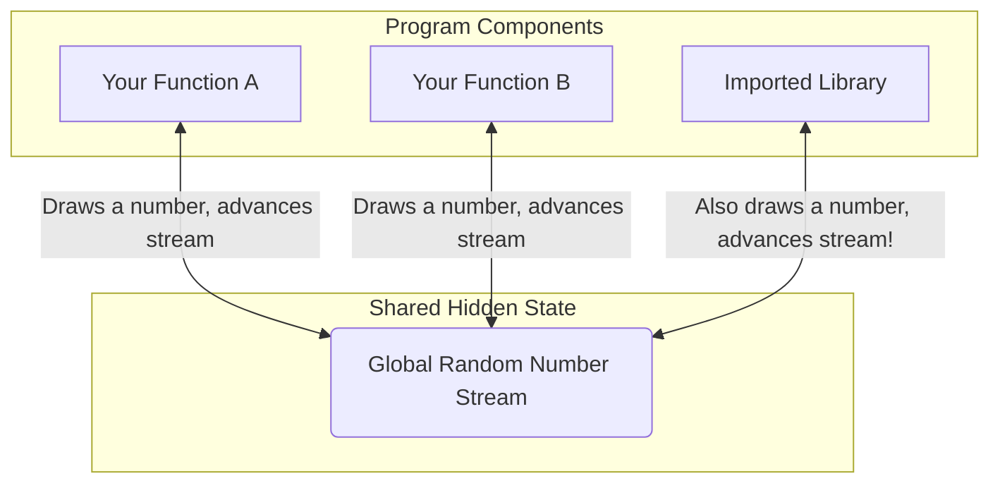

The Collaboration Challenge
===

A collaborator sends you their new Monte Carlo simulation for a paper.

**The email says:**  
> "Here's the script. It works great on my machine! Just run `python mc_simulation.py` and you should see the results."

You clone the repository and try to run it. This is where our journey begins.


<!-- speaker_note: This is the hook. We've all been here. We get code from someone, and the simple instructions 'just run it' immediately fail. This is the starting point for our debugging journey. -->

---

The Stakes: A Cautionary Tale
===

In 2010, economists Carmen Reinhart and Kenneth Rogoff published "Growth in a Time of Debt," a highly influential paper arguing that high public debt slows economic growth. It was widely cited to justify austerity policies worldwide.

**The problem:** A graduate student, Thomas Herndon, couldn't reproduce their results while trying to replicate their work for a class project.

**The fallout:**
- Herndon and his professors discovered critical errors in the original Excel spreadsheet.
- A simple formula error accidentally excluded the first 5 countries from a key average.
- The corrected analysis showed a much weaker link between debt and growth.
- The paper's central conclusion was undermined, sparking a global debate about the evidence behind austerity.

> This wasn't fraud; it was a computational error with massive real-world consequences. Reproducibility is the bedrock of scientific credibility.

<!-- speaker_note: This is a real, high-stakes example. The point is not to assign blame, but to show that reproducibility is a core ethical and scientific obligation. The failure wasn't just about code; it was about a chain of trust that broke down, starting with the inability to verify the original computational results. -->

---

Where Would You Start?
===

**The mystery:** Same code, same seed, different numbers.

What could cause this?


<!-- speaker_note: (Interactive) This is a critical interactive moment. Pause here. Ask students to think silently for 30 seconds, then discuss with a neighbor for 60 seconds. Walk around and listen. Then, solicit hypotheses and write them on the board. Validate all reasonable suggestions. Possible answers include -- Python version, library versions (NumPy, SciPy), OS differences, hardware architecture (Intel vs ARM), underlying math libraries (MKL vs OpenBLAS), environment variables (`PYTHONHASHSEED`), or even different compiler flags. This gets them invested in the debugging process. -->

---

Our Debugging Journey
===

The first challenge in collaboration isn't getting the *same* answer; it's getting *any* answer at all.

**Today, we'll tackle this from the ground up:**

1. **Get it running:** Solve the initial "it won't even start" problem.
2. **Get it right:** Ensure everyone gets the same results.
3. **Get it right, anywhere:** Build a workflow that is portable and robust.

Our goal: Move from "it works on my machine" to "it works, correctly, on **any** machine."

<!-- speaker_note: Frame the rest of the lecture. We are on a mission. First, we'll just get the code to execute. Then, we'll make sure it's correct and reproducible. This mirrors the real-world process of receiving code from a collaborator. -->


---

Attempt #1: Just Run It
===


Following our collaborator's instructions, we run the script. It immediately fails.

```bash
$ python mc_simulation.py
Traceback (most recent call last):
  File "/home/user/mc-project/mc_simulation.py", line 5, in <module>
    import scipy.stats
ModuleNotFoundError: No module named 'numpy'
```

> The script depends on a package (`numpy`) that isn't installed on our machine. The next logical step is to install it.

<!-- speaker_note: This is the first, most common failure mode. The code has dependencies that aren't on our system. The error is clear - ModuleNotFoundError. The obvious next step is to try and install it. -->

---

Attempt #2: The "Obvious" Fix
===

We try to install the missing package using `pip`.

```bash
$ pip install numpy
error: externally-managed-environment
× This environment is externally managed
╰─> To install Python packages system-wide, try apt install
    python3-xyz, or break the system packages with
    --break-system-packages.
...
note: If you believe this is a mistake, please contact your system's
      packager.
```
> We've hit a new wall. Our OS is actively preventing us from installing packages globally to protect its own tools. We need a way to manage dependencies for *this project* in an isolated way.

<!-- speaker_note: This is the crucial teaching moment. Explain what 'externally-managed-environment' means. This isn't an error to be bypassed with `--break-system-packages`; it's a sign that we need a better strategy. This problem perfectly motivates the need for virtual environments, which is our next topic. -->
---

The Core Problem: A Shared, Global Environment
===

The `externally-managed-environment` error is a symptom of a larger problem: by default, Python installations are **global**.

**This leads to two major issues:**
1.  **System Integrity:** Installing project-specific packages globally can break OS tools that depend on system Python (the error we just saw).
2.  **Project Conflicts:** Project A needs `numpy==1.26`, but Project B needs `numpy==2.0`. You can't have both installed globally at the same time.

> We need a way to create isolated, per-project environments.

<!-- speaker_note: Connect the specific error we saw to the general principle. The OS is protecting us from ourselves. The second point about conflicting project dependencies is the other key motivation. This sets up the solution perfectly. -->

---

Solution: Python Virtual Environments (`venv`)
===

The standard tool for this is `venv`. It creates a lightweight, self-contained directory with a project-specific Python installation and its own packages.

**The Workflow:**
1.  **Create** the environment (a new directory):

```bash
python3 -m venv sim_env
```

2.  **Activate** it (modifies your shell's PATH):

```bash
source sim_env/bin/activate
```
Your shell prompt will change to show `(sim_env)`.

3.  **Install** packages into the isolated environment:

```bash
pip install scipy numpy matplotlib
```
> Now, `python` and `pip` commands are local to this project. Deactivating (`deactivate`) or deleting the `sim_env` folder restores the global state.

<!-- speaker_note: Walk through each command. Emphasize that `venv` is just a directory. The 'magic' is in the `activate` script, which just prepends the venv's bin directory to the shell's PATH. Encourage them to `cat sim_env/bin/activate` to demystify it. -->

---

What are `pip` and PyPI?
===

- **[PyPI](https://pypi.org) (Python Package Index):** The official, community-hosted repository for nearly all open-source Python packages. Think of it as the App Store for Python.

- **`pip`:** The standard package installer for Python. It's the tool that downloads packages from PyPI and installs them into your environment.

When you run `pip install scipy`, `pip` connects to PyPI, finds the `scipy` package, resolves its dependencies (like `numpy`), and installs them.


<!-- speaker_note: Briefly explain this ecosystem. PyPI is the central library. pip is the librarian that fetches the books. Your virtual environment is your personal bookshelf. This mental model is very helpful. -->

---

Step 1: Documenting Dependencies
===

Now that our script runs, we must document its dependencies so others can replicate our environment. The standard is a `requirements.txt` file.

**A first attempt (`requirements.txt`):**
```text
# Our project's dependencies
numpy
scipy
matplotlib
```

**To install from the file:**
```bash
pip install -r requirements.txt
```

> **The Problem:** This installs the *latest* versions of these packages. Six months from now, "latest" will be different, and our code might break. This is not reproducible.

<!-- speaker_note: Explain that this is a good first step, but it's not enough for reproducibility. It documents *what* we need, but not *which version*. This leads directly to the need for pinning. -->

---

Step 2: Pinning Versions for Reproducibility
===

To ensure everyone uses the exact same code, we "pin" the versions using `==`.

**A reproducible `requirements.txt`:**
```text
# Pinned versions for reproducibility
numpy==1.26.4
scipy==1.12.0
matplotlib==3.8.3
```
Now, `pip install -r requirements.txt` will always install these exact versions.

**How to generate this file?**
After getting your code to work, run `pip freeze`:
```bash
pip freeze > requirements.txt
```
> `pip freeze` automatically captures the exact versions of all packages currently in your environment. This is the key to basic reproducibility.

<!-- speaker_note: This is the first major fix for reproducibility. Explain the `==` syntax. Then demo `pip freeze`. Show how it captures not just the packages we installed, but their dependencies too. This is a robust way to define an environment. -->
---

The Limit of `venv` and `pip`
===

We have a reproducible `requirements.txt`, but a new collaborator using Python 3.12 tries to install it...
```bash
(sim_env) $ pip install -r requirements.txt
```
<!-- pause -->


**The Problem:** Something in our pinned packages is not compatible with Python 3.12.

`venv` only isolates packages; it **cannot** change the version of Python itself. It just uses whatever `python3` you started with.

> We need a tool that can manage Python versions *for us*.

<!-- speaker_note: This is the next step in our staircase of problems. We solved package versions, but now the Python interpreter version itself is the problem. This is a very common and frustrating issue that `venv` alone cannot solve. -->

---

A Modern Solution: `uv`
===


`uv` is an extremely fast, all-in-one Python package manager developed by Astral (the creators of `ruff`).

**Why is it so popular?**
- **Blazing Fast:** Written in Rust, it's often 10-100x faster than `pip`.
- **All-in-One:** It's a single binary that replaces `pip`, `venv`, `pip-tools`, and more.
- **Drop-in Replacement:** You can use it with your existing `requirements.txt` files.

> `uv` solves many of the pain points of traditional Python packaging with a focus on speed and user experience.

<!-- speaker_note: Introduce uv as a modern, fast alternative. The key takeaway is speed and convenience. It's not a whole new ecosystem like Conda; it's a better, faster `pip` and `venv`. -->

---

`uv` in Action
===

`uv` can create a virtual environment with a specific Python version, solving our previous problem.

**1. Create an environment with Python 3.11:**
```bash
uv venv --python 3.11
```
`uv` will download and install Python 3.11 for you if it's not already available.

**2. Install dependencies (now it works!):**
```bash
uv pip install -r requirements.txt
```
> `uv` streamlines the workflow by managing both the Python interpreter and the packages within the environment.

<!-- speaker_note: Demo this workflow. Show how `uv venv --python <version>` is the magic command that solves the problem from the previous slide. Then show that `uv pip install` works just like `pip`, but much faster. -->

---

Ensuring Exact Environments: `uv pip sync`
===

While `uv pip install` adds packages, a more robust command is `sync`.

```bash
uv pip sync requirements.txt
```

**What `sync` does:**
- **Installs** any packages from `requirements.txt` that are missing.
- **Uninstalls** any packages in the environment that are *not* in `requirements.txt`.

> `uv pip sync` ensures the environment is an **exact** reflection of the requirements file, preventing issues from stray, manually-installed packages.

<!-- speaker_note: Explain the difference between `install` and `sync`. `install` is additive. `sync` is declarative - it makes the environment *exactly* match the file. This is more reproducible and prevents "it works for me" issues caused by extra packages being present in an environment. -->

---

A Deeper Problem: The Dependency Iceberg
===

Even with `uv` managing our Python environment, a new problem emerges: our numerical results *still* differ between machines.

**The Visible Dependencies (managed by `pip`/`uv`):**
- `numpy`, `scipy`, `matplotlib`

**The Hidden Dependencies (the rest of the iceberg):**
- **Numerical Libraries:** `MKL`, `OpenBLAS`, `LAPACK`. The linear algebra routines that `numpy` calls. Different libraries can give slightly different results.
- **System Libraries:** `glibc`, compilers (`gcc`), etc.
- **Hardware:** CPU architecture (x86 vs. ARM).

> `pip` and `uv` only manage the tip of the iceberg. For scientific code, the hidden part matters.

<!-- speaker_note: This is a key conceptual slide. Use the iceberg metaphor. The visible part is Python packages. The invisible, much larger part is the non-Python software stack. Emphasize that for numerical work, the choice of BLAS library is a critical, hidden dependency that `pip` and `uv` do not manage. -->

---

Solution: Conda for Full-Stack Management
===


Conda is a language-agnostic package and environment manager.

**Conda's Superpower:** It manages the *entire* software stack, not just Python packages.
- Python interpreters (like `uv`)
- Python packages (like `pip`)
- **And** non-Python libraries like MKL, CUDA, GCC, and more.

> Conda solves the "dependency iceberg" problem by managing dependencies from the hardware drivers all the way up to your Python script.

<!-- speaker_note: Introduce Conda as the solution to the full-stack problem. Its key differentiator is being language-agnostic and managing non-Python dependencies. This directly addresses the iceberg problem. -->

---

Conda Environments: `environment.yml`
===

Conda uses an `environment.yml` file to define the full stack.

```yaml
name: mc-sim-reproducible
channels:
  - conda-forge
dependencies:
  - python=3.11
  - numpy=1.26
  - scipy=1.12
  - mkl=2023.1 # Explicitly pin the BLAS library!
```

- **`channels`**: Locations where Conda looks for packages. `conda-forge` is the community-driven channel, like PyPI for the Conda ecosystem.
- **`dependencies`**: A list of all packages (Python and non-Python).

<!-- speaker_note: Walk through the `environment.yml` file. Explain what channels are and why `conda-forge` is the recommended default. The most important line to highlight is `mkl=...`. This is us taking control of the hidden part of the iceberg. -->

---

Conda in Practice: Using `micromamba`
===

`micromamba` is a lightweight, fast, standalone implementation of the Conda package manager. We'll use it for our demos as it's included in our development container.

**Workflow:**
1.  **Create the environment from the file:**

```bash
micromamba create -f environment.yml
```

2.  **Activate the environment:**

```bash
micromamba activate mc-sim-reproducible
```

> `micromamba` uses the same `environment.yml` files as Conda but provides a much faster and more focused experience.

<!-- speaker_note: Explain that `micromamba` is a modern, fast implementation of a conda package manager. The commands are slightly different from `conda` but the concepts and environment files are identical. This is what we will use in our demos. -->

---

The Final Challenge: Ultimate Portability
===

Even with Conda, we can face issues:
- A collaborator is on Windows and struggles with setup.
- The HPC cluster doesn't have Conda installed.
- A cloud service requires a specific deployment format.

We need to package our *entire* environment—OS, libraries, and code—into a single, runnable unit that works anywhere.

**Two approaches:**
1.  **Virtual Machines (VMs):** Heavyweight, slow, but fully isolated.
2.  **Containers:** Lightweight, fast, and the modern standard.

<!-- speaker_note: Set up the final problem. Conda is great, but it doesn't solve every portability issue. We need to package the whole OS. This introduces the classic VM vs. Container comparison. -->

---

Virtual Machines vs. Containers
===


| Virtual Machine (VM) | Container |
|---|---|
| **Heavyweight** (GBs) | **Lightweight** (MBs) |
| Full Guest OS | Shares Host OS Kernel |
| Slow to boot (minutes) | Fast to start (seconds) |
| Hardware virtualization | OS-level virtualization |

> Containers provide the isolation of a VM without the overhead, making them perfect for shipping scientific code.

<!-- speaker_note: This is a key conceptual difference. A VM emulates hardware and runs a whole new OS. A container is just an isolated process on the host's OS. This is why containers are so much smaller and faster. -->

---

What is a Container?
===

A container is a standard process on your OS, but with a crucial difference: it's **isolated** using Linux kernel features (namespaces and cgroups).

- **Image:** A read-only template containing an application and its dependencies (e.g., `ubuntu:22.04`, `python:3.11-slim`).
- **Container:** A live, running instance of an image.
- **Dockerfile:** A text file recipe for building an image.
- **Registry:** A place to store and share images (like Docker Hub).


> The **OCI (Open Container Initiative)** standard ensures that images built with one tool (like Docker) can be run by another (like Podman).

<!-- speaker_note: Define the key terms. The image is the blueprint, the container is the running house. The Dockerfile is the recipe. The OCI standard is what makes this ecosystem interoperable. -->

---

The `Dockerfile`: A Recipe for an Image
===

This file defines the steps to build our environment.

```dockerfile
# 1. Start from an official, minimal base image
FROM python:3.11-slim

# 2. Set the working directory inside the container
WORKDIR /app

# 3. Copy requirements and install dependencies
# (This step is cached if requirements.txt doesn't change)
COPY requirements.txt .
RUN pip install --no-cache-dir -r requirements.txt

# 4. Copy the rest of the application code
COPY . .

# 5. Define the default command to run
CMD ["python", "mc_simulation.py"]
```
> Each instruction creates a new "layer" in the image. This allows for efficient caching and rebuilding.

<!-- speaker_note: Walk through a well-structured Dockerfile. Explain each command. Emphasize the layer caching optimization - by copying requirements.txt first, we only reinstall packages when that specific file changes. -->

---

The Core Container Workflow
===

[Image Placeholder]: # (Diagram of the build-run-push-pull container workflow – ./img/container_workflow.png)
[Suggested Search]: # (docker build run push pull diagram)

1.  **Build:** Create an image from a `Dockerfile`.
```bash
docker build -t mc-sim-app .
```
2.  **Run:** Execute a command in a new container from the image.
```bash
docker run --rm mc-sim-app
```
3.  **Push:** Upload your image to a registry to share it.
```bash
docker push your-username/mc-sim-app
```
4.  **Pull:** A collaborator downloads the image.
```bash
docker pull your-username/mc-sim-app
```
> This workflow ensures that everyone is running the exact same bits, from the OS up.

<!-- speaker_note: Explain the full lifecycle. You build locally, run to test, push to share, and others pull to reproduce. The `--rm` flag is good practice for one-off tasks as it cleans up the container after it exits. -->

---

Interacting with Containers
===

Sometimes you need an interactive shell inside your container for debugging.

**Get an interactive shell:**
```bash
# -it gives you an interactive terminal
docker run -it --rm mc-sim-app /bin/bash
```

**Manage running containers:**
```bash
# List currently running containers
docker ps

# Stop a running container by name or ID
docker stop <container_id>
```
> The `-it` flag is your key to exploring and debugging your containerized environment interactively.

<!-- speaker_note: Explain the `-it` flag for interactive sessions. This is crucial for debugging. Show `docker ps` to see what's running and `docker stop` to manage it. -->

---

Managing Images
===

Your local machine can fill up with images.

**List local images:**
```bash
docker images
```

**Tag an image before pushing:**
```bash
# Tag your local image with your Docker Hub username
docker tag mc-sim-app your-username/mc-sim-app:v1.0
```

**Remove an image:**
```bash
docker rmi mc-sim-app
```
> Tagging is essential for versioning and sharing images on a registry.

<!-- speaker_note: Show students how to see the images they've built. Explain that tagging is like giving an alias to an image, which is necessary before pushing to a remote registry like Docker Hub. -->

---

Container Housekeeping
===

Docker can consume a lot of disk space with old images, stopped containers, and build caches.

**The magic command to clean up:**
```bash
docker system prune
```
This command will remove:
- All stopped containers
- All networks not used by at least one container
- All dangling images (untagged)
- All build cache

**For a deeper clean (use with caution!):**
```bash
docker system prune -a --volumes
```
> Run `docker system prune` periodically to reclaim disk space.

<!-- speaker_note: This is a very practical and important tip. Warn students that Docker can eat disk space. `docker system prune` is the go-to command to fix it. Explain what it does and why it's safe to run. -->

---

Automating with Scripts
===

For any non-trivial project, encapsulate your Docker commands in scripts.

**`build.sh`:**
```bash
#!/usr/bin/env bash
set -euo pipefail
IMAGE_NAME="your-username/mc-sim-app:latest"
docker build -t "$IMAGE_NAME" .
echo "Built image: $IMAGE_NAME"
```

**`run.sh`:**
```bash
#!/usr/bin/env bash
set -euo pipefail
IMAGE_NAME="your-username/mc-sim-app:latest"
# Mount current directory's 'output' folder into container's /app/output
docker run --rm -v "$(pwd)/output:/app/output" "$IMAGE_NAME"
```
> Scripts make your workflow reproducible and easier for others to use.

<!-- speaker_note: Show how simple shell scripts can make the Docker workflow much more manageable. Explain the `build.sh` and `run.sh` pattern. Highlight the `-v` flag for mounting volumes, which is how you get data (like results) out of a container. -->

---

Advanced Environments: Spack for HPC
===

Spack is a package manager designed for High-Performance Computing (HPC). You will encounter it on the Harvard cluster.

**What is it?**
- A flexible package manager for building and installing software from source.
- Manages massive, complex software stacks with thousands of versions and configurations.

**Why is it used on clusters?**
- It allows multiple versions of the same software (e.g., `gcc@10`, `gcc@11`) to coexist.
- It can optimize builds for the specific hardware of the cluster.

```bash
# Example: Load a specific version of a tool on a cluster
spack load python@3.10.4
```
> Think of Spack as a system-level tool for cluster admins, while Conda/uv are for users to manage their own project environments.

<!-- speaker_note: Explain that Spack is what enables the `module load` systems on many HPC clusters. It's designed to solve the problem of "I need this specific version of this compiler with this specific version of this library, optimized for this CPU." It's a different level of the stack than what we've discussed. -->

---

The Ultimate Reproducibility: Nix
===


Nix is a package manager and build system that takes reproducibility to its theoretical limit.

**The Core Idea:**
- It treats package builds like pure functions.
- The inputs (source code, dependencies, build scripts, compiler flags) are cryptographically hashed.
- The output is stored in a unique path derived from the hash (e.g., `/nix/store/s2...-python-3.11.5`).

> If the inputs are identical, the output is **guaranteed** to be bit-for-bit identical, across any machine.

<!-- speaker_note: Introduce Nix as the "final boss" of reproducibility. The key concept is that builds are pure functions. Explain the hash-based storage path. This guarantees that you are running the exact same binary as your collaborator. -->

---

Nix in Practice: Declarative Environments
===

The most powerful feature of Nix for developers is creating temporary, on-demand environments.

**No installation needed:**
```bash
# This command gives you a shell with numpy and scipy
# without installing them permanently.
nix-shell -p python311Packages.numpy python311Packages.scipy
```

You can also define an entire development environment in a `shell.nix` file.

> Nix allows you to pop into a perfectly defined, isolated environment for a specific task and then have it vanish. It's the ultimate "clean room."

<!-- speaker_note: The killer feature for day-to-day work is `nix-shell`. Demo the `-p` command. Explain that this is like creating and activating a venv in one step, but it's guaranteed to be the same everywhere and doesn't leave a directory behind. It's powerful but has a steeper learning curve. -->

---

Summary: Choosing the Right Tool
===

Start simple and escalate as your project's needs grow. It's about choosing the appropriate tool for the job, not always reaching for the most complex one.

<!-- column_layout: [1, 1] -->
<!-- column: 0 -->
## **`venv` + `pip`**: For solo projects.
- **Feature**: Isolates Python packages.
- **Trade-off**: Fast & small, but Python-only.

## **`uv`**: For most Python projects.
- **Feature**: Fast, all-in-one, manages Python versions.
- **Trade-off**: Python-only, still uses system libraries.

## **`conda` / `mamba`**: For numerical/scientific teams.
- **Feature**: Manages full stack (inc. MKL).
- **Trade-off**: Solves numerical dependencies, but larger environments.

<!-- column: 1 -->
## **`container`**: For publication/deployment.
- **Feature**: Packages entire OS for maximum portability.
- **Trade-off**: More setup required.

## **`Spack`**: For HPC/shared clusters.
- **Feature**: Manages complex compiled software.
- **Trade-off**: System-level tool, not for user projects.

## **`Nix`**: For ultimate reproducibility.
- **Feature**: Bit-for-bit identical builds.
- **Trade-off**: Highest reproducibility, but steep learning curve.
<!-- reset_layout -->

> **The Workflow:** Start with `uv`. If you hit system library issues, move to `conda`. For ultimate portability and publication, use a `container`.

<!-- speaker_note: This slide synthesizes the last section. Walk through the two columns, explaining that the tools represent a staircase of increasing isolation and complexity. The key takeaway is to match the tool to the project's needs. You don't always need a container. -->

---

The Unreliable Results
===

We've containerized our environment. Everything matches perfectly.

**New experiment:** Run a bootstrap analysis (1000 resamples) to get confidence intervals.

```bash
$ docker run mc-sim-bootstrap
Bootstrap CI: [8.76, 9.03]
$ docker run mc-sim-bootstrap  # Run again
Bootstrap CI: [8.52, 9.21]
```

> Same container, different confidence intervals. **Why?**

<!-- pause -->


<!-- speaker_note: This is the second major 'twist'. We have solved the environment problem, but running the same container twice gives different results. This should be surprising. Give students a minute to think-pair-share. What could possibly vary *inside* an identical container? Guide them toward random numbers. -->

---

The Culprit: Uncontrolled Randomness
===

Let's trace through what happens without explicit seed management.

```python
# In mc_simulation.py (original version)
import numpy as np

def simulate_walks(n_walks, n_steps):
    # Uses global numpy random state!
    steps = np.random.randint(0, 4, size=(n_walks, n_steps))
    # ... rest of simulation
```

> Every run starts from a different random state → different results.

<!-- speaker_note: Reveal the culprit. Show the problematic code. The key phrase is 'global numpy random state'. Explain that older NumPy code encouraged using a single, hidden, shared stream of random numbers. -->

---

Demo: Global State Chaos
===

**Demo:** `./01_demo_reproducibility_fail.py`

```python
# The OLD way - global state
np.random.seed(42)
value1 = np.random.random()  # 0.374540

# Another function uses randomness
def unrelated_function():
    return np.random.random()  # Advances global state!

x = unrelated_function()  # Advances the stream

# Try to reproduce, but the state has changed
np.random.seed(42)
_ = unrelated_function()
value2 = np.random.random() # Different from value1!
```

> Global state makes reproducibility fragile and order-dependent.

<!-- speaker_note: (Demo) Run `01_demo_reproducibility_fail.py`. This is a critical demo. Show how `np.random.seed(42)` seems to work, but then an 'unrelated' function call advances the global random stream, breaking reproducibility. This demonstrates the fragility of global state. -->

---

Why Global State Fails
===



**The fundamental problem:**
- Single hidden stream shared by a whole program
- Any function can advance it
- Order of operations matters
- Library updates can change call patterns

> In complex projects, global state is impossible to control.

<!-- speaker_note: Use the diagram to visualize the problem. The 'Global RNG Stream' is a single resource that any part of your code (and imported libraries) might be drawing from. It is impossible to track who is advancing the stream. -->

---

The Modern Solution: Isolated Generators
===

**Demo:** `./02_demo_reproducibility_fix.py`

```python
# The NEW way - explicit generators
from numpy.random import default_rng

def monte_carlo_pi(n_samples, rng=None):
    """Estimate π using Monte Carlo."""
    if rng is None:
        rng = default_rng()  # Non-reproducible if not provided
    
    x = rng.uniform(-1, 1, n_samples)
    y = rng.uniform(-1, 1, n_samples)
    inside = np.sum(x**2 + y**2 <= 1)
    return 4 * inside / n_samples

# Reproducible usage
rng = default_rng(42)
pi_estimate = monte_carlo_pi(10000, rng)  # Always 3.1408
```

> Generators are objects you control, not hidden global state.

<!-- speaker_note: (Demo) Run `02_demo_reproducibility_fix.py`. This shows the modern, correct approach. Explain the key pattern - create a Generator object with `default_rng(seed)`, then pass this object explicitly to any function that needs it. Other parts of the code can have their own generators without interference. -->

---

The Complete Pattern
===

This ensures your paper's Figure 3 is always reproducible:

```python
# main_analysis.py
SEED = 12345  # Document this in your paper!
rng = np.random.default_rng(SEED)
print(f"Using random seed: {SEED}")

# Pass to all stochastic functions
distances = simulate_walks(N_WALKS, N_STEPS, rng)
bootstrap_ci = compute_bootstrap_ci(distances, rng)
```

> One seed, explicitly passed everywhere = perfect reproducibility.

<!-- speaker_note: Summarize the best practice. At the top of your main script, create ONE main random number generator with a documented seed. Then, pass this `rng` object down to every function that performs a stochastic operation. This makes the flow of randomness explicit and traceable. -->

---

Gotcha #2: Environment Variables
===

Some environment variables silently affect reproducibility:

```bash
# Python 3.3+ dictionary/set iteration order
export PYTHONHASHSEED=0  # Reproducible
export PYTHONHASHSEED=random  # Default, non-reproducible
```

> For complete reproducibility, control `PYTHONHASHSEED` in your scripts.

<!-- speaker_note: Introduce `PYTHONHASHSEED` as another subtle source of non-reproducibility for dictionary/set ordering. The fix is to set it to a fixed value in run scripts. Briefly mention that other variables like `OMP_NUM_THREADS` also affect results in parallel code, but that is a more advanced topic. -->

---

Gotcha #3: Shell Script Portability
===

**Email from cluster admin:**
> "Your script fails with: `/bin/bash: bad interpreter: No such file or directory`"

**The problem:** Hardcoded paths
```bash
#!/bin/bash  # Assumes bash is at /bin/bash
```

**The solution:** Use `env` to find in PATH
```bash
#!/usr/bin/env bash
```

> Small change, huge portability improvement.

<!-- speaker_note: This is a common, practical problem when moving to a server or cluster. The fix is to use `#!/usr/bin/env bash`, which tells the system to find the `bash` executable in the user's PATH, making scripts much more portable. -->

---

The Bulletproof Pipeline
===

**Demo:** `run_analysis.sh` - Your computational lab notebook

```bash
#!/usr/bin/env bash
set -euo pipefail  # Fail fast on errors

# Create timestamped results directory
RESULTS_DIR="results_$(date +%Y%m%d_%H%M%S)"
mkdir -p "$RESULTS_DIR"

# Log EVERYTHING
{
    echo "Git hash: $(git rev-parse HEAD)"
    pip list
} >> "$RESULTS_DIR/run.log"

# Run analysis, appending output to log
python3 mc_simulation.py 2>&1 | tee -a "$RESULTS_DIR/run.log"
```

<!-- speaker_note: (Demo) Showcase `run_analysis.sh` as the culmination of our efforts. This is a reproducible recipe for an entire analysis. Walk through its key features - `set -euo pipefail`, a timestamped results directory, and comprehensive logging. This log file becomes your digital lab notebook. -->

---

When Reproducibility Fails: Debugging
===

**Demo:** `setup.sh` - Systematic environment checking

```bash
# Check Python version
PYTHON_VERSION=$(python3 -c 'import sys; print(f"{sys.version_info.major}.{sys.version_info.minor}")')
if [ "$PYTHON_VERSION" != "3.10" ]; then
    echo "Warning: Expected Python 3.10, got $PYTHON_VERSION"
fi

# Verify package versions match requirements
pip list --format=freeze > current.txt
diff requirements.txt current.txt || echo "Package mismatch detected!"
```

> Automate your debugging - don't rely on memory.

<!-- speaker_note: (Demo) Introduce `setup.sh` as a diagnostic tool. When a collaborator has a problem, your first response should be 'can you run `./setup.sh` and send me the output?'. Show how it systematically checks for common problems. This automates debugging. -->

---

Your Reproducible Workflow
===

Let's synthesize our debugging journey into a robust, reusable workflow.

> This is the structure that emerged from fixing our simulation.

<!-- speaker_note: This is the final section, where we synthesize everything into a reusable template. Frame this as the 'ideal' project structure that emerged from our debugging journey. It is a prescriptive guide for their own projects. -->

---

The Structure That Emerged
===

**What we built while fixing our simulation:**
```text
mc-project/
├── README.md              # Start here - always!
├── requirements.txt # For quick setup
├── environment.yml        # For numerical work
├── Dockerfile             # For publication
├── setup.sh               # Checks everything
├── run_analysis.sh        # Runs everything
└── mc_simulation.py       # Our actual work
```

> This structure captures our entire reproducible process.

<!-- speaker_note: Walk through the file structure. Explain the purpose of each file, linking it back to the problems we solved. `README.md` is the entry point, `requirements.txt` solves versions, `Dockerfile` solves portability, and the scripts automate checking and execution. This is their blueprint. -->

---

Progressive Enhancement Strategy
===

You don't need everything at once. Start simple and add complexity as needed.

1. **Exploration:** `requirements.txt` (unpinned)
2. **Sharing with a colleague:** `requirements.txt` + `venv`
3. **Numerical work:** `environment.yml` (Conda)
4. **Publication/collaboration:** `Dockerfile`
5. **Repeated runs:** `run_analysis.sh`

> Match the tool to the project's current stage.

<!-- speaker_note: Reassure them that they do not need this entire structure for every small script. The key is 'progressive enhancement'. Start simple, and add more layers of reproducibility as the project grows in complexity or importance. This makes the advice practical. -->

---

Testing Before Sharing
===

**The "clean machine" test:**

1. `git clone` your project into a new directory
2. Run `setup.sh` → Does the environment check pass?
3. Create a `venv` → Does it work cleanly?
4. Run `run_analysis.sh` → Does the full pipeline complete?
5. Check `results/` → Are the outputs correct?

> The golden rule: If you can't reproduce it, neither can they.

<!-- speaker_note: This is one of the most important slides. Call it the 'clean machine test'. Before you send code to anyone, you must go through these steps. The golden rule is simple - if you cannot follow your own instructions to reproduce your work, it is guaranteed that no one else can either. -->

---

Version Control Integration
===

**What to track with `git`:**
- All environment files (`requirements.txt`, `environment.yml`, `Dockerfile`)
- All scripts (`setup.sh`, `run_analysis.sh`)
- Your source code (`mc_simulation.py`)

**What NOT to track:**
- The virtual environment itself (`sim_env/`)
- Python cache files (`__pycache__/`)
- Output directories (`results_*/`)

<!-- speaker_note: Connect reproducibility to version control. Explain what should and should not be tracked in `git`. You track the source (code, scripts, environment files), but you do not track the products (virtual environments, output files). This is what `.gitignore` is for. -->

---

Example `.gitignore`
===

This file tells `git` what to ignore. We've added one to `lec03/code/.gitignore`:

```gitignore
# Python virtual environments created by demo scripts
demo_env/
venv_demo/

# Python cache files
__pycache__/
*.pyc

# Output directories and files from analysis scripts
results_*
walk_analysis.png
*.log
```

> Keep your repository clean and focused on source files.

<!-- speaker_note: Briefly show the example `.gitignore` from the lecture code. Explain that this file tells `git` to ignore the specified files and directories. Point out the patterns for ignoring virtual environments, Python cache, and results. This keeps the repository clean. -->

---

Tagging for Publication
===

When you generate results for a paper, tag that exact version of the code.

```bash
# After generating final figures
git add -A
git commit -m "Generate final figures for Nature paper"
git tag -a v1.0-nature -m "Code for Nature submission, Jan 2025"
git push origin v1.0-nature
```

**In your paper:**
> "Code is available at github.com/user/repo, tag `v1.0-nature`."

<!-- speaker_note: This is a crucial practice for academic integrity. When you generate final figures for a paper, `git tag` that specific commit. This creates a permanent, human-readable pointer to the exact version of the code used. In your paper, you can then cite this tag, providing an unambiguous link between your publication and your code. -->

---

From Chaos to Confidence
===

**Where we started:**
> "It works on someone's machine!"

**Where we are now:**
> "It works on ANY machine!"

**The tools we mastered:** `venv`/`uv` → `conda`/`micromamba` → `Docker`  
**The practices we adopted:** Document → Isolate → Automate → Test

<!-- speaker_note: This is the first wrap-up slide. Summarize the journey. We started with a chaotic, unreliable situation and ended with a robust, trustworthy workflow. Reiterate the tools and practices that got us here. This reinforces the main takeaways. -->

---

Resources
===

<!-- column_layout: [1, 1] -->
<!-- column: 0 -->
**Course Materials**
- All lecture code: `am215_lectures/lec03/code/`

**Tools**
- [`uv`](https://astral.sh/uv): The fast Python package installer.
- [`conda`](https://conda.io/en/latest/): Full-stack environment management.
- [`micromamba`](https://mamba.readthedocs.io/en/latest/user_guide/micromamba.html): A fast `conda` alternative.
- [`Docker`](https://docs.docker.com/): Containerization for portability.
- [`Nix`](https://nixos.org/): The ultimate reproducible build system.

<!-- column: 1 -->
**Further Reading**
- [The Python Packaging Guide](https://packaging.python.org/)
- [The Turing Way: Reproducibility](https://book.the-turing-way.org/reproducible-research/overview)
- [NumPy's Random Number Generation](https://numpy.org/doc/stable/reference/random/index.html)
- [Reinhart-Rogoff: The Excel Error](https://www.bbc.com/news/magazine-22223190)
- [Floating Point Math](https://docs.python.org/3/tutorial/floatingpoint.html)

<!-- reset_layout -->

> Start small, build up as needed.

<!-- speaker_note: Point them to the resources. The `code/` directory for this lecture contains all the demo scripts for them to experiment with. Encourage them to explore the links, especially The Turing Way for general principles and the tool documentation for specific problems. Reiterate the main message - start small and build up. -->
