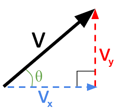
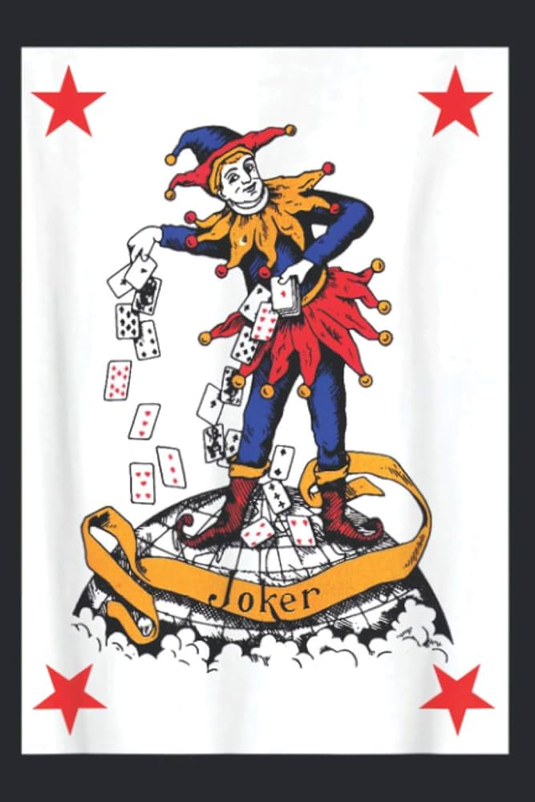
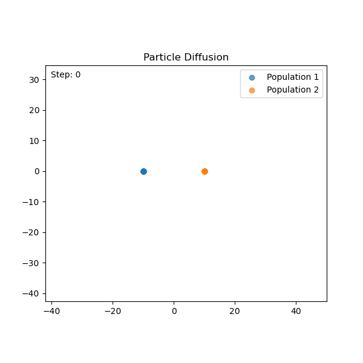

From Functions to Frameworks
===

So far, we've written scripts and functions. But as our models grow, we need a better way to organize our code.

**The Challenge:** How do we bundle related data and behavior together into logical, reusable, and intuitive components?

**Today's Goal:** Move from writing standalone functions to designing robust, class-based APIs for scientific computing.


---

Today's Roadmap
===

We will build our understanding of object-oriented design by example:

1.  **A `Vector` Class**: Learn how operator overloading (`__add__`, `__mul__`) and properties (`@property`) create intuitive APIs.
2.  **Decorators Deep Dive**: Demystify decorators by building a `@time_it` function wrapper from scratch.
3.  **A `Deck` of Cards**: See how implementing a simple protocol (`__len__`, `__getitem__`) enables powerful "duck typing."
4.  **A Particle Simulation**: Synthesize all concepts to build a flexible simulation framework with inheritance and metaprogramming.


---

The Basics — A `Vector` Class
===

We'll start with a simple mathematical object to explore how Python's core features allow us to build intuitive tools.



---

The Simplest Possible Class
===

Let's start with an empty class. We can create an instance and then manually assign attributes to it.

```python +exec
class Vector:
    pass

v = Vector()
v.x = 3
v.y = 4

print(v.x, v.y)
```
> This works, but it's tedious and error-prone. There's no guarantee that every `Vector` instance will have an `x` and a `y`.

---

A Proper Constructor with `__init__`
===

The `__init__` method is our first "dunder" method. It's a constructor that runs when an object is created, ensuring every instance is properly initialized.

```python +exec
class Vector:
    def __init__(self, x, y):
        self.x = x
        self.y = y

v = Vector(3, 4)
print(v)
```
> We've solved the initialization problem, but now printing the object is useless. It doesn't show the vector's state.

---

A Developer-Friendly Representation (`__repr__`)
===

The `__repr__` method provides the **official** string representation of an object. It should be unambiguous and, ideally, allow you to recreate the object.

```python +exec
class Vector:
    def __init__(self, x, y):
        self.x = x
        self.y = y

    def __repr__(self):
        return f"Vector({self.x}, {self.y})"

v = Vector(3, 4)
print(v)

# The repr is valid Python code!
v2 = eval(repr(v))
print(v2)
```
> The goal of `__repr__` is to be informative for the developer. If `__str__` is not defined, `print()` falls back to using `__repr__`.

---

A User-Friendly Representation (`__str__`)
===

The `__str__` method provides a "pretty" or user-friendly string representation. It's what `print()` and `str()` use.

```python +exec
class Vector:
    def __init__(self, x, y):
        self.x = x
        self.y = y

    def __repr__(self):
        return f"Vector({self.x}, {self.y})"

    def __str__(self):
        return f"({self.x}, {self.y})"

v = Vector(3, 4)
print(v)
print(repr(v))
```
> **Rule:** Implement `__repr__` for your developers (and your future self). Implement `__str__` for your users.

---

Making Vectors Addable
===

What happens when we try to add two vectors?

```python +exec
class Vector:
    def __init__(self, x, y):
        self.x = x
        self.y = y
    def __repr__(self):
        return f"Vector({self.x}, {self.y})"

v1 = Vector(2, 3)
v2 = Vector(10, 20)
v1 + v2
```
> Python doesn't know what `+` means for our new type. We have to teach it by implementing the `__add__` dunder method.

---

Implementing `__add__`
===

When Python sees `v1 + v2`, it calls `v1.__add__(v2)`.

```python +exec
class Vector:
    def __init__(self, x, y):
        self.x = x
        self.y = y
    def __repr__(self):
        return f"Vector({self.x}, {self.y})"
    def __add__(self, other):
        if not isinstance(other, Vector):
            return NotImplemented
        return Vector(self.x + other.x, self.y + other.y)

v1 = Vector(2, 3)
v2 = Vector(10, 20)
print(v1 + v2)
```
> The special value `NotImplemented` signals that our method can't handle the operation for the given type, allowing Python to try other options.

---

Unary vs. Binary Operators: `__neg__` and `__sub__`
===

The `-` symbol is overloaded: it can be a *unary* operator (negation) or a *binary* operator (subtraction). We must implement both.

```python +exec
class Vector:
    def __init__(self, x, y):
        self.x = x
        self.y = y
    def __repr__(self):
        return f"Vector({self.x}, {self.y})"
    def __neg__(self):
        return Vector(-self.x, -self.y)

v = Vector(3, 4)
print(-v)
```
> `__neg__` handles the unary case. But `v1 - v2` will still fail.

---

Reusing Logic for `__sub__`
===

We can implement subtraction by elegantly reusing the logic we've already built for addition and negation.

```python +exec
class Vector:
    def __init__(self, x, y): self.x=x; self.y=y
    def __repr__(self): return f"Vector({self.x}, {self.y})"
    def __add__(self, other):
        if not isinstance(other, Vector): return NotImplemented
        return Vector(self.x + other.x, self.y + other.y)
    def __neg__(self): return Vector(-self.x, -self.y)
    def __sub__(self, other):
        if not isinstance(other, Vector): return NotImplemented
        return self + (-other)

v1 = Vector(10, 20)
v2 = Vector(3, 4)
print(v1 - v2)
```
> `v1 - v2` becomes `v1.__sub__(v2)`, which we've defined as `v1 + (-v2)`. This calls `v1.__add__(v2.__neg__())`.

---

Scalar Multiplication
===

What about `v * 2`? And more trickily, `2 * v`?

```python +exec
class Vector:
    def __init__(self, x, y): self.x=x; self.y=y
    def __repr__(self): return f"Vector({self.x}, {self.y})"
    def __mul__(self, scalar):
        return Vector(self.x * scalar, self.y * scalar)

v = Vector(3, 4)
print(v * 2)

# This will raise a TypeError
print(2 * v)
```
> `v * 2` works, but `2 * v` fails. Why? Because `(2).__mul__(v)` is called first, and the `int` type doesn't know how to multiply by a `Vector`.

---

How Operators *Really* Work: The Dispatch Protocol
===

When Python sees `x * y`, it follows a precise protocol:

1.  It calls `x.__mul__(y)`.
2.  If that method doesn't exist, or if it returns `NotImplemented`, Python tries the reverse: `y.__rmul__(x)`.
3.  If that also fails, it raises a `TypeError`.

> This two-step protocol is the core mechanism that makes Python's operators so flexible. It gives both operands a chance to handle the operation.

---

The Dispatch Protocol in Action: `__rmul__`
===

To handle `2 * v`, we implement the "right-multiply" method, `__rmul__`.

1.  Python tries `(2).__mul__(v)`. This returns `NotImplemented`.
2.  Python tries the reverse: `v.__rmul__(2)`.
3.  Our class implements this, so the call succeeds.

```python +exec
class Vector:
    def __init__(self, x, y): self.x=x; self.y=y
    def __repr__(self): return f"Vector({self.x}, {self.y})"
    def __mul__(self, scalar):
        return Vector(self.x * scalar, self.y * scalar)
    def __rmul__(self, scalar):
        return self.__mul__(scalar)

v = Vector(3, 4)
print(2 * v)
```
> Implementing `__rmul__` makes our class a good citizen that can participate in operations even when it's on the right-hand side.

---

A Dynamic Attribute (`@property`)
===

We want a `magnitude` attribute. A naive approach is to calculate it in `__init__`.

```python +exec
class Vector:
    def __init__(self, x, y):
        self.x = x
        self.y = y
        # This is calculated once and never updated!
        self.magnitude = (x**2 + y**2)**0.5

v = Vector(3, 4)
print(f"Initial magnitude: {v.magnitude}")
v.x = 0
print(f"Magnitude after change: {v.magnitude}")
```
> The magnitude is now out of sync with the components. It should be computed dynamically.

---

The Solution: `@property`
===

A method is one option (`v.magnitude()`), but it feels like an attribute. The `@property` decorator gives us the best of both worlds.

```python +exec
import math

class Vector:
    def __init__(self, x, y):
        self.x = x
        self.y = y

    @property
    def magnitude(self):
        """A read-only computed property."""
        return math.sqrt(self.x**2 + self.y**2)

v = Vector(3, 4)
print(f"Initial magnitude: {v.magnitude}")
v.x = 0
print(f"Magnitude after change: {v.magnitude}")
```
> The `@property` decorator lets us expose a computed value as a clean, read-only attribute, creating a robust and intuitive API.

---

A Deeper Look at Decorators
===

We just used `@property`. But what *is* a decorator?

Decorators are Python's most common tool for **metaprogramming**—the idea of writing code that operates on other code. They allow us to modify or extend the behavior of functions and classes dynamically.

**Why is this useful?**
-   **Reduces boilerplate**: Apply common logic (like timing or logging) to many functions without rewriting it.
-   **Increases flexibility**: Allows a framework to automatically discover and register components, like the different `Walker` types we'll build for our diffusion simulation.

> In short, decorators let us add behavior to functions or classes in a clean, reusable way.

---

Decorators as Closures
===

A decorator is a higher-order function that takes another function as input and returns a *new* function that wraps the original. The `@` syntax is just "syntactic sugar" for this:

```python
# This syntax...
@time_it
def my_function():
    # ... do work ...

# ...is equivalent to this:
def my_function():
    # ... do work ...
my_function = time_it(my_function)
```

The returned wrapper is a **closure**: it's an inner function that "remembers" the original `my_function` from its enclosing scope, even after the outer function (`time_it`) has finished executing.


---

Example: A Timing Decorator
===

Let's build a simple decorator to time how long a function takes to run.

```python +exec
import time

def time_it(func):
    """A decorator that prints the execution time of a function."""
    def wrapper(*args, **kwargs):
        """The wrapper function that adds timing behavior."""
        start = time.perf_counter()
        result = func(*args, **kwargs)
        end = time.perf_counter()
        print(f"'{func.__name__}' took {end - start:.4f}s to execute.")
        return result
    return wrapper

@time_it
def do_work(duration):
    """A simple function that simulates work by sleeping."""
    time.sleep(duration)

do_work(0.1)
```
> This pattern (a function that defines and returns an inner `wrapper` function) is the standard way to build decorators. But it has a hidden problem.

---

The Problem: Lost Metadata
===

Our decorator works, but it obscures the identity of the original function. Introspection tools now see the `wrapper`, not `do_work`.

```python +exec
import time

def time_it(func):
    def wrapper(*args, **kwargs):
        """I am the wrapper function."""
        # ...
        return func(*args, **kwargs)
    return wrapper

@time_it
def do_work(duration):
    """I am the original do_work function."""
    time.sleep(duration)

print(f"Function name: {do_work.__name__}")
print(f"Docstring: {do_work.__doc__}")
```
> This is bad for debugging and breaks tools that rely on introspection. The original function's metadata has been replaced by the wrapper's.

---

The Solution: `functools.wraps`
===

The `functools` module provides a decorator specifically to solve this problem.

```python +exec
import time
import functools

def time_it(func):
    @functools.wraps(func)
    def wrapper(*args, **kwargs):
        """I am the wrapper function."""
        # ...
        return func(*args, **kwargs)
    return wrapper

@time_it
def do_work(duration):
    """I am the original do_work function."""
    time.sleep(duration)

print(f"Function name: {do_work.__name__}")
print(f"Docstring: {do_work.__doc__}")
```
> `@functools.wraps` is itself a decorator that copies the name, docstring, and other metadata from the original function to the wrapper. **Always use it.**

---

Custom Containers — A `Deck` of Cards
===

Let's model something more complex: a deck of cards. This will force us to think about how to create our own **container** objects and manage different kinds of behavior.

**The Motivation:** We want to build components for a card game simulation, like Blackjack. This requires a deck that can be shuffled, drawn from, and even constructed in special ways for game variants.


---

The Basic `Card` and `Deck`
===

A `Card` is a simple data object. A `Deck` is a **container** that holds and manages `Card` objects.

```python
class Card:
    def __init__(self, rank, suit):
        self.rank = rank
        self.suit = suit
    def __repr__(self):
        return f"Card('{self.rank}', '{self.suit}')"

class Deck:
    def __init__(self):
        # This is an "internal" attribute
        self._cards = [...]
```
> We use a single underscore prefix (`_cards`) to signal that this attribute is for the class's internal use and not part of its public API. This is a key convention for **encapsulation**.

---

Python's "Private" Attributes
===

Python doesn't have true private variables. The underscore is a convention.

- **Single Underscore (`_name`):** A convention that means "this is for internal use." You can still access it, but you shouldn't. We can see it with `vars()`:
```python
>>> deck = Deck()
>>> vars(deck)
{'_cards': [Card('2', '♠'), ...]}
```

- **Double Underscore (`__name`):** Triggers **name mangling**. Python renames the attribute to `_ClassName__name`. This isn't for privacy; it's to avoid naming conflicts in subclasses during inheritance (which will be covered shortly).

> The goal is to design a clean public API. The underscore conventions help communicate that intent.

---

The Container "Contract"
===

To make our `Deck` behave like a Python sequence (like a `list`), we need to implement the container **protocol**—an implicit contract.

```python
# In the Deck class...
def __len__(self):
    """Enables the `len()` built-in function."""
    return len(self._cards)

def __getitem__(self, position):
    """Enables indexing and slicing (`deck[i]`, `deck[i:j]`)."""
    return self._cards[position]
```
> By implementing just these two dunder methods, we get a huge amount of functionality for free.

---

The Payoff: Duck Typing
===

Because our `Deck` object now "walks and talks" like a sequence, Python's built-in functions know how to work with it.

```python
>>> import random
>>> from code.deck import Deck
>>> deck = Deck()

>>> len(deck)
52

>>> deck[0]  # First card
Card('2', '♠')

>>> random.choice(deck) # Works because deck has __len__ and __getitem__
Card('K', '♡')
```
> This is **Duck Typing**: "If it walks like a duck and quacks like a duck, then it must be a duck." We didn't have to register our class or inherit from `list`; we just implemented the right methods.

---

Instance Methods
===

Methods that modify the state of a *specific* object are called **instance methods**. They always take `self` as their first argument.

```python
# In the Deck class...
import random

def shuffle(self):
    """Shuffles the cards in this deck."""
    random.shuffle(self._cards)

def draw(self):
    """Removes and returns the top card from this deck."""
    return self._cards.pop()
```
> They need `self` to access `self._cards`. Calling `deck.shuffle()` modifies that specific `deck` object. This is the default and most common method type.

---

Building a Blackjack Game
===

Where should the rules for Blackjack live? Inside the `Deck` class?

> No. A `Deck` should manage cards; it shouldn't know the rules of every possible game. This is the principle of **separation of concerns**. We'll create a new `BlackjackGame` class to encapsulate the rules.

```python
class BlackjackGame:
    # Game logic will go here...
    pass
```

---

Static Methods for Utility Logic
===

To play Blackjack, we need to calculate a hand's value. This logic is related to the game, but it doesn't depend on the state of a specific game instance.

> This is a self-contained utility function. It belongs in the `BlackjackGame` class for organization, but it doesn't need access to any state. This is the job of a `@staticmethod`.

```python
# In the BlackjackGame class...
@staticmethod
def get_hand_value(hand):
    """Calculates the Blackjack value of a hand of cards."""
    # ... logic to handle aces and face cards ...
    return value
```

---


Extending the Framework
===

<!-- column_layout: [2, 1] -->
<!-- column: 0 -->
What if we want to play "Joker Blackjack," where the deck has a Joker and any hand with it is an automatic 21?

This requires two changes:
1.  A different kind of deck.
2.  A different set of rules.

> A good design should allow us to add this new functionality without rewriting existing code. This is the **Open/Closed Principle**: open for extension, closed for modification.
<!-- column: 1 -->


<!-- reset_layout -->


---

Class Methods for Alternative Construction
===

To create our special deck, we can add a **factory** to the `Deck` class. This is the perfect use case for a `@classmethod`.

```python
# In the Deck class...
@classmethod
def create_deck_with_joker(cls):
    """A factory method to create a 53-card deck with a Joker."""
    deck = cls()  # Creates a new standard deck instance
    deck._cards.append(Card('Joker', '🃏'))
    return deck
```
> A class method receives the class (`cls`) as its first argument, not the instance (`self`). This allows it to call the constructor (`cls()`) to create a new instance in a special configuration.

---

Extending Game Logic with Inheritance
===

To handle the new rules, we create a `JokerBlackjackGame` class that **inherits** from `BlackjackGame`. We override `get_hand_value` to add the new logic.

```python
class JokerBlackjackGame(BlackjackGame):
    @staticmethod
    def get_hand_value(hand):
        """Overrides the base method to handle the Joker rule."""
        if any(card.rank == 'Joker' for card in hand):
            return 21
        # Fall back to the original logic for hands without a Joker
        return super().get_hand_value(hand)
```
> We use `super()` to call the parent's version of the method. This lets us **extend** the original logic rather than completely replacing it, keeping our design clean and avoiding code duplication.

---

Running the Simulations
===

Our flexible design allows us to easily swap components to run different scenarios and compare the outcomes. The `simulation.py` script does exactly this, running simulations for:
1.  **Standard Game** vs. **Joker Game**
2.  **Blind Player Strategy** (stands on 17+) vs. **Informed Player Strategy** (also considers dealer's card)

The script generates a plot comparing the player's wealth trajectories across these four scenarios, allowing us to analyze the impact of game rules and player strategy.

> This is the power of a good API: the final application code is a simple script that combines our components to answer interesting questions.

---

Alternative Design Questions
===

Our design works, but it's not the only way. Good design involves trade-offs.

-   Should `Hand` be its own class? If so, adding a card could be `hand += card` by implementing `__iadd__`.
```python
# In a hypothetical Hand class...
def __iadd__(self, card):
    self._cards.append(card)
    return self
```
-   Should `Player` and `Dealer` be classes with `wealth` and `strategy` attributes?
-   For games like Poker, comparing hands is key. This would require **rich comparison methods** like `__eq__` and `__lt__` on a `Hand` class.
```python
# In a hypothetical Hand class...
def __lt__(self, other):
    return self.value < other.value
```

---

Modeling Questions and Insights
===

These simulations are not just toy examples; they are tools for generating insight. We can use our framework to answer real modeling questions:

-   What is the optimal player strategy given the dealer's fixed rules?
-   How does the player's long-term expected wealth (the drift of the random walk) change if we use six decks instead of one?
-   Can we quantify the exact advantage the player gains in the Joker variant?

> By building flexible, class-based models, we can run computational experiments to understand and make predictions about complex systems.


---

Building an Extensible Simulation Framework
===

Let's synthesize our concepts to build a simulation of diffusing particles. Our goal is to create a flexible API that allows us to easily define and run different types of random walks.

- **Standard Walk**: $\vec{x}_{t+1} = \vec{x}_t + \vec{\delta}_t$, where $\vec{\delta}_t \sim \text{Uniform}(-1, 1)$
- **Biased Walk**: $\vec{x}_{t+1} = \vec{x}_t + \vec{\delta}_t + \vec{c}$, where $\vec{c}$ is a constant drift vector.

We'll model this system by creating `Particle` objects and different `Walker` classes that control their movement.




---

Controlling State with Setters
===

Our `Particle` will store its position in Cartesian coordinates (`x`, `y`), but what if we want to interact with it using polar coordinates (`r`, `theta`)?

```python
# code/diffusion/particle.py
class Particle:
    def __init__(self, x, y):
        self.x = x
        self.y = y

    @property
    def r(self):
        return math.sqrt(self.x**2 + self.y**2)

    @r.setter
    def r(self, new_r):
        """Scales the particle's position to a new radius."""
        if self.r == 0: return
        ratio = new_r / self.r
        self.x *= ratio
        self.y *= ratio
```
> A **setter** provides a controlled way to modify an object's internal state through a clean, attribute-based API.

---

Using the Setter Property
===

The setter allows us to interact with the particle using an intuitive polar coordinate API, while the object handles the complexity of keeping the underlying Cartesian coordinates consistent.

```python +exec
# Assume Particle class from previous slide
import math
class Particle:
    def __init__(self, x, y): self.x = x; self.y = y
    @property
    def r(self): return math.sqrt(self.x**2 + self.y**2)
    @r.setter
    def r(self, new_r):
        if self.r == 0: return
        ratio = new_r / self.r
        self.x *= ratio; self.y *= ratio

p = Particle(3, 4)
print(f"Initial: x={p.x:.2f}, y={p.y:.2f}, r={p.r:.2f}")

# Use the setter to change the radius
p.r = 10
print(f"After p.r = 10: x={p.x:.2f}, y={p.y:.2f}, r={p.r:.2f}")
```
> The benefit is a cleaner, more intuitive interface. The user can think in terms of radius and angle, and the object guarantees its internal `x` and `y` state is always valid.
---

Enforcing a Contract: Abstract Base Classes
===

Our simulation needs to work with any object that can "walk". How do we formalize what "can walk" means?

```python
# code/diffusion/walkers.py
from abc import ABC, abstractmethod

class RandomWalker(ABC):
    """An abstract base class defining the walker API contract."""

    @abstractmethod
    def move(self, particle):
        """Move the particle according to the walker's rules."""
        pass
```
> An **Abstract Base Class (ABC)** defines an interface. Any concrete class that inherits from `RandomWalker` *must* provide an implementation for the `move` method, or Python will raise a `TypeError`.


---

Specializing Behavior: Inheritance
===

As with our `JokerBlackjackGame`, we use inheritance to create specialized behavior. Here, we create concrete `Walker` classes that fulfill the `RandomWalker` contract.

```python
# code/diffusion/walkers.py
import random
class StandardWalker(RandomWalker):
    """A simple walker that takes a random step."""
    def move(self, particle):
        particle.x += random.uniform(-1, 1)
        particle.y += random.uniform(-1, 1)

class BiasedWalker(RandomWalker):
    """A walker that tends to move to the right."""
    def move(self, particle):
        particle.x += random.uniform(0, 2) # Biased step
        particle.y += random.uniform(-1, 1)
```
> Here, inheritance isn't about reusing parent code (the ABC is empty). It's about **conforming to a contract**. This guarantees that any `RandomWalker` subclass will have a `move` method, allowing our simulation to treat all walkers polymorphically, knowing they will have the required functionality.


---

Automating Extensibility with Metaprogramming
===

Just as decorators let us modify functions, other metaprogramming tools let us modify classes. How can our simulation *automatically discover* all the `Walker` types we've defined?

We can use `__init_subclass__` to create a self-registering system.

```python
# In the RandomWalker base class...
class RandomWalker(ABC):
    WALKER_REGISTRY = {}

    def __init_subclass__(cls, **kwargs):
        super().__init_subclass__(**kwargs)
        # Register the new subclass by its name, but not the ABC itself
        if cls.__name__ != "RandomWalker":
            RandomWalker.WALKER_REGISTRY[cls.__name__] = cls
        print(f"Registered walker: {cls.__name__}")
```
> **Why do this?** This makes the framework truly plug-and-play. The main simulation script can now select a walker by name (`"BiasedWalker"`) without ever having to import it explicitly. To add a new walker type, you just create a new file with a new class; the framework finds it automatically.

---

Diffusion Demonstration
===

We've built a flexible framework. Now let's use it.

The `run_simulation.py` script uses our components:
1.  It creates two populations of `Particle` objects.
2.  It looks up a `Walker` class from the registry by name.
3.  It loops through time, calling `walker.move(particle)` for each particle.
4.  It uses an `animate` module to generate a visualization.

```bash
# To run directly (from the code/ directory):
python diffusion/run_simulation.py

# Or, to run inside a container (from the code/ directory):
cd diffusion
./docker_build.sh
./docker_run.sh
```

> By designing our components with clean, class-based APIs, the final application code becomes simple, readable, and easy to extend.


---

Summary: Building Better Tools
===

We've built a powerful mental model for structuring code by leveraging Python's data model.

- **Dunder Methods**: Implement protocols (`__add__`, `__len__`) to enable operator overloading and achieve **duck typing**.
- **Properties & Method Types**: Use `@property` for controlled attribute access, `@staticmethod` for utility functions, and `@classmethod` for alternative constructors.
- **Decorators**: Create wrappers (like `@time_it`) to add behavior to functions in a clean, reusable way.
- **Inheritance & ABCs**: Extend functionality (`JokerGame`) and define formal API contracts (`RandomWalker`) for reliable, polymorphic code.
- **Metaprogramming**: Automate framework behavior, like the self-registering `Walker` classes, to create plug-and-play systems.

> The goal is to design APIs that are **intuitive, predictable, and extensible**.


---

Resources
===

**Course Materials**
- All lecture materials & code: `https://code.harvard.edu/AM215/main_2025/tree/main/am215_lectures/lec04`

**Further Reading**
- [Python's Data Model](https://docs.python.org/3/reference/datamodel.html) (The official reference)
- [Fluent Python](https://www.oreilly.com/library/view/fluent-python-2nd/9781492056348/) by Luciano Ramalho (The definitive guide to this topic)
- [Primer on Python Decorators](https://realpython.com/primer-on-python-decorators/)
- [Python's `super()`: An In-Depth Guide](https://realpython.com/python-super/)
- [Python Descriptors: An Introduction](https://realpython.com/python-descriptors/) (The mechanism behind `@property`)
- [A Guide to Python Metaclasses](https://realpython.com/python-metaclasses/) (Related to `__init_subclass__`)

