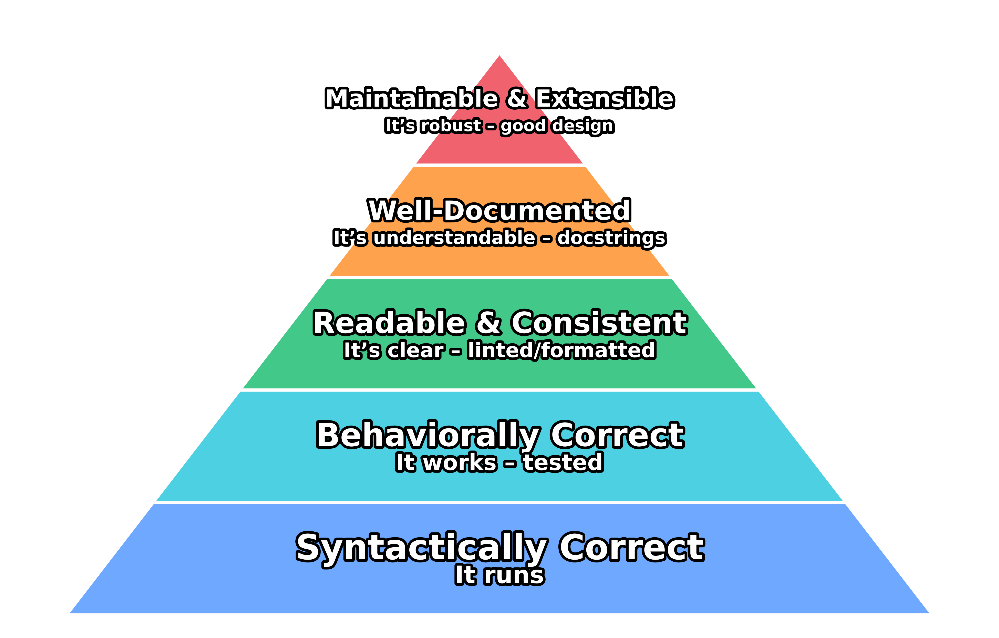
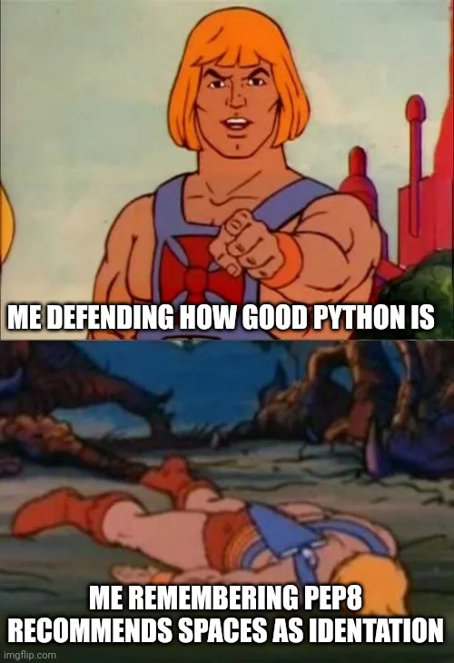
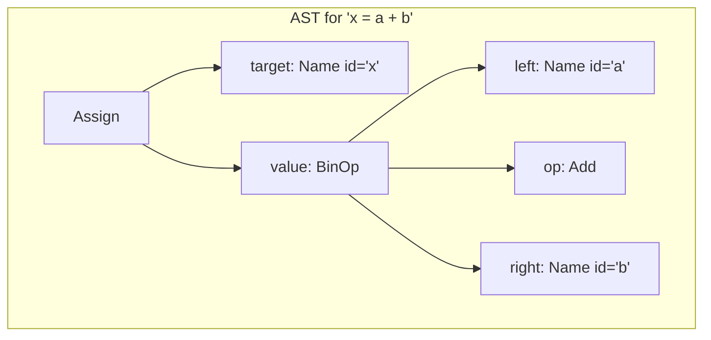
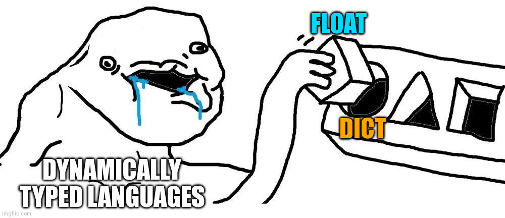
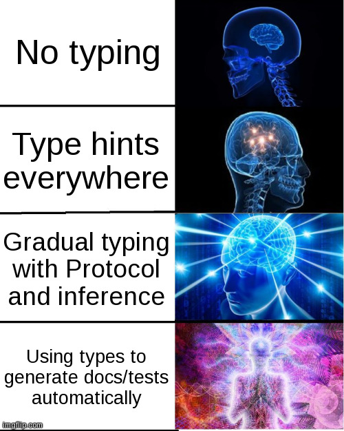
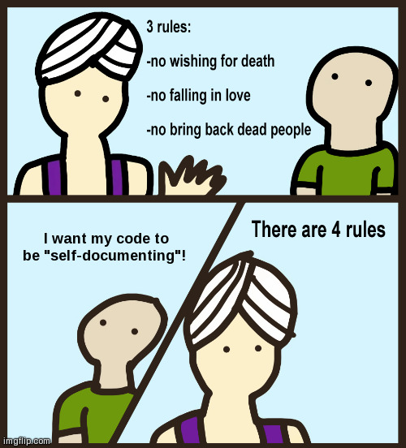
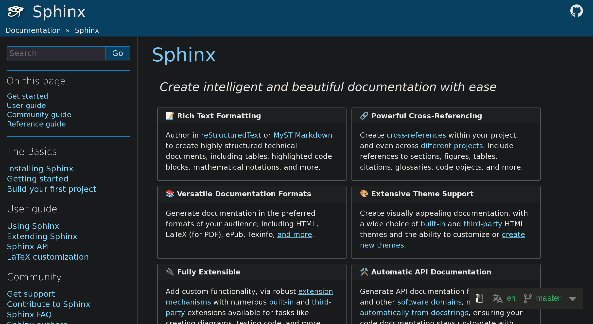
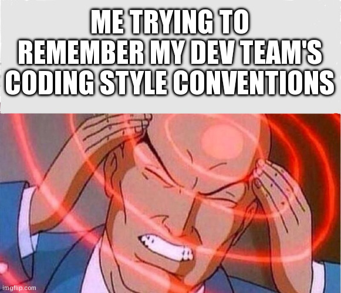
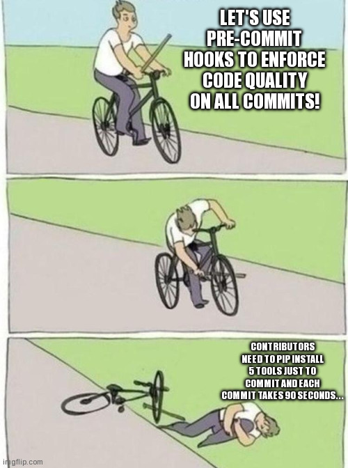

Today's Roadmap
===

## **1. Why Code Quality Matters**
Moving beyond correctness to build trust and reduce cognitive load.

## **2. Static Assurance**
Using tools like linters and type checkers to find bugs before running code.

## **3. Communicating Through Documentation**
Writing effective docstrings that serve as contracts and user guides.

## **4. Automation & Integration**
Embedding quality standards into our workflow with `pyproject.toml` and CI.

---

<!-- jump_to_middle -->
Part 1: Why Code Quality Matters
===

---

Beyond Correctness
===

In previous lectures, we've focused on making our code work correctly and reproducibly.

-   **Lec 3 (Reproducibility):** Ensured our environment and results are deterministic.
-   **Lec 6 (Testing):** Verified that our code's *behavior* is correct.


> But code that is correct is not necessarily code that is **usable**, **maintainable**, or **trustworthy**.

Passing tests doesn't mean the code is easy to understand, review, or extend.

---

The Code Quality Pyramid
===

We can think of code quality as a hierarchy of needs.



> Today, we focus on climbing from Level 2 to Level 5. The goal is to reduce **cognitive load** for our collaborators and our future selves.

---
The Problem: Inconsistent Style
===

Which of these is "correct"?

<!-- column_layout: [1, 1] -->
<!-- column: 0 -->
**Developer A:**
```python
def process_data(data,
                 threshold=0.5):
    if (len(data) > 0):
        return [x for x in data if x > threshold]
    else:
        return []
```

<!-- column: 1 -->
**Developer B:**
```python
def process_data(data, threshold=0.5):
    if len(data) == 0:
        return []
    return [
        x for x in data
        if x > threshold
    ]
```
<!-- reset_layout -->

> Both run, but inconsistent style makes code harder to read and code reviews noisy. We waste cognitive energy on trivialities.

---

Format Example: The "Noisy" Diff
===

Imagine a code review. The only logical change was adding `new_param`. The rest is just style noise.

```diff
- def process_data(data, threshold=0.5, old_param=True):
+ def process_data(
+     data, threshold=0.5, old_param=True, new_param=False
+ ):
      # ...
-     result = [item for item in data if item > threshold]
+     result = [
+         item for item in data if item > threshold
+     ]
      return result
```

> **Problem:** It's hard to spot the meaningful change. The reviewer has to work harder to separate style from substance. An auto-formatter prevents this by ensuring a consistent style *before* the code is committed.

---

Format Example: Quotes and Spacing
===

This code is functionally correct, but visually jarring and inconsistent.

**Before Formatting:**
```python
my_dict = {'key1':"value1",
    'key2' : "value2"}

x=1+2
y = 3  *  4
```

**After Formatting (`ruff format .`):**
```python
my_dict = {"key1": "value1", "key2": "value2"}

x = 1 + 2
y = 3 * 4
```
> A formatter enforces consistent use of quotes (e.g., double quotes) and spacing around operators, making the code easier to parse visually.

---

Format Example: Line Breaks & Trailing Commas
===

Long lines are hard to read and cause horizontal scrolling.

**Before Formatting:**
```python
# This line is > 100 characters long
important_settings = {"user": "admin", "permissions": ["read", "write", "execute"], "retries": 3, "timeout": 60, "log_level": "info"}
```

**After Formatting:**
```python
important_settings = {
    "user": "admin",
    "permissions": ["read", "write", "execute"],
    "retries": 3,
    "timeout": 60,
    "log_level": "info", # <-- Trailing comma!
}
```
> The formatter breaks the dictionary into multiple lines. The trailing comma makes it so adding a new key-value pair only changes one line in a `git diff`.

---

Another Problem: Hidden Bugs
===

This code runs without error. But can you spot the problems?

```python
import sys
import numpy
import os # Unused import

def calculate_mean(data):
    # This works, but what if `data` is empty?
    # It will raise a `RuntimeWarning`.
    return numpy.mean(data)

def process_file(path):
    # This shadows the built-in `open`
    open = get_custom_opener()
    with open(path, "r") as f:
        return f.read()
```

> Relying on human memory to spot these issues is unreliable and doesn't scale.

---

Lint Example: Unused Imports
===

This code runs, but it's confusing.

```python
import sys
import numpy
import os # <-- Linter warning: Unused import `os`

def get_platform():
    # This function only uses the `sys` module.
    return sys.platform
```

> **Why it's a problem:**
> -   **Cognitive Load:** A reader might wonder, "Where is `os` used? Am I missing something?"
> -   **Maintenance:** It pollutes the namespace and can hide dependencies that are no longer needed.
>
> A linter automatically detects and can even remove this dead code.

---

Lint Example: Shadowing Built-ins
===

This is a very common and dangerous mistake.

```python
# The developer wants a list of numbers
list = [1, 2, 3]
print(list)

# Later, they try to convert a tuple to a list...
my_tuple = (4, 5, 6)
# This will fail! `list` is no longer the type, it's the variable.
new_list = list(my_tuple) # <-- TypeError: 'list' object is not callable
```

> A linter will immediately flag `list = [1, 2, 3]` with a warning like: `Redefinition of built-in 'list'`. This prevents the downstream `TypeError`.

---

Lint Example: Mutable Default Arguments
===

This is one of the most infamous "gotchas" in Python.

```python
def add_item(item, target_list=[]):
    target_list.append(item)
    return target_list

# First call seems to work
l1 = add_item("a") # -> ["a"]
print(f"l1: {l1}")

# Second call has a surprising result!
l2 = add_item("b") # -> ["a", "b"]
print(f"l2: {l2}")
```
> **The Bug:** The default list `[]` is created *once*, when the function is defined, not each time it's called. A linter detects this pattern and suggests the correct idiom: `target_list=None` and creating a new list inside the function.

---

<!-- jump_to_middle -->
Part 2: Static Assurance
===

---

The Goal: Static Assurance
===

> Let the computer find and fix predictable errors, so human reviewers can focus on what matters: **design, intent, and scientific validity.**

**Static analysis** tools read your code without executing it. This allows them to catch entire classes of bugs and style issues automatically, *before* your code runs.

We'll look at two main categories:
1.  **Linting & Formatting:** Enforcing consistency and finding hidden bugs.
2.  **Type Checking:** Verifying the "shapes" of your data match your intent.

---

The Standard: PEP 8
===

The problem of clashing code styles is so common that the Python community created **PEP 8**, the official style guide for Python code.

<!-- column_layout: [1,1] -->
<!-- column: 0 -->
It provides conventions for:
-   **Line length:** Max 79 characters for code, 72 for docstrings.
-   **Indentation:** 4 spaces per indentation level.
-   **Imports:** Should be at the top of the file, grouped in a standard order.
-   **Whitespace:** Around operators and after commas.
-   **Naming:** `snake_case` for functions and variables, `PascalCase` for classes.

<!-- column: 1 -->

<!-- reset_layout -->
> Following a consistent style guide is more important than any single rule. An auto-formatter makes this effortless.

---

The Historical Formatter: `black`
===

To solve the problem of inconsistent style, the community developed opinionated auto-formatters. The most influential was `black`.


-   **Philosophy:** "The Uncompromising Code Formatter."
-   **Goal:** End debates over style by providing one single, deterministic style. It is not configurable.
-   **Impact:** `black` popularized the idea of handing over all style decisions to an automated tool, enforcing a strict subset of PEP 8.

> `black` was a game-changer, but it only solved formatting. Developers still needed other tools to find bugs.

---

The Historical Linter Ecosystem
===


For finding bugs (linting), developers had to combine several different tools:
<!-- column_layout: [1,1] -->
<!-- column: 0 -->
-   **`flake8`:** A popular wrapper that bundled basic style checks (`pycodestyle`) and simple bug detection (`pyflakes`).
-   **`pylint`:** A much more powerful (and often slower and "noisier") linter that performs deeper code analysis.
-   **`isort`:** A specialized tool that did only one thing: sort import statements alphabetically and into sections.

<!-- column: 1 -->

<!-- reset_layout -->

> **The Problem:** Managing, configuring, and running this collection of separate, slow tools was complex and a common source of friction for projects.

---

The Modern, Unified Tool: `ruff`
===

`ruff` is an extremely fast, all-in-one tool written in Rust that replaces the entire historical ecosystem.

<!-- column_layout: [1, 1] -->
<!-- column: 0 -->
**It is a formatter:**
Replaces `black` and `isort`.
```bash
# Format code
ruff format .
```

**It is a linter:**
Replaces `flake8`, `pylint`, and many other plugins.
```bash
# Find and fix issues
ruff check --fix .
```

<!-- column: 1 -->
**Why `ruff`?**
-   **Speed:** It is 10-100x faster than the tools it replaces.
-   **Simplicity:** One tool to install, configure, and run.
-   **Compatibility:** It can be configured to be a drop-in replacement for `black` and `flake8`.
<!-- reset_layout -->

> This unified workflow is fast, simple, and makes code reviews easier because diffs are minimal and focused on logic, not style.

---

How Static Analysis Works: The AST
===

Tools like `ruff` don't just read text; they parse your code into an **Abstract Syntax Tree (AST)**. This tree represents the code's grammatical structure.



By "walking" this tree, a tool can understand the code's structure and enforce rules.

---

Inspecting the AST with `ast.dump`
===

The `ast.dump()` function gives a detailed, unambiguous view of the tree's structure. It's more verbose than a diagram but essential for debugging.

<!-- column_layout: [1, 1] -->
<!-- column: 0 -->
**Source:**
```python
import ast

code = "x = a + b"
tree = ast.parse(code)

# Get a developer-friendly view of the tree
print(ast.dump(tree, indent=4))
```
<!-- column: 1 -->
**Output:**
```text
Module(
    body=[
        Assign(
            targets=[
                Name(id='x', ctx=Store())],
            value=BinOp(
                left=Name(id='a', ctx=Load()),
                op=Add(),
                right=Name(id='b', ctx=Load())))],
    type_ignores=[])
```
<!-- reset_layout -->
> This detailed output shows every node and its attributes, like `ctx=Store()` (for assignment) vs. `ctx=Load()` (for usage).

---

Analyzing with `ast.NodeVisitor`
===

The `ast.NodeVisitor` class provides a way to walk the AST and execute code for every node of a certain type. It's perfect for collecting information without changing the code.

**Example: Find all imported modules.**
```python
import ast

class ImportCollector(ast.NodeVisitor):
    def __init__(self):
        self.imports = set()

    def visit_Import(self, node):
        for alias in node.names:
            self.imports.add(alias.name)
        self.generic_visit(node)

source = "import numpy as np\nimport os"
tree = ast.parse(source)
collector = ImportCollector()
collector.visit(tree)
print(collector.imports) # -> {'numpy', 'os'}
```
> The visitor pattern lets you write clean, targeted functions (`visit_Import`, `visit_FunctionDef`, etc.) that operate on specific parts of your code's structure.

---

Modifying the AST with `ast.NodeTransformer`
===

To change the code, we use `ast.NodeTransformer`. It's similar to `NodeVisitor`, but its `visit_*` methods can **return a new node** to replace the original one.

<!-- column_layout: [1, 1] -->
<!-- column: 0 -->
-   **Return a new node:** Replaces the original node in the tree.
-   **Return `None`:** Removes the node from the tree.
-   **Return the original node:** The tree remains unchanged.

This allows for powerful, programmatic refactoring of source code.

> The key difference: `NodeVisitor` is for *reading*, `NodeTransformer` is for *writing*.

<!-- column: 1 -->
**Example: Replacing a node**
```python
# Before: 2 + 3
# Transformer replaces `Add` with `Sub`
def visit_Add(self, node):
    return ast.Sub()
# After: 2 - 3
```

**Example: Removing a node**
```python
# Before: pass
# Transformer removes `Pass` nodes
def visit_Pass(self, node):
    return None
# After: (empty line)
```
<!-- reset_layout -->

---

AST Example: A Simple Code Transformer
===

Let's write a transformer that finds all string literals and converts them to uppercase.

```python
import ast

class UppercaseStrings(ast.NodeTransformer):
    def visit_Constant(self, node):
        # In modern Python, strings are `Constant` nodes.
        # In older Python, they were `Str` nodes.
        if isinstance(node.value, str):
            # Create a new node with the modified value
            return ast.Constant(value=node.value.upper())
        return node

source = 'print("Hello, world!")'
tree = ast.parse(source)

transformer = UppercaseStrings()
new_tree = transformer.visit(tree)
```
> After this runs, `new_tree` represents the code `print("HELLO, WORLD!")`. But it's still a tree object. How do we get back to source code?

---

AST Example: A Mini-Linter
===

Let's write a tiny linter that flags functions with too many parameters, a common sign of poor design.

```python
# mini_linter.py
import ast
import sys

class FuncVisitor(ast.NodeVisitor):
    def visit_FunctionDef(self, node):
        # Rule: A function should not have more than 5 parameters.
        if len(node.args.args) > 5:
            print(
                f"Linter Warning: {node.name} at line {node.lineno} "
                f"has {len(node.args.args)} parameters (> 5)."
            )
        self.generic_visit(node) # Continue visiting child nodes

# Read a file, parse it into an AST, and visit the nodes.
source_code = open(sys.argv[1]).read()
tree = ast.parse(source_code)
FuncVisitor().visit(tree)
```
> This is the core principle behind all static analysis tools. They define rules by inspecting the structure of the code's AST.

---

Reconstructing Code with `ast.unparse`
===

The `ast.unparse()` function (available in Python 3.9+) takes a modified AST and converts it back into valid Python source code.

<!-- column_layout: [1,1] -->
<!-- column: 0 -->
**Completing our example:**
```python
# (continued from previous slide)
import ast

# ... UppercaseStrings transformer definition ...

source = 'print("Hello, world!")'
tree = ast.parse(source)
transformer = UppercaseStrings()
new_tree = transformer.visit(tree)

# Convert the new tree back to a string
new_code = ast.unparse(new_tree)
print(new_code)
**Completing our example:**
```
<!-- column: 1 -->
**Output:**
```python
print('HELLO, WORLD!')
```
> This completes the cycle: `code -> AST -> modified AST -> new code`. This is the foundation of tools like `ruff`, which not only find issues but can also automatically fix them.
<!-- reset_layout -->
---

The Problem: Dynamic Type Errors
===

Python is **dynamically typed**: type errors are only caught when the code is executed.

<!-- column_layout: [1, 1] -->
<!-- column: 0 -->
**The Code:**
```python
def get_final_items(items):
    # The author assumes `items`
    # is a list of numbers.
    print(f"Processing {len(items)} items")
    return items[-1]

# This works
get_final_items([10, 20, 30])

# This fails at runtime!
get_final_items(123)
```

<!-- column: 1 -->
**The Runtime Error:**
```text
Traceback (most recent call last):
  File "<stdin>", line 1, in <module>
  File "<stdin>", line 3, in get_final_items
TypeError: object of type 'int' has no len()
```


<!-- reset_layout -->

> We want to find these bugs *statically*—before we run a long simulation. In contrast, **statically-typed** languages (like C++ or Rust) would catch this before the program even runs.

---

The Solution: Type Hints & Checkers
===

**Step 1: Add Type Hints**
We annotate our code to declare our intent. This is a form of documentation.

```python
def get_final_items(items: list[int]) -> int:
    print(f"Processing {len(items)} items")
    return items[-1]
```

**Step 2: Run a Type Checker**
A static analysis tool reads the hints and validates them. Python itself does *not* enforce them at runtime.

```bash
# ty is a modern, fast type checker
# mypy is another popular choice
ty check .
```
```text
error: Argument 1 to "get_final_items" has incompatible type "int"; expected "list[int]"
```
> Type hints + a checker turn runtime errors into static analysis errors.

---

The `typing` Module: A Vocabulary for Types
===

For more complex types, Python provides the `typing` module.

<!-- column_layout: [1, 1] -->
<!-- column: 0 -->
**Common Primitives:**
```python
from typing import List, Dict, Tuple, Optional, Union

# Python 3.9+
ids: List[int]
scores: Dict[str, float]
# Python 3.10+ allows | syntax
ids: list[int]
scores: dict[str, float]
```

<!-- column: 1 -->
**Composing Types:**
```python
# A value that can be a string or None
user_id: Optional[str]
# Same as:
user_id: str | None

# A value that is an int or a float
value: Union[int, float]
# Same as:
value: int | float
```
<!-- reset_layout -->

> This vocabulary allows us to precisely describe the data our functions expect and return.

---

Advanced Types: `Protocol`
===

How do you type-hint an object that needs to behave a certain way (e.g., have `.fit()` and `.predict()` methods) without forcing it to inherit from a specific base class?

Use `typing.Protocol` to define an interface based on **behavior (duck typing)**, not inheritance.

```python
from typing import Protocol
import numpy as np

class TrainableModel(Protocol):
    """A protocol for objects that can be trained and used for prediction."""
    def fit(self, X: np.ndarray, y: np.ndarray) -> None:
        ... # The "..." is a literal part of the syntax
    def predict(self, X: np.ndarray) -> np.ndarray:
        ...

def evaluate_model(model: TrainableModel, X_test, y_test):
    # The type checker now knows `model` has .fit and .predict methods.
    predictions = model.predict(X_test)
    # ... calculate accuracy ...
```
> This decouples your functions from specific implementations, making your code more flexible and reusable—perfect for comparing different scientific models.

---

From Types to Tests
===
If you know the *shape* of your data, you can make the computer test it for you.
<!-- column_layout: [1,1] -->
<!-- column: 0 -->
```python
from hypothesis import given
from hypothesis.strategies import floats, lists
from typing import Sequence

def mean(xs: Sequence[float]) -> float:
    return sum(xs) / len(xs)

@given(lists(floats(min_value=0, max_value=1), min_size=1))
def test_mean(xs):
    y = mean(xs)
    assert 0 <= y <= 1

```
<!-- column: 1 -->

<!-- reset_layout -->
>Property-based testing tools like `Hypothesis` can use type hints to automatically infer test inputs.
Future tools (like `pytest-typegen` or `pyright` plugins) will go even further — automatically generating tests directly from your type annotations and docstrings.

---
<!-- jump_to_middle -->
Part 3: Communicating Through Documentation
===

---

Docstrings vs. Comments
===

They serve different purposes and audiences.

-   **Comments (`#`):** For the **maintainer** of the code.
    -   Explain *how* a tricky piece of code works or *why* a specific implementation choice was made.
    -   They live alongside the code they describe.

-   **Docstrings (`"""..."""`):** For the **user** of the code.
    -   Explain *what* a function/class does, its parameters, and what it returns.
    -   They are part of the object's definition and can be accessed at runtime with `help()` or `__doc__`.

> **Rule:** Comments explain the implementation; docstrings explain the API.

---

Writing a Docstring
===

A good docstring is a user manual. For scientific code, it must be precise. We will build one piece by piece.



---

Part 1: Summary & Description
===

Start with a concise one-line summary, followed by a more detailed paragraph.

-   **One-line summary:** Used by automated tools for quick reports. Imperative mood ("Do this," not "Does this").
-   **Extended description:** Provides context, explains the "why."

```python
def run_monte_carlo(n_samples: int, rng: np.random.Generator):
    """Run a Monte Carlo simulation to estimate particle distances.

    This function simulates multiple random walks and returns the final
    Euclidean distance of each walk from the origin.
    """
    # ... implementation ...
```

---

Part 2: Describing Parameters
===

The `Parameters` section describes each argument. For scientific code, this is non-negotiable.

**For each parameter, specify:**
-   `name : type`
-   Description
-   Units, constraints, or expected shape.

```python
def run_monte_carlo(n_samples: int, rng: np.random.Generator):
    """...

    Parameters
    ----------
    n_samples : int
        The number of random walks to simulate. Must be positive.
    rng : np.random.Generator
        A seeded random number generator for reproducibility.
    """
    # ... implementation ...
```

---

Part 3: Describing Returns
===

The `Returns` section describes the output of the function.

**For each returned value, specify:**
-   `name : type`
-   Description
-   Units and shape.

```python
def run_monte_carlo(n_samples: int, rng: np.random.Generator) -> np.ndarray:
    """...

    Returns
    -------
    distances : np.ndarray, shape (n_samples,)
        An array containing the final distance for each simulated walk,
        measured in meters.
    """
    # ... implementation ...
```

---

Part 4: Assumptions & Side Effects
===

Use sections like `Notes`, `Raises`, or `Warns` to communicate non-obvious behavior.

-   **Assumptions:** What must be true for the function to work? (e.g., "Input must be sorted.")
-   **Side Effects:** Does the function modify inputs in-place? Does it write a file?
-   **Errors:** What exceptions does it explicitly raise?

```python
def run_monte_carlo(n_samples: int, rng: np.random.Generator) -> np.ndarray:
    """...

    Raises
    ------
    ValueError
        If `n_samples` is not a positive integer.
    """
    # ... implementation ...
```

---

Part 5: Providing Examples
===

The `Examples` section provides a minimal, runnable example of how to use the function.

-   This is often the first thing a user looks for.
-   It serves as a quickstart guide.
-   It can be automatically tested with `doctest`.

```python
def run_monte_carlo(n_samples: int, rng: np.random.Generator) -> np.ndarray:
    """...

    Examples
    --------
    >>> import numpy as np
    >>> rng = np.random.default_rng(42)
    >>> distances = run_monte_carlo(n_samples=5, rng=rng)
    >>> distances.shape
    (5,)
    """
    # ... implementation ...
```

---

Putting It All Together: A Full Scientific Docstring
===

This brings all the pieces together into a compact, readable, and machine-parseable format.

<!-- column_layout: [1, 1] -->
<!-- column: 0 -->
```python
import numpy as np

def run_monte_carlo(n_samples: int, rng: np.random.Generator) -> np.ndarray:
    """Run a Monte Carlo simulation.

    Simulates random walks and returns final distances.

    Parameters
    ----------
    n_samples : int
        Number of walks to simulate.
    rng : np.random.Generator
        Seeded random number generator.

    Returns
    -------
    distances : np.ndarray
        Final distance for each walk (meters).

    Examples
    --------
    >>> rng = np.random.default_rng(42)
    >>> run_monte_carlo(5, rng).shape
    (5,)
    """
    # ... implementation ...
```

<!-- column: 1 -->
**Anatomy of the Docstring:**

-   **1. Summary:** A concise one-liner.
-   **2. Description:** More context.
-   **3. Parameters:** Inputs with types and descriptions.
-   **4. Returns:** Outputs with types and descriptions.
-   **5. Examples:** A runnable doctest.

<!-- reset_layout -->

---

Doctests: Executable Documentation
===

The `Examples` section of our docstring contains **doctests**. They are a simple way to demonstrate usage and provide a basic sanity check.

`pytest` can discover and run them automatically.

```bash
pytest --doctest-modules
```

> Doctests turn your examples into verifiable tests, ensuring your documentation never goes out of date.

---

Doctest Example: Where They Shine
===

Doctests are perfect for pure, deterministic functions with simple inputs and outputs.

```python
def factorial(n):
    """
    Computes the factorial of a non-negative integer.

    Examples
    --------
    >>> factorial(5)
    120
    >>> factorial(0)
    1
    """
    if n < 0:
        raise ValueError("Factorial not defined for negative numbers")
    if n == 0:
        return 1
    return n * factorial(n - 1)
```
> This is a perfect use case: the example is clear, easy to verify, and effectively documents the function's primary behavior.

---

Doctest Example: Where They Fail
===

Doctests are brittle and poorly suited for code with side effects, randomness, or complex output.

```python
from datetime import datetime

def log_event(message):
    """
    Logs a message with a timestamp to a file.

    Examples
    --------
    >>> log_event("System start")
    # How do you test this?
    # 1. The return value is None.
    # 2. It writes to a file (a side effect).
    # 3. The log includes a timestamp, so the output is never the same.
    """
    with open("events.log", "a") as f:
        f.write(f"{datetime.now()}: {message}\n")
```
> This is a job for `pytest`, where you can use fixtures to create a temporary file and mock the `datetime` module.
>
> **Rule:** Use doctests to prove your _examples_ are correct. Use `pytest` to prove your code is robust.

---

The Problem: Documentation Doesn't Scale
===

For a small project, reading source code or using `help(my_function)` might be enough. But as a project grows, this approach fails.

-   **No Central Hub:** How do you get a high-level overview of the whole library?
-   **Hard to Discover:** How do you find a function if you don't know its name?
-   **Poorly Organized:** `help()` just dumps a wall of text. It's not browsable or searchable.

> We need a way to turn our docstrings into a centralized, cross-referenced, and searchable website.

---

The Solution: Sphinx
===

**Sphinx** is the de facto standard documentation generator for the Python ecosystem. It builds a professional website directly from your source code's docstrings.




> Sphinx turns your inline documentation into a first-class, user-facing product. It's what powers the documentation for NumPy, SciPy, Pandas, and thousands of other libraries.

---

Sphinx Workflow Step 1: Setup
===

First, you set up the documentation source directory.

```bash
# Install sphinx and a theme
pip install sphinx sphinx_rtd_theme numpydoc

# Create a docs directory
mkdir docs
cd docs

# Run the interactive setup wizard
sphinx-quickstart
```
This creates a `source` directory with key files:
-   `conf.py`: The main configuration file for your documentation project.
-   `index.rst`: The homepage of your documentation website.

> The `.rst` extension stands for reStructuredText, a markup language similar to Markdown.

---

Sphinx Workflow Step 2: Configuration
===

Next, you edit `docs/source/conf.py` to tell Sphinx how to find and interpret your code.

```python
# docs/source/conf.py

# ... other settings ...

# List of extensions to enable
extensions = [
    'sphinx.ext.autodoc',           # Core: pull documentation from docstrings
    'sphinx.ext.napoleon',          # To understand NumPy/Google style docstrings
    'sphinx.ext.viewcode',          # Add links to source code
    'sphinx_autodoc_typehints', # Render type hints in documentation
]

# Set the theme
html_theme = 'sphinx_rtd_theme'
```
> The `extensions` list is the most important part. It activates plugins that give Sphinx its power.

---

Sphinx Workflow Step 3: Connecting Code
===

Now, you tell Sphinx *which* modules to document. You do this in your `.rst` files using `autodoc` directives.

**Example: `docs/source/api.rst`**
```rst
API Reference
=============

.. automodule:: my_package.simulation
   :members:

.. automodule:: my_package.analysis
   :members:
```
-   `.. automodule:: my_package.simulation`: Tells Sphinx to find the `simulation` module.
-   `:members:`: Tells Sphinx to document all public functions, classes, and methods in that module.

> You can also use `autoclass` or `autofunction` for more granular control.

---

Sphinx Workflow Step 4: Building the Site
===

Finally, you install your package and run the build command.

```bash
# From the project root directory
# 1. Install the package in editable mode
pip install -e .

# 2. Build the documentation
sphinx-build -b html docs/source docs/build/html
```
-   Installing the package makes it importable by Sphinx without `sys.path` hacks.
-   `sphinx-build` then generates the HTML site into the `docs/build/html` directory.

> You can now open `docs/build/html/index.html` in a browser to see your documentation website.

---

The Sphinx Workflow: A Recap
===

1.  **Setup (`sphinx-quickstart`):** Create the initial `docs/source` directory and configuration files.
2.  **Configure (`conf.py`):** Point Sphinx to your source code and enable extensions like `autodoc` and `napoleon`.
3.  **Connect (`.rst` files):** Use `automodule` directives to tell Sphinx which parts of your code to document.
4.  **Build (`sphinx-build`):** Run the command to generate the final HTML website from your docstrings.

> This workflow seems complex at first, but it's a one-time setup. Once configured, you just write docstrings and run the build command.

---

<!-- jump_to_middle -->
Part 4: Automation & Integration
===

---

The Goal: Sustainable Quality
===


> Standards should live in configuration files and automated checks, not in people's heads or style guide documents.

This ensures that quality is maintained over time and across a team, without relying on manual effort or memory.

The central hub for this automation is `pyproject.toml`.

---

`pyproject.toml`: The Central Hub
===

As we saw in **Lecture 5**, `pyproject.toml` defines our package. It's also where we configure our quality tools.

<!-- column_layout: [1, 1] -->
<!-- column: 0 -->
```toml
# pyproject.toml

# Project metadata from Lec 5
[project]
name = "am215-demo"
version = "0.1.0"
requires-python = ">=3.11"

# Ruff configuration
[tool.ruff]
line-length = 88
select = [
    "E", "F", "I", # Base rules
    "UP",          # Pyupgrade
    "B",           # Bugbear
]
```

<!-- column: 1 -->
```toml
# (continued from left)

# Pytest configuration from Lec 6
[tool.pytest.ini_options]
minversion = "6.0"
addopts = "-ra -q"
testpaths = [
    "tests",
    "src",
]
```
<!-- reset_layout -->

> Consolidating configuration makes the project's standards explicit and easy to manage.

---

What are Git Hooks?
===

Git hooks are scripts that run automatically at certain points in the `git` lifecycle.

-   **Client-side hooks:** Triggered by local actions like committing (`pre-commit`) or pushing (`pre-push`).
-   **Server-side hooks:** Run on the remote server, e.g., after a push is received.

They live inside your local `.git/hooks` directory. When you run `git init`, Git populates this directory with example scripts.

```bash
$ ls .git/hooks
applypatch-msg.sample  pre-rebase.sample
commit-msg.sample      pre-push.sample
post-update.sample     prepare-commit-msg.sample
pre-applypatch.sample  update.sample
pre-commit.sample
```
> To enable a hook, you just remove the `.sample` extension and make the script executable.

---

The Allure of Pre-Commit Hooks
===

The most common use case is the `pre-commit` hook. The idea is to automatically run quality checks before a commit is even created.



**The Perceived Benefit:**
-   Get instant feedback without waiting for a CI pipeline.
-   Prevent "bad" code (with linting errors or failing tests) from ever entering the repository history.

> This seems like a great way to enforce standards locally. However, this approach has critical flaws.

---

The Problem: Hooks are Local and Not Shared
===

The `.git` directory is **local to your machine**. It is not cloned, not version-controlled, and not shared with collaborators.

-   This means every developer on a team must **manually install and manage their own hooks**.
-   There is no guarantee that everyone has the same hooks, or any hooks at all.
-   This makes them completely unreliable as a project-wide enforcement mechanism.

> A standard that relies on every single person opting in and correctly configuring their local environment is not a standard at all.

---

The Problem: Hooks Create Friction and Can Be Bypassed
===

Even if a developer has hooks installed, they are not a foolproof quality gate.

1.  **They can be bypassed.** Any hook can be skipped with the `--no-verify` flag.
```bash
# This command skips all pre-commit and commit-msg hooks
git commit -m "I'm ignoring the rules" --no-verify
```
2.  **They create friction.** Slow-running hooks can make committing a frustrating experience, encouraging developers to bypass them.

> Mandatory local checks create a poor developer experience and provide a false sense of security.

---

The Better Solution: CI as the Source of Truth
===

Quality enforcement belongs in a **centralized, non-bypassable CI pipeline**.

-   **Centralized:** The rules are defined once in a version-controlled file (e.g., `.github/workflows/ci.yml`).
-   **Consistent:** The same checks run in the same clean environment for every single commit and pull request.
-   **Non-Bypassable:** Branch protection rules in GitHub can be configured to *require* the CI checks to pass before merging.

> Use local tools like `ruff` and `ty` for **developer convenience** to get fast feedback. Use a CI pipeline as the **authoritative quality gate** for enforcement.

---

A Minimal CI Pipeline
===

This GitHub Actions workflow automates our quality checks on every push and pull request, building on our CI knowledge from **Lecture 6**.

<!-- column_layout: [1, 1] -->
<!-- column: 0 -->
```yaml
# .github/workflows/ci.yml
name: Quality and Docs
on: [push, pull_request]
jobs:
  main:
    runs-on: ubuntu-latest
    steps:
      - uses: actions/checkout@v4
      - uses: actions/setup-python@v5
        with:
          python-version: '3.11'
      - name: Install dependencies
        run: |
          pip install ruff ty sphinx \
            sphinx-autodoc-typehints numpydoc
```

<!-- column: 1 -->
```yaml
# (continued from left)
      - name: Lint and Format Check
        run: |
          ruff check .
          ruff format --check .
      - name: Type Check
        run: ty .
      - name: Build Documentation
        run: sphinx-build -b html docs/source docs/_build/html
      - name: Upload Docs Artifact
        uses: actions/upload-artifact@v4
        with:
          name: docs-html
          path: docs/_build/html
```
<!-- reset_layout -->

> This pipeline ensures that no code can be merged unless it passes all linting, formatting, type, and documentation build checks.

---

The Problem: Repetitive Local Commands
===

While CI provides enforcement, it's tedious to manually run all the checks locally before you push.

You might have a sequence of commands like this:
```bash
# Check for linting errors
ruff check .

# Check formatting
ruff format --check .

# Run the type checker
ty .

# Run the test suite
pytest
```
> This is hard to remember, easy to get wrong, and inconsistent across a team. We need a single, simple command to run all our local checks.

---

Solution 1: `make` - The Classic Task Runner
===

`make` is a classic, language-agnostic tool for automating command sequences, originating from the C/C++ world. It uses a `Makefile` to define "targets".

**Example `Makefile`:**
```makefile
.PHONY: lint test docs

lint:
	ruff check .
	ruff format --check .

test:
	pytest

docs:
	sphinx-build -b html docs/source docs/build/html

all: lint test docs
```
**To run:**
```bash
make lint
make all
```
> `make` is simple and ubiquitous, but it's not Python-aware and doesn't manage environments.

---

Solution 2: `nox` - The Python-Native Approach
===

`nox` is a modern, Python-native task runner that uses a `noxfile.py` for configuration.

**Key Advantages:**
-   **Configuration is Python:** Use the full power of Python to define your tasks.
-   **Environment Isolation:** `nox` creates a clean, temporary virtual environment for each session. This ensures your checks run in a reproducible environment, separate from your local development setup.

> This isolation prevents issues where a check passes locally but fails in CI because of a missing or incorrect dependency.

---

Example: `nox` in Practice
===

A `noxfile.py` defines sessions, which are isolated environments for running commands.

```python
# noxfile.py
import nox

@nox.session
def lint(session):
    session.install("ruff")
    session.run("ruff", "check", ".")
    session.run("ruff", "format", "--check", ".")

@nox.session
def docs(session):
    session.install("sphinx", "numpydoc")
    session.run("sphinx-build", "-b", "html", "docs", "docs/_build")
```
**To run:**
```bash
# Run specific sessions
nox -s lint docs

# List all available sessions
nox -l
```
> This provides a consistent, convenient interface for developers without the friction of mandatory pre-commit hooks.

---

Other Modern Alternatives: `just`
===

`just` is another popular command runner that aims to be a simpler, cleaner alternative to `make`. It uses a `justfile`.

**Example `justfile`:**
```
# justfile
lint:
    ruff check .
    ruff format --check .

test:
    pytest

docs:
    sphinx-build -b html docs/source docs/build/html

all: lint test docs
```
**To run:**
```bash
just lint
just all
```
> `just` is a great choice if you want the simplicity of `make` with a more modern syntax and without the baggage of `make`'s file-dependency features.

---

Code Review as Social CI
===

Automation handles the objective details. Human review is for the subjective.

> A good code review is a dialogue about **design and intent**.

**A Quick Review Checklist:**
-   **Naming:** Are variable and function names clear and unambiguous?
-   **API Surface:** Is the public interface intuitive?
-   **Invariants:** Does the code maintain important assumptions (e.g., "this array is always sorted")?
-   **Data Contracts:** Are data shapes, units, and types handled correctly?
-   **Testability:** Is the code structured in a way that is easy to test?

---

Lecture Recap
===

-   **Code quality** is about communication and reducing cognitive load, not just correctness.
-   **Static analysis** tools (`ruff`, `ty`) find bugs and enforce style automatically by analyzing the code's structure (AST).
-   **Docstrings** are for users (the API), while **comments** are for maintainers (the implementation).
-   **Automation is key:** Centralize configuration in `pyproject.toml` and run checks in CI to ensure quality is sustainable.
-   **Human review** complements automation by focusing on high-level design and intent.

---

Summary: A Mental Map for Quality
===

| Dimension | Toolchain | Purpose |
| :--- | :--- | :--- |
| **Behavior** | `pytest`, `hypothesis` | Does it *work correctly*? |
| **Quality** | `ruff`, `ty` | Is it *clear, consistent, and safe*? |
| **Communication** | Docstrings, Sphinx | Is it *understandable and verifiable*? |
| **Sustainability** | `pyproject.toml`, CI | Will it *stay that way*? |
| **Collaboration** | Code Review | Is the *design sound*? |

> These dimensions are interconnected. Good documentation makes code more testable. Automated formatting makes code reviews more effective.

---

Next Steps
===

-   Apply this template to your own projects.
-   Start with a simple `pyproject.toml` configuration for `ruff`.
-   Write one high-quality, NumPy-style docstring for a key function.
-   Add a simple CI workflow to your repository to automate the checks.

> "Automation is kindness to your future collaborator." — and your future self is your most frequent collaborator.
