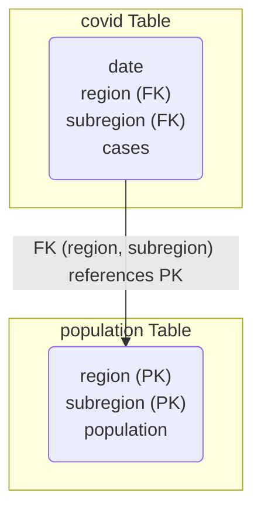
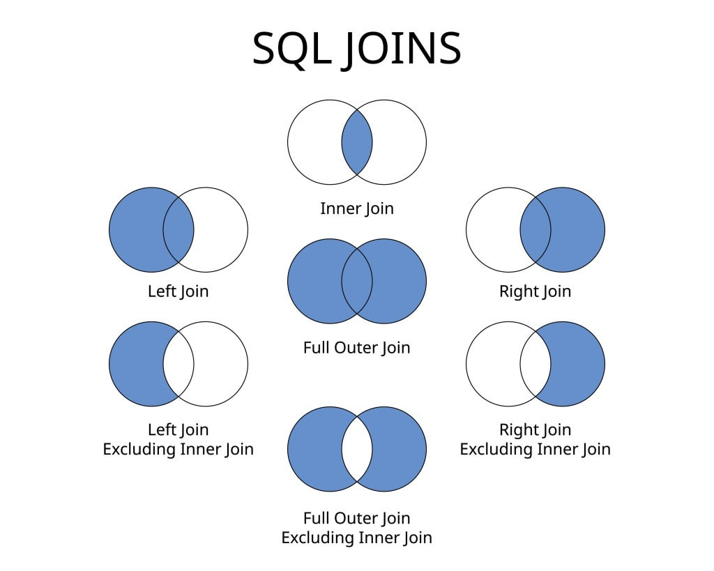
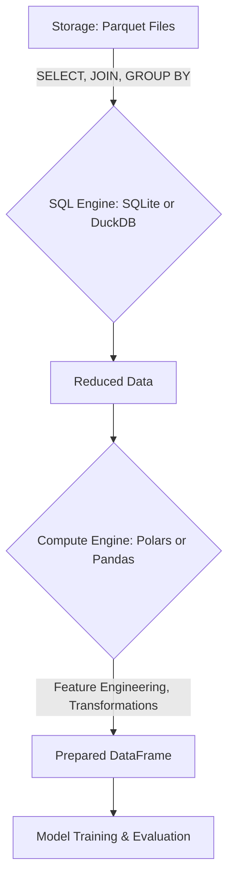

The Data Bottleneck
===
### Complex models are useless if data cannot be processed effectively!
-   **Data too large for RAM:** Common with modern scientific instruments and simulations.
-   **Slow preprocessing:** Wastes valuable research time.
-   **Reproducibility nightmares:** Inconsistent data inputs lead to irreproducible results.
---

Today's Mission: Efficient, Scalable, Reproducible Workflows
===

Our goal: Build **efficient, scalable, reproducible data workflows** that empower robust scientific modeling.

We will cover:
1.  **Storage Layer:** From CSV chaos to columnar efficiency (Parquet, Feather, Arrow).
2.  **Compute Layer:** Choosing the right Python engine (Pandas, Polars, Dask).
3.  **SQL Layer:** Reducing data *before* Python.
4.  **SQL Engines:** SQLite for structured data, DuckDB for fast analytics.
5.  **Integration:** Connecting SQL and Python DataFrames.
6.  **Reproducibility & Testing:** Ensuring trust in your data pipelines.
7.  **Code Examples:** Putting it all together.

---

<!-- jump_to_middle -->
Storage Layer: How Data Lives on Disk
===

---

CSV: The Ubiquitous Data Storage Format
===


A simple CSV file looks like this:
<!-- column_layout: [1, 1] -->
<!-- column: 0 -->
```csv
date,region,cases
2022-01-01,North,150
2022-01-01,South,
2022-01-02,North,155
```
<!-- column: 1 -->
**Why it's popular:**
-   **Simple:** It's just plain text.
-   **Human-readable:** You can open it in any text editor.
-   **Universal:** Supported by nearly every tool, including Excel.
<!-- reset_layout -->

---

Why Your Go-To Format is Holding You Back
===

```csv
date,region,cases
2022-01-01,North,150
2022-01-01,South,
2022-01-02,North,155
```
<!-- column_layout: [3, 1] -->
<!-- column: 0 -->
**The Problems:**
-   **Ambiguous Types:** Is `150` an integer or a string? Is the empty value `NULL` or an empty string?
-   **Slow to Parse:** The entire file must be read line-by-line to find a specific record.
-   **No Schema:** The file itself doesn't tell you the data types. This must be inferred or specified manually on every load.
-   **Large on Disk:** Text is verbose. `150` takes 3 bytes; as a 16-bit integer it would take 2.

<!-- column: 1 -->

<!-- reset_layout -->
---

Columnar Storage to the Rescue
===


### Parquet: The On-Disk Format
-   An efficient, compressed, columnar, and typed binary format.
-   **Columnar:** Stores data column by column, not row by row.
-   **Compressed:** Achieves high compression ratios (e.g., using Snappy or Zstandard).
-   **Typed:** Includes schema metadata in the file footer, eliminating type inference on load.

[Image Placeholder]: # (Diagram of Parquet file structure with footer, row groups, and column chunks – ./img/parquet_structure.png)
[Suggested Search]: # (parquet file format structure diagram)

---

Columnar In-Memory: Apache Arrow
===

### The Lingua Franca for Data Analytics

-   **Apache Arrow** is a standardized, language-agnostic **in-memory columnar data format**.
-   It provides a common data structure that different tools (Polars, DuckDB, Pandas 2.0+) can all understand.
-   This enables **zero-copy** data transfer: tools can operate on the same block of memory without expensive serialization or copying.

---

Feather: Fast, Lightweight Arrow Storage
===
### The On-Disk Format for Speed

-   A simple, fast, columnar file format for storing Arrow tables.
-   It is essentially the Arrow in-memory format written directly to disk.
-   **Use Case:** Ideal for short-term storage or passing data between Python processes (Inter-Process Communication) with maximum speed.
-   **Trade-off:** Lacks the advanced compression and metadata features of Parquet, making it less suitable for long-term archival storage.

> **Parquet** for archival, **Feather** for speed.

---

Why Columnar Wins (1/3): I/O Efficiency
===
### Read Only What You Need

-   Analytical queries often only need a few columns from a wide table.
-   **Columnar storage** allows you to read just the `temperature` and `pressure` columns, skipping `humidity`, `wind_speed`, etc. on disk.
-   This dramatically reduces the amount of data read from disk (I/O), which is often the slowest part of a data pipeline.

> If a query only needs 2 out of 20 columns, you can achieve a ~10x reduction in I/O.

---

Why Columnar Wins (2/3): Faster Computation
===
### Leveraging Modern CPUs

-   Data for a single column is stored contiguously in memory.
-   This layout is ideal for modern CPUs, which can perform a single instruction on multiple pieces of data at once (**SIMD** or **vectorization**).
-   Operations like `sum()`, `mean()`, or applying a filter are significantly faster because the CPU can process chunks of a column in parallel.

> Columnar data "fits the shape" of the CPU, leading to massive speedups in aggregation and filtering.

---

Why Columnar Wins (3/3): Better Compression
===
### Reducing Storage Footprint

-   Columns contain data of the same type (e.g., all integers, all strings).
-   This homogeneity allows for much more effective compression algorithms.
    -   **Dictionary encoding**, for example, replaces long, repeated strings (like "North America") with small integers (`0`) and stores a lookup table ("dictionary"). This is extremely efficient for columns with low cardinality.
-   Better compression means smaller files on disk, which in turn means faster data transfer over networks and less storage cost.

> Smaller data on disk → faster to read → faster analysis.

---

Columnar vs. Row Layout
===
### A Fundamental Difference in Data Organization

-   **Row-oriented (e.g., CSV, traditional databases):** Stores all data for a single record together.
    -   Good for transactional workloads (**OLTP** - Online Transaction Processing) where you need to retrieve or update entire rows quickly (e.g., processing an order).
-   **Column-oriented (e.g., Parquet, Arrow):** Stores all data for a single column together.
    -   Excellent for analytical workloads (**OLAP** - Online Analytical Processing) where you often aggregate or filter on specific columns across many records (e.g., calculating average sales).

---

<!-- jump_to_middle -->
Compute Layer: How Data Is Processed in Python
===

---

Pandas: The Familiar Workhorse
===


-   ✅ **Mature and flexible:** The standard for years, with a massive ecosystem.
-   ✅ **Intuitive API** for many common data manipulation tasks.
-   ❌ **Eager execution:** Operations run immediately, which can be inefficient.
-   ❌ **Single-threaded and memory-bound:** Struggles with datasets larger than RAM and doesn't use modern multi-core CPUs effectively.

> **Verdict:** Great for small to medium data, but a liability for large-scale, reproducible pipelines.

---

Polars: The Modern Challenger
===


-   ✅ **Extremely fast:** Built in Rust on top of Apache Arrow.
-   ✅ **Lazy query optimizer:** Plans the most efficient way to execute your query, reducing memory usage and computation time.
-   ✅ **Multi-threaded:** Automatically uses all available CPU cores.
-   ❌ **Smaller ecosystem:** Fewer third-party integrations compared to Pandas.

> **Verdict:** The modern default for high-performance, single-machine data work.

---

Dask: Scaling Beyond a Single Machine
===


-   ✅ **Out-of-core and distributed:** Can handle datasets larger than RAM by breaking them into chunks (like NumPy arrays or Pandas DataFrames) and processing them in parallel across multiple cores or machines.
-   ✅ **Pandas-like API:** Provides a familiar interface for users coming from Pandas.
-   ❌ **Complexity and overhead:** Requires managing a scheduler and workers, which adds complexity. Not ideal for problems that can fit on a single machine.

> **Verdict:** Use Dask when your data is truly too large for one machine, not just because it's "big."

---

What if Data Still Doesn't Fit?
===
### Streaming and Chunking

-   Even without Dask, you can process large files by reading them in **chunks**.
-   This is a form of **streaming**, where you process the data piece by piece without ever holding the entire file in memory.

```python
# Pandas can read a CSV in chunks
chunk_iter = pd.read_csv("very_large_file.csv", chunksize=1_000_000)

results = []
for chunk_df in chunk_iter:
    # Process each million-row chunk
    results.append(process_chunk(chunk_df))

final_result = pd.concat(results)
```
> This is a manual, "out-of-core" approach. Polars' lazy engine and Dask automate this process more effectively.

---

Choosing Your Compute Engine
===
### Pick the Engine Based on Scale, Not Habit

| Engine | Strength | Limitation | Best Use Case |
|---|---|---|---|
| **Pandas** | Familiar, mature ecosystem | Single-threaded, memory-bound | Small to medium data |
|   | | |
| **Polars** | Fast, lazy, multi-threaded | Newer, smaller ecosystem | Fast local processing |
|   | | |
| **Dask** | Distributed, out-of-core | Overhead, cluster complexity | Larger-than-RAM data |

> This is a scale gradient: **Pandas** (familiar) → **Polars** (optimized) → **Dask** (distributed).

---

Before We Scale Out, Let's Scale Smart
===
### The Most Efficient Memory Optimization

-   **Dask** helps when your data is *already* in Python and too big for one machine.
-   But what if we could avoid loading all that data in the first place?
-   The most efficient memory optimization is to **not load data you don't need.**

> This is the job of the **SQL Layer**: to reduce data *before* it ever touches a Python DataFrame.

---

<!-- jump_to_middle -->
SQL Layer: Reducing Data Before Loading
===

---
`S`tructured `Q`uery `L`anguage
===


---

Why Use SQL in a Python Workflow?
===
### Push Computation to the Data

-   **Reduce data before loading:** The most effective way to manage memory is to not load data you don't need.
    -   SQL is the language of data reduction.
-   **Push compute to where data lives:** Databases are highly optimized for filtering, joining, and aggregating. Let them do the heavy lifting.
-   **Declarative and deterministic:** A SQL query is a precise, repeatable definition of a dataset.
    -   Excellent for reproducibility.

> **Core Principle:** SQL filters, aggregates, and joins **before** Python loads the data, dramatically reducing memory cost and processing time.

---

Relational DB Foundations
===
### The Language of Structured Data

A relational database organizes data into **tables** with predefined **schemas**.

-   **Schema:** A formal contract for a table's structure. It defines:
    -   Column names (e.g., `date`, `region`, `cases`).
    -   Data types (e.g., `TEXT`, `INTEGER`, `REAL`).
    -   Constraints (e.g., `NOT NULL`, `UNIQUE`).
-   **ACID Guarantees:** Transactions are Atomic, Consistent, Isolated, and Durable.
    -   Ensures data integrity, which is critical for scientific reproducibility.

---

Primary and Foreign Keys
===
### The Language of Table Relationships

-   A **Primary Key (PK)** is a column (or set of columns) that uniquely identifies each row in a table. No two rows can have the same primary key, and it cannot be `NULL`.
-   A **Foreign Key (FK)** is a column in one table that refers to the Primary Key of another table. This creates a link between the two tables.

In our dataset, `(region, subregion)` together form a composite Primary Key for the `population` table. In the `covid` table, these same columns act as a Foreign Key, linking each daily report back to a specific population entry.



---

Core SQL Syntax
===
### The Verbs of Data Manipulation

SQL provides a clear, declarative syntax for retrieving and manipulating data. Let's look at the core commands.

-   `SELECT ... FROM ...`: Choose columns from a table.
-   `WHERE ...`: Filter rows based on a condition.
-   `GROUP BY ...`: Aggregate data into summary rows.
-   `JOIN ... ON ...`: Combine rows from multiple tables.
-   `ORDER BY ...`: Sort the results.

We will now look at each of these in turn.

---

SQL: `SELECT`
===
### Choosing Columns

The `SELECT` statement specifies which columns you want to retrieve.

-   `SELECT *` is a wildcard that selects **all** columns.
-   `SELECT column1, column2` retrieves only specific columns.
-   You can use `AS` to create an **alias** (a new name) for a column in the output.

```sql
-- Select all columns from the covid table
SELECT * FROM covid;

-- Select only specific columns
SELECT date, region, cases FROM covid;

-- Select a column and rename it
SELECT date, cases AS daily_cases FROM covid;
```

---

SQL: `WHERE`
===
### Filtering Rows

The `WHERE` clause filters rows based on one or more conditions.

-   Use standard comparison operators: `=`, `!=`, `>`, `<`, `>=`, `<=`.
-   Combine conditions with `AND` and `OR`.
-   Use `BETWEEN` for date or number ranges.

```sql
-- Filter for a specific region
SELECT date, region, cases
FROM covid
WHERE region = 'North';

-- Filter for a date range
SELECT date, region, cases
FROM covid
WHERE date BETWEEN '2022-01-01' AND '2022-01-31';
```

---

SQL: `GROUP BY`
===
### Aggregating Data

The `GROUP BY` clause groups rows that have the same values in specified columns into summary rows. It is almost always used with **aggregate functions** like `SUM()`, `AVG()`, `COUNT()`, `MAX()`, `MIN()`.

```sql
-- Calculate the total cases for each region
SELECT
    region,
    SUM(cases) AS total_cases
FROM covid
GROUP BY region;
```
> This query collapses all rows for a given region into a single output row, summing up the `cases` for that entire group.

---

SQL: `ORDER BY`
===
### Sorting Results

The `ORDER BY` clause sorts the final result set based on one or more columns.

-   `ASC` for ascending order (the default).
-   `DESC` for descending order.

```sql
-- Calculate total cases per region and sort from highest to lowest
SELECT
    region,
    SUM(cases) AS total_cases
FROM covid
GROUP BY region
ORDER BY total_cases DESC;
```

---

A Note on Modifying Data
===
### `CREATE`, `INSERT`, `UPDATE`, `DELETE`

While our focus is on *querying* data for analysis, SQL also includes commands for modifying the database structure and its contents.

-   **`CREATE TABLE`**: Defines a new table and its schema.
-   **`INSERT INTO`**: Adds new rows of data to a table.
-   **`UPDATE`**: Modifies existing rows.
-   **`DELETE`**: Removes rows.

These commands are part of **Data Definition Language (DDL)** and **Data Manipulation Language (DML)**. While essential for database administration, they are less central to the data *analysis* workflow we are focusing on today.

---

Understanding JOINs
===
### Combining Data from Multiple Tables

`JOIN` is arguably the most powerful feature of SQL. It allows you to combine rows from two or more tables based on a related column between them.

This is how we connect our `covid` data with our `population` data to calculate per-capita rates.

We will focus on the two most common types: `INNER JOIN` and `LEFT JOIN`.

---

`INNER JOIN`
===
### Finding the Intersection

An `INNER JOIN` returns only the rows where the join key exists in **both** tables. It finds the intersection of the two datasets.

<!-- column_layout: [1, 1] -->
<!-- column: 0 -->
```sql
SELECT
    c.date,
    c.cases,
    p.population
FROM covid AS c
INNER JOIN population AS p
  ON c.region = p.region;
```
> If a region exists in the `covid` table but not in the `population` table (or vice-versa), it will be excluded from the result.

<!-- column: 1 -->

<!-- reset_layout -->

---

`LEFT JOIN`
===
### Keeping All Data from the "Left" Table

A `LEFT JOIN` returns **all** rows from the left table, and the matched rows from the right table. If there is no match for a row from the left table, the columns from the right table are filled with `NULL`.

<!-- column_layout: [1, 1] -->
<!-- column: 0 -->
```sql
SELECT
    c.date,
    c.cases,
    p.population
FROM covid AS c
LEFT JOIN population AS p
  ON c.region = p.region;
```
> Use this when you want to keep all records from one dataset (the "left" one), even if they don't have a corresponding entry in the other.

<!-- column: 1 -->

<!-- reset_layout -->

---

Many Types of Joins!
===



---

<!-- jump_to_middle -->
SQL Engines for Scientific Computing
===

---

SQLite: The Portable, Versionable Database
===


-   **File-based:** A complete database stored in a single, cross-platform binary file with a stable, well-documented format.
    -   No server, no installation, zero configuration.
-   **Portable and versionable:** You can commit your SQLite database file to Git (if small) or DVC.
-   **Perfect for reproducible pipelines:** Bundling a SQLite DB with your code ensures your analysis runs on a known, consistent dataset.

> **Use Case:** Your go-to for creating a small, structured, and reproducible relational dataset that you control.

---

DuckDB: The Analytical Powerhouse
===


-   **Analytical Database (OLAP):** Designed for fast, complex queries, not transactional updates.
-   **Query Parquet/CSV directly:** Can run SQL on files without importing them into a database.
-   **Vectorized and fast:** Extremely high performance for analytical queries.
-   **In-process:** Runs inside your Python application, like SQLite.

> **Use Case:** Running fast SQL on large local Parquet or CSV files without the overhead of a traditional database.

---

SQLite vs. DuckDB: A Quick Comparison
===

| Engine | Best For | Key Feature |
|---|---|---|
| **SQLite** | Structured, versioned relational data | A portable, self-contained database file |
|            |                                       |                                          |
| **DuckDB** | Fast SQL on Parquet / large files | Querying files directly without import |

> They are complementary. Use **SQLite** to manage a curated, relational dataset. Use **DuckDB** for ad-hoc, high-performance analysis of raw data files.

---

A Note on NoSQL Databases
===
### When Would You Use Something Else?

Relational databases are not the only model. Other types exist for different use cases.

| Type | Example | Best For |
|---|---|---|
| **Document** | MongoDB | Semi-structured JSON-like data (e.g., web app user profiles). |
|              |         |                                                           |
| **Key-Value** | Redis | Fast caching, session storage, real-time counters. |
|              |         |                                                           |
| **Graph** | Neo4j | Network analysis, social graphs, recommendation engines. |

> For most scientific modeling, data is **structured and relational**, making SQL databases the natural choice.

---

<!-- jump_to_middle -->
Integration: SQL + Python DataFrames
===

---

The Modern Data Pipeline
===



---

Connecting to SQLite in Python
===
### The `sqlite3` Module

Python's built-in `sqlite3` module provides a simple, direct interface for working with SQLite databases.

-   **`sqlite3.connect(path)`**: Opens a connection to a database file. It will create the file if it doesn't exist.
-   **Connection Object**: Represents the database session. You use it to execute commands.
-   **Cursor Object**: A lower-level object for executing queries and fetching results one by one. For our purposes, `pandas` and other libraries handle the cursor for us.

For managing connections, using a `with` statement (as shown in the demo's `db.py`) is the modern best practice, as it ensures the connection is automatically closed even if errors occur.

---

SQL to Pandas
===
### The Classic Integration

`pd.read_sql` executes a SQL query and loads the results directly into a Pandas DataFrame.

```python
import pandas as pd
import sqlite3

# Assumes a SQLite connection `conn`
conn = sqlite3.connect("data/covid.sqlite")

query = """
SELECT
    r.date,
    r.region,
    r.subregion,
    r.cases,
    p.population
FROM covid AS r
JOIN population AS p
  ON r.region = p.region AND r.subregion = p.subregion
WHERE r.date >= :start_date;
"""

df = pd.read_sql(query, conn, params={"start_date": "2021-01-01"})
```
> Using parameters (`params=...`) is a critical best practice to prevent **SQL injection**, a major security vulnerability.

---
A Note on Security: SQL Injection
===
### Why You Should NEVER Use F-Strings for Queries

**The Wrong Way (Vulnerable):**
```python
# User input could be malicious
user_input = "2021-01-01'; DROP TABLE population; --"

# Using an f-string injects the malicious code directly into the query
query = f"SELECT * FROM covid WHERE date >= '{user_input}';"
conn.executescript(query) # This would delete your table!
```

**The Right Way (Safe):**
```python
# The database driver safely handles the parameter
query = "SELECT * FROM covid WHERE date >= :start_date;"
df = pd.read_sql(query, conn, params={"start_date": user_input})
```
> Parameterization separates the query's logic from the data. The database driver sanitizes the input, preventing it from being executed as code.

---

xkcd tried to warn you!
===


---

SQL to Polars
===
### High-Performance Integration

A robust way to integrate Polars is by converting from a Pandas DataFrame. This is the approach used in our demo to ensure a fair compute comparison with minimal dependencies.

```python
import pandas as pd
import polars as pl
import sqlite3

# Assumes a SQLite connection `conn` and a `query` string
df_pd = pd.read_sql(query, conn)

# Efficiently convert from Pandas to Polars
df_pl = pl.from_pandas(df_pd)
```

For the highest performance, DuckDB can query Parquet files and return a Polars DataFrame with zero-copy data transfer.

```python
import duckdb
import polars as pl

# DuckDB returns a Polars DataFrame directly
df_pl = duckdb.query("SELECT * FROM 'data/*.parquet'").pl()
```

---

Reproducibility: Beyond Code and Environments
===
### Pinning Data and Queries for Trustworthy Science

-   **From Lecture 3:** We learned to pin **environments** (Python versions, packages) for reproducible code execution.
    -   `venv`, `uv`, `conda`, `Docker` ensure consistent code behavior.
-   **But reproducibility extends to data:**
    -   Same inputs must always yield same outputs.
    -   This requires pinning **data + queries**.
-   **The Immutable Data Principle:** Never overwrite raw data.
    -   Treat raw data as an unchangeable artifact.

---

Data Versioning Strategies
===
### Tracking Changes in Your Most Valuable Asset

-   **Why version data?**
    -   Ensures **same input → same output**, even months later.
    -   Provides an audit trail for data transformations.
-   **Strategies for different scales:**
    -   **Git for small data:** Simple, but quickly becomes unwieldy for large files.
    -   **DVC / lakeFS for large data:** Specialized tools for versioning large datasets and models.
    -   **Parquet + hash digest:** Storing data in Parquet with a cryptographic hash of its contents provides a strong guarantee of immutability.

---

Reproducibility & Testing (1/4): Version Your Queries
===
### Treat SQL as Code

-   Your SQL queries are a critical part of your analysis logic. They should be treated like any other source code.
-   Store your queries in dedicated `.sql` files and commit them to version control (`git`).
-   Load them into your Python code rather than embedding them as multi-line strings.

```python
# db_utils.py
from pathlib import Path

def load_query(name: str) -> str:
    query_path = Path("queries") / f"{name}.sql"
    return query_path.read_text()

# analysis.py
from db_utils import load_query
query = load_query("get_covid_data")
```
> **Anti-Pattern:** Hiding complex SQL inside scattered notebook cells or Python scripts.

---

Reproducibility & Testing (2/4): Separate Concerns
===
### Create a Data Access Layer

-   Isolate all your database interaction logic into a dedicated module (e.g., `db.py` or `data_access.py`).
-   This module should be responsible for:
    -   Managing database connections.
    -   Loading queries from `.sql` files.
    -   Executing queries and returning data (e.g., as a DataFrame).
-   Your main analysis code should call functions from this layer, without knowing the details of the database connection or SQL.

> This separation makes your code cleaner, easier to maintain, and vastly easier to test.

---

Reproducibility & Testing (3/4): Unit Testing with Mocks
===
### Isolate Your Logic from the Database

-   Your unit tests for analysis functions should **never** touch a real database. (Revisiting Lec 6)
-   Use **mocking** to replace the data access layer with a fake object that returns a pre-defined DataFrame.
-   This makes your tests fast, reliable, and independent of any external database file.

```python
# test_analysis.py
def test_feature_engineering(mocker):
    # Create fake data that the mock will return
    fake_df = pd.DataFrame(...)
    # Patch the function in the data access layer
    mocker.patch("db_utils.load_data", return_value=fake_df)

    # Run the analysis function, which now receives the fake data
    result = create_features()
    assert "new_feature" in result.columns
```

---

Reproducibility & Testing (4/4): Integration Testing
===
### Verifying the Full Pipeline

-   While unit tests isolate components, **integration tests** verify that they work together.
-   For a data pipeline, an integration test can verify the full SQL-to-DataFrame workflow.
-   Use a temporary, **in-memory SQLite database** for these tests.
    -   Create a fresh database for each test run.
    -   Populate it with a small, known set of test data.
    -   Run your real query against it and check the result.

```python
# test_integration.py
def test_sql_to_dataframe_pipeline():
    # Create an in-memory SQLite DB
    conn = sqlite3.connect(":memory:")
    # ... create tables and insert test data ...

    # Run the real query against the temporary DB
    df = pd.read_sql(load_query("get_covid_data"), conn)
    assert len(df) == 5 # Check against known test data
```

> For cleaner and more reusable test setup, this database creation logic is perfectly suited for a `pytest` fixture.

---

<!-- jump_to_middle -->
Code Examples: Putting It All Together
===

---

Scenario: Analyzing COVID Data
===
### Comparing Pandas and Polars for a Realistic Task

-   **The Data:** We have two tables in a SQLite database:
    -   `covid`: Daily case counts by `(region, subregion)`.
    -   `population`: Population data for each `(region, subregion)`.
-   **The Goal:** Compute a 7-row rolling average of per-capita case rates.
-   **The Task:**
    1.  Use SQL to `JOIN` the two tables.
    2.  Load the result into Pandas and Polars.
    3.  Perform the rolling average calculation in each library.
    4.  Compare the performance (time and memory).

> This example code mirrors a common scientific data preparation workflow: joining disparate datasets and engineering a time-series feature.

---

From SQL to Features with Pandas and Polars
===

1.  **Query SQLite:** Run a parameterized SQL JOIN on `(region, subregion)` to combine COVID cases and population data.
2.  **Load into Pandas:** Use `pd.read_sql` to load the query result.
3.  **Load into Polars:** Convert the Pandas DataFrame to a Polars DataFrame to ensure an identical starting point for a fair comparison.
4.  **Compute Rolling Feature:** In both libraries, compute a 7-row rolling per-capita case rate.
5.  **Compare Performance:** Measure and compare the wall time and memory usage for the feature engineering step.

> **Goal:** Demonstrate the full, reproducible pipeline and highlight the performance characteristics of modern tools.

---

Key Takeaways
===
### Designing for Scale and Reproducibility

-   **Parquet > CSV:** Use columnar formats for efficient, typed, and reproducible data storage.
-   **SQL first, DataFrame second:** Reduce your data with SQL *before* loading it into Python for computation.
-   **Pandas vs. Polars vs. Dask = Scale Choices:**
    -   Start with **Pandas** for familiarity.
    -   Move to **Polars** for performance on a single machine.
    -   Use **Dask** for problems that exceed a single machine's memory.
-   **Reproducibility is a design decision:** Version your data, your queries, and your code.

---

Thank you!
===

