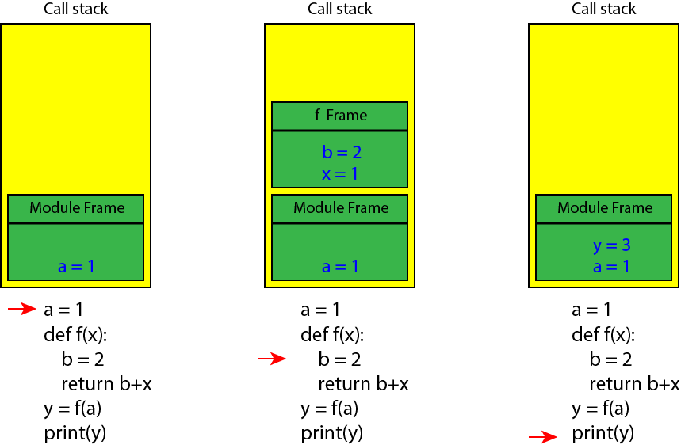
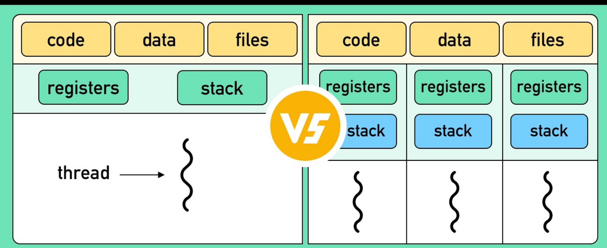

Today's Mission
===
### Build efficient, scalable scientific workflows by choosing the right concurrency model.

We will cover:
1.  **The "Why" of Concurrency:** CPU-bound vs. I/O-bound problems.
2.  **Multiprocessing:** True parallelism for CPU-bound tasks.
3.  **Threading & The GIL:** Overlapping I/O-bound tasks.
4.  **Asyncio:** Massive concurrency for modern I/O.
5.  **Choosing the Right Tool:** A practical decision framework.

---

<!-- jump_to_middle -->
Part 1: The Limitations of Synchronous Code
===

---

Synchronous Execution: One Step at a Time
===
### By default, Python code runs sequentially. Each task must finish before the next one begins.

```python
import time

def task_one():
    print("Starting task one...")
    time.sleep(1) # Simulate work
    print("Task one finished.")

def task_two():
    print("Starting task two...")
    time.sleep(1) # Simulate work
    print("Task two finished.")

task_one()
task_two()
# Total time: ~2 seconds
```

> This one-at-a-time model is simple and predictable, but it becomes a major bottleneck when tasks involve significant work or waiting.

---

Bottleneck 1: CPU-Bound Work
===


### Tasks limited by the speed of the processor. The CPU is the bottleneck.

-   The program is actively performing computations, keeping the CPU busy.
-   Examples:
    -   Complex numerical calculations (e.g., matrix multiplication).
    -   Intensive data processing and transformations.
    -   Monte Carlo simulations.

> For these tasks, performance is determined by how fast the CPU can execute instructions. A synchronous program can only use one CPU core at a time.

---

Bottleneck 2: I/O-Bound Work
===


### Tasks limited by waiting for slow external resources. The CPU is mostly idle.

-   The program spends most of its time waiting for Input/Output (I/O) operations to complete.
-   Examples:
    -   Network requests (e.g., downloading a file, calling an API).
    -   Reading or writing large files from a disk.
    -   Querying a database.

> For these tasks, performance is determined by the speed of the network or disk. A synchronous program wastes CPU time by sitting idle during these waits.

---

Concept: Concurrency
===


### Structuring a program to manage multiple tasks at once.

-   Tasks can be started, run, and completed in overlapping time periods.
-   They are not necessarily running at the same instant.
-   **Analogy:** A chef making a salad while also occasionally stirring a soup. One person is making progress on two tasks by switching between them.

> Concurrency is about dealing with lots of things at once.

---

Concept: Parallelism
===


### Executing multiple tasks at the exact same time.

-   This is a stronger guarantee than concurrency. It requires hardware with multiple cores or processors.
-   **Analogy:** Two chefs, each in their own kitchen, making their own dish. They are working simultaneously.

> Parallelism is about doing lots of things at once.

---

Concurrency vs. Parallelism: A Summary
===


### Concurrency is about structure; parallelism is about execution.

<!-- column_layout: [1, 1] -->
<!-- column: 0 -->
**Concurrency**

-   **Goal:** Manage multiple tasks.
-   **How:** Interleaving execution.
-   **Requires:** A single core is sufficient.

<!-- column: 1 -->
**Parallelism**

-   **Goal:** Execute multiple tasks simultaneously.
-   **How:** Running on separate cores.
-   **Requires:** Multiple hardware cores.

<!-- reset_layout -->

> You can have concurrency without parallelism (e.g., on a single-core CPU), but you cannot have parallelism without concurrency.

---

The Process: An Isolated Program
===
### A process is an instance of a computer program that is being executed.

-   **Isolation:** Each process has its own private memory space. One process cannot directly access the memory of another.
-   **Resources:** It has its own set of resources, such as memory, file handles, and network connections.
-   **Cost:** Processes are "heavyweight" for the operating system to create and manage.

> Think of a process as a separate, self-contained workshop.

---

The Thread: A Flow Inside a Process
===
### A thread is the smallest sequence of programmed instructions that can be managed independently by a scheduler.

-   A single process can contain multiple threads.
-   **Shared Memory:** All threads within a process share the same memory space. This makes communication between them fast, but also dangerous if not managed carefully.
-   **Cost:** Threads are "lightweight" to create compared to processes.

> Think of threads as multiple workers inside the same workshop. They can collaborate on the same project but must coordinate to avoid getting in each other's way.

---

Concept: The Thread's Stack
===



### Each thread has its own call stack.

-   **Call Stack:** A data structure that stores information about the active subroutines of a computer program. It's where local variables and function call information are kept.
-   **Isolation within a Process:** While threads *share* the process's main memory (heap), each thread maintains its *own separate stack*.
-   **Purpose:** This allows each thread to execute functions independently, keeping track of its own execution path and local variables without interfering with other threads.

> Think of it as each worker in the workshop having their own personal workbench where they keep their current tools and instructions.

---

Process vs. Thread: Key Differences
===


### The choice between them depends on memory sharing and the type of work.

<!-- column_layout: [1, 1] -->
<!-- column: 0 -->
**Process**

-   **Memory:** Isolated.
-   **Communication:** Slow (IPC).
-   **Cost:** High.
-   **Best for:** CPU-bound tasks where memory isolation is a benefit.

<!-- column: 1 -->
**Thread**

-   **Memory:** Shared.
-   **Communication:** Fast (shared variables).
-   **Cost:** Low.
-   **Best for:** I/O-bound tasks where overlapping waits is key.

<!-- reset_layout -->

[Image Placeholder]: # (Diagram showing one process box containing two smaller thread boxes – ./img/process_vs_thread.png)
[Suggested Search]: # (process vs thread diagram)

---

<!-- jump_to_middle -->
Part 2: Multiprocessing for CPU-Bound Tasks
===

---

Motivator: 10 Million Draws Before Coffee
===
### Our first challenge: A classic CPU-bound scientific computing task.

-   **Scenario:** We need to run a Monte Carlo simulation with 1,000 different parameter settings, where each setting requires 10,000 independent draws.
-   **Problem:** This is a "Lots of Doing" task. Sequentially, it will take a long time as it runs on a single CPU core.

> **Question:** Can the work for each parameter setting be done independently? If so, how can we leverage a multi-core CPU to speed this up?

---

Baseline: Sequential Monte Carlo
===
### The straightforward approach uses a single core.

```python
import time

def trial(n_samples):
    # Simulate n_samples and return a result
    # (This is a CPU-intensive calculation)
    ...

# Run 1000 tasks sequentially
t0 = time.perf_counter()
results = [trial(10_000) for _ in range(1000)]
print(f"Sequential time: {time.perf_counter() - t0:.2f}s")

```
<!-- speaker_note: Explain that `time.perf_counter()` is a high-resolution timer ideal for benchmarking short durations. -->

-   This code is simple and correct, but inefficient.
-   It cannot take advantage of modern multi-core processors.

---


---

A Naive Approach: Manual Parallelization
===
### What if we just run the script multiple times from the terminal?

```bash
# We could modify our script to take a command-line argument...
# python run_mc.py --chunk=1 &
# python run_mc.py --chunk=2 &
# ...
```
-   This *is* a form of multiprocessing, but it's manual, clumsy, and hard to scale.
-   We have to manually aggregate the results from different runs.
-   This highlights the need for a tool that can manage this process for us from within a single Python script.

---

The Tool: `concurrent.futures.ProcessPoolExecutor`
===
### Python's high-level interface for true parallel execution.

-   It creates and manages a pool of separate Python **processes**.
-   The operating system can schedule these processes to run on different CPU cores simultaneously.
-   This is the standard way to achieve **parallelism** for CPU-bound tasks in Python.

```python
from concurrent.futures import ProcessPoolExecutor

tasks = [10_000] * 1000

with ProcessPoolExecutor() as executor:
    results = list(executor.map(trial, tasks))
```

-   **`with ProcessPoolExecutor() ...`**: The `with` statement creates the process pool and ensures it is properly shut down when we're done, even if errors occur.
-   **`executor.map(trial, tasks)`**: This is the core of the operation. It "maps" the `trial` function onto each item in the `tasks` list, distributing the calls among the worker processes in the pool.

---

Live Run: Monte Carlo with Processes
===
### Let's see the speedup from parallel execution.

```python
# mp_pi.py
import time, random
from concurrent.futures import ProcessPoolExecutor

def hits(n):
    """Simulates n random draws to estimate pi."""
    r = random.random; c = 0
    for _ in range(n):
        x, y = r(), r(); c += (x*x + y*y <= 1.0)
    return c

if __name__ == "__main__":
    TASKS, N = 8, 1_000_000
    t0 = time.perf_counter()
    with ProcessPoolExecutor() as ex:
        total = sum(ex.map(hits, [N]*TASKS))
    print(f"pi≈{4*total/(TASKS*N):.5f}, time={time.perf_counter()-t0:.3f}s")
```
<!-- speaker_note: Run the sequential version first, then the parallel version. Point out the significant time difference on the terminal. -->

> By distributing the `hits` function across multiple processes, we achieve a significant speedup that scales with the number of available CPU cores.

---

Cost 1: Startup Overhead
===
### Creating a new process is expensive for the operating system.

-   Each worker process is a full, separate Python interpreter that must be launched and initialized.
-   This cost is particularly high on macOS and Windows, which use the `spawn` start method by default. A `fork` (on Linux) is faster but has its own safety issues.
-   **Impact:** Parallelizing very fast function calls can be slower than running them sequentially, as the startup cost dominates.

---

Cost 2: Data Serialization (Pickling)
===
### Data sent between processes must be converted into a byte stream.

-   Processes don't share memory. To send an object (like a function argument or a return value) to another process, Python must **serialize** it using the `pickle` module.
-   The receiving process must then **deserialize** it.
-   **Impact:** This adds overhead that can be significant for large or complex Python objects (e.g., large lists, custom class instances).

---

Cost 3: Memory Duplication
===
### Each process has its own private memory space.

-   When you pass a large data structure (like a big NumPy array or Pandas DataFrame) to a worker process, a copy of that data may be created in the worker's memory.
-   If you have 8 worker processes, you could end up with 8 copies of your data in RAM.
-   **Impact:** Can lead to very high memory consumption and even system crashes if not managed carefully.

---

Multiprocessing: Best Practices
===
### How to mitigate the costs and write robust parallel code.

1.  **Use Fewer, Larger Tasks**
    -   The ideal task is long enough to make the startup and serialization costs negligible.
    -   Don't parallelize very short function calls; the overhead will dominate.

2.  **Guard Your Main Execution**
    -   Always protect your main script's logic with `if __name__ == "__main__":`.
    -   On `spawn` systems (macOS/Windows), worker processes re-import the main script. Without this guard, each worker would try to start its own process pool, leading to an infinite loop of process creation.

3.  **Manage Large Data Carefully**
    -   Avoid passing large datasets as arguments if possible.
    -   For truly large arrays (e.g., NumPy), consider using `shared_memory` or memory-mapped files to allow processes to access the same data without copying it.

---

<!-- jump_to_middle -->
Part 3: Threading & The GIL
===

---

Motivator: 500 Tiny Files from the Cloud
===
### Our second challenge: A classic I/O-bound task.

-   **Scenario:** We need to download 500 small JSON files from a web API. Each download takes ~100ms due to network latency, but only ~2ms of CPU time to parse.
-   **Problem:** This is a "Lots of Waiting" task. Sequentially, the CPU is idle >98% of the time, waiting for the network. Total time is dominated by the sum of all wait times.

> **Question:** Can we overlap the "waiting" periods? Can we start a new download while a previous one is in flight?

---

Baseline: Sequential File Fetching
===
### The straightforward approach waits for each download to complete.

```python
import time, requests

URLS = ["https://example.com"] * 50

def fetch(url):
    r = requests.get(url, timeout=10)
    return r.content

t0 = time.perf_counter()
results = [fetch(u) for u in URLS]
print(f"Sequential time: {time.perf_counter() - t0:.2f}s")
```

-   This code is simple, but its total runtime is the sum of all individual network latencies.
-   The CPU sits idle while the operating system waits for network packets.

---

The Tool: `concurrent.futures.ThreadPoolExecutor`
===
### Python's high-level interface for concurrent execution.

-   It creates and manages a pool of **threads** within a single process.
-   Threads are well-suited for I/O-bound tasks because they can overlap periods of waiting.
-   While one thread is blocked (e.g., waiting for the network), the OS can switch to another thread to start a new task.

```python
from concurrent.futures import ThreadPoolExecutor

with ThreadPoolExecutor(max_workers=20) as executor:
    results = list(executor.map(fetch, URLS))
```

-   **`max_workers=20`**: Sets the size of the thread pool. For I/O-bound tasks, this can be larger than the number of CPU cores. Finding the optimal number often requires experimentation.
-   **`executor.map(fetch, URLS)`**: Just like with `ProcessPoolExecutor`, this distributes the `fetch` calls across the threads in the pool.

<!-- speaker_note: Mention that `executor.map` waits for all tasks to complete. For more advanced use cases, `imap` (in the standard library's `multiprocessing.pool`) provide lazy iteration over results. -->

> This allows many I/O operations to be "in flight" at the same time, dramatically reducing the total wall-clock time.

---

Live Run: I/O Threads *Win* on Waiting
===
### Let's see the speedup from overlapping I/O.

```python
# io_threads_ok.py
import time, requests
from concurrent.futures import ThreadPoolExecutor

URLS = ["https://example.com"]*50

def fetch(u):
    r = requests.get(u, timeout=10)
    return len(r.content)

t0 = time.perf_counter()
with ThreadPoolExecutor(max_workers=20) as ex:
    sizes = list(ex.map(fetch, URLS))
print(f"bytes={sum(sizes)}, time={time.perf_counter()-t0:.3f}s")
```

> By overlapping the network wait times, threads provide a massive performance boost for I/O-bound workloads. The total time is now closer to the duration of the longest few requests, not the sum of all of them.

---

The Twist: What Happens with CPU-Bound Work?
===
### We saw threads excel at I/O. Let's try them on our CPU-bound Monte Carlo task.

-   **Hypothesis:** If we have 8 CPU cores, using 8 threads should give us a similar speedup to using 8 processes, right?

<!-- pause -->


> This leads us to one of the most important and misunderstood concepts in Python concurrency: The Global Interpreter Lock.

---


---

The Challenge of Shared State: Race Conditions
===
### When multiple threads access and modify shared data, the final result can depend on the unpredictable order of execution.

```python
import threading

counter = 0

def increment():
    global counter
    # This is not an atomic operation!
    # It involves: 1. read, 2. increment, 3. write.
    counter += 1

threads = [threading.Thread(target=increment) for _ in range(100_000)]
for t in threads: t.start()
for t in threads: t.join()

print(f"Final counter: {counter}") # Expected: 100000, Actual: ???
```
> A **race condition** occurs because a thread can be interrupted between reading the value of `counter` and writing the new value back. This leads to lost updates and incorrect results.

---

Solution: Mutexes (Locks)
===
### A mutex (Mutual Exclusion lock) is a synchronization primitive that ensures only one thread can execute a critical section of code at a time.

```python
import threading

counter = 0
lock = threading.Lock()

def increment():
    global counter
    with lock:
        # The 'with' statement automatically acquires and releases the lock.
        # Only one thread can be inside this block at a time.
        counter += 1

# ... (same thread setup as before) ...
print(f"Final counter: {counter}") # Expected: 100000, Actual: 100000
```
> By wrapping the critical section (`counter += 1`) in a lock, we make the operation **atomic** and prevent race conditions, ensuring correctness at the cost of some performance.

---


---

The Global Interpreter Lock (GIL)
===


### A lock that protects CPython's internal memory management.

-   **What it is:** A single, process-wide mutex that allows only **one thread** to execute Python bytecode at any given time, even on a multi-core processor.
-   **Why it exists:** It simplifies CPython's memory management (e.g., reference counting) by acting as a global lock that prevents race conditions when multiple threads try to modify the same Python object simultaneously.

[Image Placeholder]: # (Diagram showing multiple threads trying to access Python bytecode, but a GIL allows only one through at a time – ./img/gil_diagram.png)
[Suggested Search]: # (python global interpreter lock diagram)

> The GIL is specific to the CPython interpreter. Other implementations like Jython or IronPython do not have a GIL.

---

GIL Impact on CPU-Bound Python
===
### The GIL prevents multiple threads from running Python code in parallel.

-   The operating system can switch between threads on a multi-core machine, but only the thread that holds the GIL can actually execute Python bytecode.
-   **Result:** No performance gain for pure Python computation. The overhead of thread management often makes it slightly *slower* than a simple sequential implementation.


---

GIL Impact on I/O-Bound Python
===
### Threads can achieve true concurrency for I/O because they release the GIL.

-   A **blocking I/O call** is an operation (like a network request or disk read) that causes the program to pause and wait for the external resource.
-   In CPython, the standard library is designed so that when a thread makes a blocking I/O call, it **releases the GIL**.
-   **Result:** While one thread is waiting for the network, the OS can switch to another thread, which can then acquire the GIL and run. This enables many I/O operations to be overlapped.

---

The GIL and Scientific Libraries (NumPy, SciPy)
===
### C extensions can release the GIL, enabling parallelism for scientific code.

-   Many scientific libraries like NumPy, SciPy, and Pandas are written in C or Fortran for performance.
-   When you call a function like `np.dot()`, you are executing compiled C code, not Python bytecode.
-   These libraries are often designed to **release the GIL** during long-running computations.
-   **Result:** You can use a thread to run a heavy NumPy calculation on one core, and while it's running, another thread can acquire the GIL to do other work (like more Python processing or I/O). This is a powerful pattern for mixed workloads.

---

Live Run: When Threads Disappoint
===
### Let's re-run our CPU-bound `hits` function with a `ThreadPoolExecutor`.

```python
# cpu_threads_bad.py
import time
from concurrent.futures import ThreadPoolExecutor

def hits(n):
    """Simulates n random draws to estimate pi."""
    r = random.random; c = 0
    for _ in range(n):
        x, y = r(), r(); c += (x*x + y*y <= 1.0)
    return c

if __name__ == "__main__":
    TASKS, N = 8, 1_000_000
    t0 = time.perf_counter()
    with ThreadPoolExecutor(max_workers=TASKS) as ex:
        total = sum(ex.map(hits, [N]*TASKS))
    print(f"Threads (CPU-bound) time: {time.perf_counter()-t0:.3f}s")
```
<!-- speaker_note: Explain that this code is identical to the multiprocessing example, except we've swapped `ProcessPoolExecutor` for `ThreadPoolExecutor`. The disappointing result directly demonstrates the impact of the GIL on CPU-bound code. -->

> Because `hits` is pure Python code, the GIL prevents parallel execution. The threads run one at a time, and performance is similar to (or worse than) the sequential version. This is the critical difference between multiprocessing and threading.

---

A Note on Testing Concurrent Code
===


### Testing threaded code is notoriously difficult.

-   **Non-Determinism:** Race conditions may only appear under specific, unpredictable timing conditions. A test suite might pass 1,000 times and then fail on the 1,001st run.
-   **Heisenbugs:** Bugs that seem to disappear or change when you try to debug them (e.g., by adding print statements, which can alter the timing).
-   **Strategies:**
    -   **Stress Testing:** Running tests repeatedly in a loop to increase the chance of triggering a race condition.
    -   **Fuzzing:** Using tools to inject random delays or inputs to explore unlikely execution paths.
    -   **Careful Design:** The best approach is to minimize shared state and use well-tested synchronization primitives (like `queue.Queue`) to communicate between threads.

---

<!-- jump_to_middle -->
Part 4: Asyncio for Massive Concurrent I/O
===

---

The Problem with Threads at Scale
===
### Threads are effective, but have limitations for massive concurrency.

-   **Memory Footprint (Stack):** Each thread requires its own dedicated **call stack** (typically 1-8 MB). Creating thousands of threads can quickly consume gigabytes of RAM.
-   **OS Overhead (Scheduling):** The operating system must manage and schedule each thread. With thousands of threads, the overhead of context switching and managing these resources can degrade performance.

> For applications needing to handle thousands of simultaneous network connections (like a modern web server or data streaming service), a more lightweight model is required.

---

Asyncio: The Event Loop & Cooperative Multitasking
===
### A single-threaded approach to concurrency.

Instead of relying on the OS to switch between threads, `asyncio` uses a single thread and an **event loop**.

-   **Event Loop:** A coordinator that manages and distributes events or messages in a program. It keeps track of all running tasks.
-   **Cooperative Multitasking:** Tasks explicitly **yield control** back to the event loop when they encounter a blocking I/O operation. The event loop can then run another task.


---

Asyncio Vocabulary: `async` and `await`
===
### New syntax for defining and controlling cooperative tasks.

<!-- column_layout: [1, 1] -->
<!-- column: 0 -->
**`async def`**
-   Defines a function as a **coroutine**.
-   A coroutine is a special function that can be paused and resumed. It does not run until it is scheduled on an event loop.

<!-- column: 1 -->
**`await`**
-   The keyword used *inside* a coroutine to pause its execution and pass control back to the event loop.
-   You can only `await` other "awaitable" objects (e.g., another coroutine, or an I/O operation from an `async`-compatible library).

<!-- reset_layout -->

> A **Task** is a coroutine that has been scheduled to run on the event loop. `asyncio.run(main())` starts the event loop and runs the main coroutine.

---

Live Run: Asyncio Fan-Out
===
### Let's demonstrate non-blocking waits with `asyncio.sleep`.

`asyncio.sleep(t)` is an `awaitable` that completes after `t` seconds without blocking the event loop, allowing other tasks to run.

```python
# aio_fanout.py
import asyncio, time

async def ioish(i):
    await asyncio.sleep(0.1) # Simulate a non-blocking 100ms I/O wait
    return i

async def main(n=30):
    t0 = time.perf_counter()
    # asyncio.gather runs many coroutines concurrently
    await asyncio.gather(*(ioish(i) for i in range(n)))
    print(f"asyncio with {n} tasks in {time.perf_counter()-t0:.3f}s")

if __name__ == "__main__":
    asyncio.run(main())
```

> The total time is just over 0.1s, not 3.0s. `asyncio` runs all 30 "waits" concurrently on a single thread, demonstrating its efficiency for I/O-bound workloads without the overhead of creating 30 separate threads.

---

Part 5: Choosing the Right Tool
===


---

Decision Table: A High-Level Guide
===
### Match the tool to the bottleneck.

| Problem Type | Multiprocessing | Threading | Asyncio |
| :--- | :--- | :--- | :--- |
| **CPU-Bound** | ✅ **Excellent** | ❌ **No** (due to GIL) | ❌ **No** |
| (Numerical computation) | (True Parallelism) | | |
| | | | |
| **I/O-Bound** | ⚠️ **Okay** | ✅ **Good** | ✅ **Excellent** |
| (Network, Disk) | (High overhead) | (OS-managed) | (Lightweight) |
| | | | |
| **Massive I/O** | ❌ **No** | ⚠️ **Okay** | ✅ **Excellent** |
| (1000s of connections) | (Too heavyweight) | (High memory/OS cost) | (Designed for this) |

---

Decision Table: Detailed Comparison
===
### A deeper look at the trade-offs.

| | Multiprocessing | Threading | Asyncio |
| :--- | :--- | :--- | :--- |
| **Best For** | CPU-bound tasks | I/O-bound tasks | Massive I/O-bound tasks |
| | (Parallel computation) | (e.g., 10-100 requests) | (e.g., 1000s of connections) |
| | | | |
| **Key Cost** | High startup & memory | GIL prevents parallelism | Code complexity (`async`/`await`) |
| | | | |
| **Execution** | Parallel (multiple cores) | Concurrent (single core) | Concurrent (single core) |
| | | | |
| **Memory** | Separate memory per process | Shared memory per process | Shared memory (single process) |

---

What to Try First: A Hierarchy of Optimization
===
### Concurrency is a powerful tool, but it's not the first one you should reach for.

1.  **Vectorize Your Code**
    -   Before anything else, use NumPy, SciPy, Pandas, or PyTorch to replace slow Python loops with fast, compiled C or Fortran code.
    -   This is often the single biggest performance gain.
2.  **Profile Your Code**
    -   Use a profiler to find the *actual* bottleneck. Is your code CPU-bound or I/O-bound?
    -   Don't guess! Measure.
3.  **Choose a Concurrency Model**
    -   Only after vectorizing and profiling should you choose a concurrency model based on the bottleneck you identified.

---

Key Takeaways
===
### Designing for Scale and Reproducibility

-   **CPU-Bound? → Multiprocessing.** Use `ProcessPoolExecutor` for true parallelism across multiple cores. Watch out for data serialization costs.
-   **I/O-Bound? → Threading.** Use `ThreadPoolExecutor` to overlap "waiting" time. The GIL prevents it from speeding up CPU-bound Python code.
-   **Massive I/O? → Asyncio.** Use `async`/`await` for the most lightweight, scalable concurrency, but be prepared for increased code complexity.
-   **Always Profile First.** Don't optimize prematurely. Identify your bottleneck, then choose the right tool for the job.

---

Resources & Further Reading
===

-   **`concurrent.futures` Documentation**
    -   [docs.python.org/3/library/concurrent.futures.html](https://docs.python.org/3/library/concurrent.futures.html)
-   **`asyncio` Documentation**
    -   [docs.python.org/3/library/asyncio.html](https://docs.python.org/3/library/asyncio.html)
-   **`Real Python Guides`**
    -   [Intro to Python Concurrency/](https://realpython.com/python-concurrency/)
    -   [AsyncIO](https://realpython.com/async-io-python/)
    -   [Intro to Python Threading](https://realpython.com/intro-to-python-threading/)
    -   [Thread Locks](https://realpython.com/python-thread-lock)
    -   [The Python GIL](https://realpython.com/python-gil/)

---

Thank you!
===


